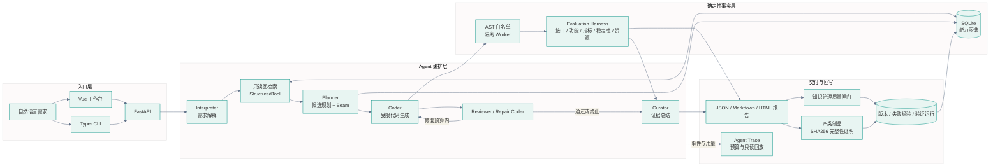
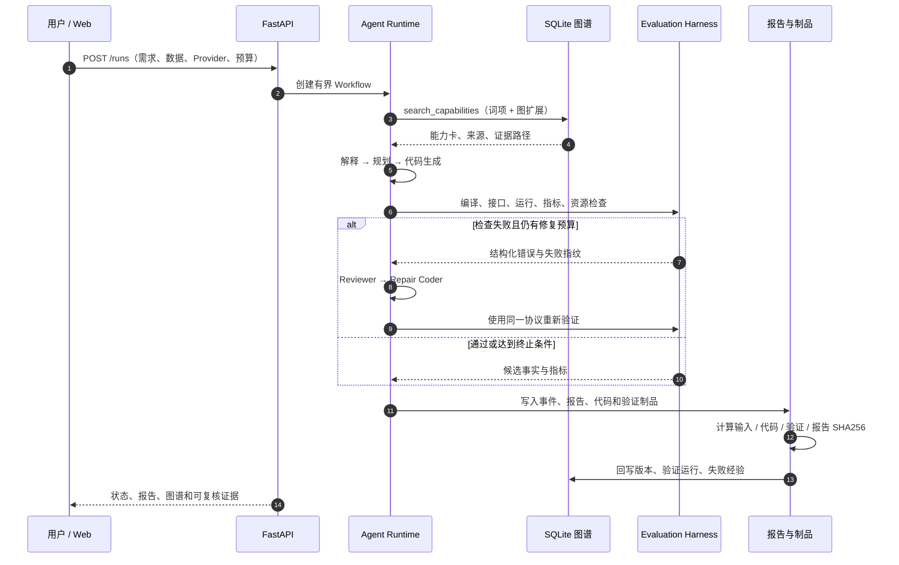

# AlgoForge · 可验证的算法能力工厂

> 将自然语言算法需求变成**有来源、有验证、有版本**的可运行算法能力。

AlgoForge 是基于 LLM Agent 的算法能力工厂，面向行业算法的复刻、验证与知识沉淀。它以**银行营销响应预测**为主场景，以 **SMS 垃圾信息分类**展示跨任务迁移，串联能力理解、知识检索、方案规划、代码生成、自动验证、多轮修复和知识回写。

[](https://github.com/dengdeng55525/algorithm-capability-factory/actions/workflows/ci.yml) [](https://github.com/dengdeng55525/algorithm-capability-factory/actions/workflows/frontend.yml)

代码采用 MIT 许可证；第三方数据、模型和源码遵循各自许可证与使用条款，详见 [NOTICE](NOTICE)。

## 项目背景与目标

真实团队的算法能力通常分散在需求文档、历史代码、实验记录和专家经验里。AlgoForge 将这些能力转成有来源的结构化知识，再按照固定数据协议和受限执行器完成复刻、验证与沉淀。系统为算法选择依据、代码可运行性、指标事实和失败经验复用提供统一证据。

项目围绕银行客户是否订购定期存款构建完整业务闭环，并通过 SMS 分类展示同一套编排、验证与报告接口在文本任务中的复用。

## 你可以先看到什么

- **Vue 工作台**：需求输入、运行监控、候选比较、折叠式验证报告、知识图谱和运行历史。
- **LangChain Agent 工作流**：结构化角色链与只读图检索工具连接解释器 → 检索器 → 规划器 → 代码生成器 → 验证器 → 审查/修复器 → 回写器。
- **可审计知识图谱**：SQLite 持久化来源、能力、算法、数据、环境、验证运行、制品和失败经验。
- **可复现验证**：固定数据切分、主指标 AP、Dummy 基线、接口/功能/稳定性/资源检查，缺失值不填零。
- **现代 Agent 观测台**：记录角色与工具 span、调用预算、token 用量和终态事件；运行报告支持按事件游标只读回放，不泄露未来步骤或隐式推理。
- **Agent Evaluation Harness**：用版本化用例对运行报告做离线、只读、可重复评测，检查事件、角色协作、候选、修复预算和敏感字段。
- **知识治理质量闸门**：对来源、状态、版本、内容哈希、任务类型和图谱关系逐项校验，空库、篡改和悬空关系都有明确结果。
- **可复现制品证明**：按需生成输入、代码、验证、报告四类制品的 SHA256 清单，发现缺失、越界、超限或篡改时给出可定位诊断。
- **多候选和有限搜索**：比较候选方案，并提供有界 Beam Search、修复预算和失败分母。
- **四种推理后端**：OpenAI Responses API、DeepSeek API、本地 OpenAI 兼容 HTTP 接口、确定性 Mock。支持前端切换 API / 本地模型，配套 1 卡与 4 卡 14B 启动配置和端点池。
- **0–4 卡资源状态栏**：顶栏显示 GPU 0–3 的可见性、启用状态、利用率、显存和温度；无卡时明确回退到 CPU / Mock。

## 界面与证据导览

下面的截图按“入口 → 运行 → 证据 → 图谱”的阅读顺序排列。图片是仓库内可复核的静态快照，数据面板中的运行编号、指标、状态和代码哈希都来自同一份报告制品；打开图片即可查看大图。

<table>
  <tr>
    <td width="50%" align="center">
      <a href="docs/images/workbench-overview.png"></a><br>
      <strong>① 工作台概览</strong><br>
      <sub>从公开数据场景进入任务，查看运行历史、能力数量与端到端能力链。</sub>
    </td>
    <td width="50%" align="center">
      <a href="docs/images/workbench-graph.png"></a><br>
      <strong>② 知识图谱</strong><br>
      <sub>沿来源、能力版本、算法、验证运行和失败经验的关系定位证据。</sub>
    </td>
  </tr>
  <tr>
    <td width="50%" align="center">
      <a href="docs/images/workbench-report.png"></a><br>
      <strong>③ 验证报告</strong><br>
      <sub>先看结论与候选比较，再展开检查、修复、Agent 观测和完整 JSON。</sub>
    </td>
    <td width="50%" align="center">
      <a href="docs/images/resource-tradeoffs.png"></a><br>
      <strong>④ 质量与资源权衡</strong><br>
      <sub>在相同验证协议下比较 AP、训练耗时和 worker 峰值 RSS，辅助解释候选选择。</sub>
    </td>
  </tr>
  <tr>
    <td width="50%" align="center">
      <a href="docs/images/gpu-status-bar.png"></a><br>
      <strong>⑤ 0–4 卡 GPU 状态栏</strong><br>
      <sub>顶栏显示可见卡数，展开后查看每张卡的启用状态、利用率、显存与温度。</sub>
    </td>
    <td width="50%" align="center">
      <strong>阅读顺序</strong><br>
      <sub>先从工作台进入任务，再查看报告结论和候选证据，最后沿图谱、Harness 与制品哈希复核。</sub>
    </td>
  </tr>
</table>

### 页面和产物的对应关系

| 页面 | 阅读重点 | 后端事实来源 | 可导出制品 |
| --- | --- | --- | --- |
| 工作台概览 | 场景、运行历史、能力链入口 | `GET /summary`、`GET /runs` | 运行索引 |
| 创建算法任务 | 需求、数据、Provider、搜索与修复预算 | `POST /runs` | `request.json` |
| 运行与报告 | 候选、检查、指标、修复、Agent trace | `GET /runs/{id}`、`GET /runs/{id}/agent-trace` | JSON / Markdown / HTML |
| 知识探索 | 节点、关系、来源、版本、质量闸门 | `GET /graph`、`GET /knowledge/quality` | JSON / GraphML |
| 模型与环境 | API / 本地模型、GPU 端点、0–4 卡启用状态、资源边界 | `GET /settings`、`GET /health`、`GET /system/gpus` | 环境快照 |

截图用于解释交互层；最终结论以报告中的 `status`、`quality_status`、检查项和制品哈希为准。

## 60 秒离线体验

Mock 不需要 API Key 或 GPU，可以先验证完整工程闭环：

```bash
git clone https://github.com/dengdeng55525/algorithm-capability-factory.git
cd algorithm-capability-factory
python3 -m venv .venv
source .venv/bin/activate
python -m pip install -r requirements.txt
python -m pip install -e '.[dev,ui]'
python scripts/verify_data.py
python -m capability_factory init --provider mock
python -m capability_factory run \
  --dataset bank \
  --provider mock \
  --max-candidates 2 \
  --max-repairs 2 \
  --description '预测银行客户是否订购定期存款，仅使用通话前特征，禁止 duration，比较两个候选并生成验证报告。'
```

命令会返回新的 `run_id`。报告可以通过 CLI 导出：

```bash
python -m capability_factory report RUN_ID --format json --output artifacts/demo-report.json
python -m capability_factory report RUN_ID --format markdown --output artifacts/demo-report.md
python -m capability_factory report RUN_ID --format html --output artifacts/demo-report.html
```

Mock 使用确定性规则生成语言模型响应，同时执行真实的数据处理和算法验证；真实 LLM 生成质量请查看 `mode=real` 的运行报告。

## 启动 Web 工作台

先构建 Vue 前端，需要 Node.js 22.12+ 和 npm：

```bash
# 在已按上一步创建的项目目录中执行
./scripts/build_web.sh
```

在两个终端启动 API 和 UI 网关：

```bash
# 终端 1
./scripts/start_api.sh

# 终端 2
./scripts/start_ui.sh
```

打开 <http://127.0.0.1:8501/app/>。API 进程也直接挂载同一工作台：<http://127.0.0.1:8000/app/>；OpenAPI 文档位于 <http://127.0.0.1:8000/docs>。

页面路径如下：

| 页面 | 路径 | 用途 |
| --- | --- | --- |
| 工作台概览 | `/app/#/` | 查看真实运行、能力和关系统计 |
| 创建算法任务 | `/app/#/workbench` | 输入需求、选择数据和推理后端 |
| 运行与验证报告 | `/app/#/runs/{run_id}` | 查看候选、检查、修复、代码和导出物 |
| 知识探索 | `/app/#/knowledge` | 探索图谱、来源、版本和验证路径 |
| 运行历史 | `/app/#/history` | 搜索、过滤和复用历史任务 |
| 模型与环境 | `/app/#/settings` | 查看 API、本地 14B 规划和执行边界 |

`start_ui.sh` 和 `start_api.sh` 从脚本位置定位项目根目录，并使用项目配置的 Python 环境。旧版 Streamlit 入口保留在 `scripts/start_legacy_ui.sh`，默认 Vue 工作台是交付入口。

## API 与本地模型

| 前端选项 | CLI / API 的 Provider | 配置位置 |
| --- | --- | --- |
| OpenAI API / 兼容 Responses 网关 | `openai` | 服务端 `OPENAI_*` 环境变量 |
| DeepSeek API | `deepseek` | 服务端 `DEEPSEEK_*` 环境变量 |
| 本地大模型 | `local_http` | `LOCAL_LLM_*` 环境变量、[1 卡 / 4 卡部署配置](configs/inference_profiles.json) |
| Mock 工程验证 | `mock` | 无需模型凭证 |

### OpenAI Responses API

项目使用官方 OpenAI Python SDK 调用 Responses API。将以下配置加入项目根目录未入 Git 的 `.env`：

```dotenv
OPENAI_API_KEY=your-server-api-key
OPENAI_BASE_URL=https://api.openai.com/v1
OPENAI_MODEL=gpt-5.5
OPENAI_STREAM=true
```

使用兼容 Responses 网关时，填入部署者指定的 HTTPS 基础地址，例如 `https://your-gateway.example/v1`；模型 ID 按所选服务实际开放的模型填写。报告依据实际端点区分官方服务与兼容网关，并记录请求模型和返回模型。需要临时出站代理时，仅向目标命令或应用进程传入 `OPENAI_PROXY_URL`，进程退出后失效；默认留空直连。用法见 [框架集成指南](docs/14_技术选型与框架集成.md)，配置模板见 [.env.example](.env.example)。

OpenAI Provider 默认通过 SSE 接收流式响应，在收到已完成的终态响应、核验用量并通过 JSON 与 Pydantic 合约校验后交给后续阶段。中间推理片段和增量文本不保存或执行；接收事件时检查取消与全局时限。`OPENAI_STREAM=false` 可切换为非流式调用，这一参数只调整项目或当前进程中的模型调用方式。报告的 `provider_metadata.stream` 记录传输模式，`usage.records` 同时记录请求输出额度与实际用量；兼容网关超出请求额度时留下 `output_limit_exceeded` 标记，全局 token 预算按实际用量累计。

```bash
python -m capability_factory doctor --provider openai --check-api
python -m capability_factory init --provider mock
python -m capability_factory run \
  --dataset bank --provider openai --search compare \
  --max-candidates 2 --max-repairs 2 \
  --description '预测银行定期存款订购，仅使用通话前特征，比较候选并保存验证、修复与知识来源。'
```

初始化命令导入离线能力与公开来源，运行命令通过真实 Responses API 完成角色调用。`doctor --provider openai --check-api` 检查模型目录访问；`init --provider openai` 可进一步使用模型从批准的来源片段抽取能力卡。服务端配置完成后，也可直接在创建任务页面选择 OpenAI，无需逐次输入命令。完整参数与工具协作说明见 [技术选型与框架集成](docs/14_技术选型与框架集成.md)。

### DeepSeek API

凭证只放在服务端环境或未入 Git 的 `.env`：

```dotenv
DEEPSEEK_API_KEY=your-key
DEEPSEEK_BASE_URL=https://api.deepseek.com
DEEPSEEK_MODEL=deepseek-flash
```

然后检查并运行：

```bash
python -m capability_factory doctor --check-api
python -m capability_factory init --provider deepseek
python -m capability_factory run \
  --dataset bank \
  --provider deepseek \
  --search compare \
  --max-candidates 2 \
  --max-repairs 2 \
  --description '预测银行定期存款订购，禁止通话后特征，按验证集 AP 选择方案并保留来源和修复证据。'
```

`doctor --check-api` 用于检查端点连通性；完整 `run` 提供生成、验证和回写链路的运行证据。真实 API 调用可能产生费用，API Key 仅由服务端环境读取。

## 端到端闭环

下面的流程图对应当前仓库中的实际边界：用户入口通过 FastAPI 进入 Workflow；Agent 运行层负责结构化交接，算法执行和评测 Harness 负责独立事实；报告、图谱与制品证明共同形成回写闭环。



### 一次运行的证据时序



每个边界都写入结构化事件和事实字段。LangChain 角色链负责角色交接，Workflow 控制预算、状态和终止条件，Evaluation Harness 只读取生成制品并独立判定检查结果；模型输出不会直接决定通过状态。

## Agent 角色与职责

AlgoForge 使用“LangChain 结构化角色链 + 显式状态机”的编排方式。OpenAI Responses、DeepSeek、本地 OpenAI 兼容模型和 Mock 实现同一套 Provider 接口；一次运行由选定的模型先后承担不同角色。LangChain Core 的 `RunnableSequence` 串联角色调用与 Pydantic 合约校验，`StructuredTool` 将带类型约束的只读知识检索接入工作流。每个角色拥有固定提示词和独立输入输出，代码执行和指标计算由本地验证器完成。

| Agent 角色 | 代码位置 | 职责 | 结构化输出 |
| --- | --- | --- | --- |
| `interpreter` 需求解释 | [prompts.py](src/capability_factory/prompts.py) `INTERPRETER`、[workflow.py](src/capability_factory/workflow.py) `ask` | 将自然语言需求转换成目标、特征约束、假设、警告和资源预算；数据协议保持由系统配置管理 | `TaskInterpretation` |
| `planner` 方案规划 | `PLANNER`、[workflow.py](src/capability_factory/workflow.py) `make_plans` | 根据任务协议和知识证据设计候选算法、变体、理由和父子关系；负责 Beam Search 的候选扩展 | `PlanSet` / `CandidatePlan` |
| `coder` 代码生成 | `CODER`、[workflow.py](src/capability_factory/workflow.py) `execute_plan` | 按候选方案生成受限 sklearn Pipeline 构造程序；代码访问范围固定为允许的构造器 | `GeneratedCode` |
| `reviewer` 错误审查 | `REVIEWER`、[workflow.py](src/capability_factory/workflow.py) 修复分支 | 阅读验证器的实际错误，给出诊断、具体修复方式和是否可修复；验证器与评估协议由系统管理 | `Review` |
| `repair_coder` 代码修复 | `CODER` + `previous_code`/`review`、[workflow.py](src/capability_factory/workflow.py) 修复分支 | 根据 reviewer 建议生成下一次代码，受 `max_repairs` 限制后重新验证 | `GeneratedCode` |
| `curator` 结果总结 | `CURATOR`、[workflow.py](src/capability_factory/workflow.py) 候选比较分支 | 汇总本地验证器已经计算的候选结果，说明选择依据、失败候选和限制；指标全部引用验证器结果 | `Explanation` |
| `extractor` 能力抽取 | `EXTRACTOR`、[prompts.py](src/capability_factory/prompts.py) | 初始化或更新知识库时，从批准的文档/代码片段抽取带来源的能力卡片；能力状态沿验证流程更新 | 能力卡片集合 |

一次完整运行的角色顺序是：

```text
interpreter → 知识检索 → planner → coder → 本地验证器
                                      ↓ 失败
                             reviewer → repair_coder → 本地验证器
                                      ↓ 通过
                         Beam 扩展与候选比较 → curator → 报告和知识回写
```

确定性控制和验证模块包括：`KnowledgeStore.search` 负责词项/图关系检索；`execution/compiler.py` 负责受限 AST 检查；`execution/runner.py` 负责子进程运行、接口检查和资源限制；`metrics.py` 负责在可信主进程计算指标。模型提出方案，系统依据独立验证结果判定是否通过。

角色链的实际实现见 [agent_runtime.py](src/capability_factory/agent_runtime.py)：`invoke_provider → persist_response → validate_contract`；只读图检索通过 `search_capabilities` 工具执行。框架版本、角色链、检索工具和关闭外部追踪的配置写入 `provenance.agent_runtime`。角色的完整提示词和输出合约见 [prompts.py](src/capability_factory/prompts.py) 与 [contracts.py](src/capability_factory/contracts.py)。每次模型请求的角色、请求/响应文件、耗时和 token 统计会保存到 `artifacts/runs/<run_id>/llm/` 与报告的 `usage.records` 中，便于复盘真实 API 调用。

## 系统架构与模块

| 层 | 实现 | 选择理由 |
| --- | --- | --- |
| Agent 编排 | LangChain Core Runnable / StructuredTool、显式状态机、Pydantic 合约 | 角色链与检索工具可组合，状态、预算、错误和终止条件可测试 |
| Agent 评测 | 本地 Evaluation Harness、版本化 JSON case、Agent Trace 投影 | 对保存的运行事实做离线、确定性、只读评测，避免把模型自评当作验证结论 |
| LLM | OpenAI SDK Responses、DeepSeek HTTP、本地 HTTP、Mock | 云端与本地共用角色合约；Mock 支撑离线工程验证 |
| 知识库 | SQLite + 属性图表 | 单机可复现，节点/关系/版本/来源可审计 |
| 检索 | 词项匹配 + 有界图扩展，最多两跳 | 结合文本相关性与图关系，提供可解释的知识证据路径 |
| 算法执行 | 受限 AST 构造器 + 资源限制子进程 | 执行范围限定为允许的算法构造语言 |
| 验证 | scikit-learn 固定协议、AP/Dummy、接口和资源检查 | 算法候选使用统一分母和验证集 |
| Agent 评测 Harness | 版本化用例、事件/角色契约、候选与修复证据、游标安全 trace 投影 | 离线、确定性、只读评测；可在 CLI、API 和 CI 中复用 |
| 服务 | FastAPI + CLI | 同一套后端同时服务命令行、API 和 Web |
| Agent 观测 | 本地事件投影 + Vue AgentTracePanel | 角色、工具、预算和事件回放统一展示；投影只读、可脱敏、可测试 |
| 运行资源 | 进程级 `nvidia-smi` 探测 + 顶栏 GPU Status Bar | 固定 0–3 四槽位，兼容 0/1/2/3/4 卡，状态读取不改变 CUDA、代理或服务配置 |
| 前端 | Vue 3 + TypeScript + D3 + Lucide | 报告、图谱和交互状态可清楚分层 |

执行器采用受限 AST 构造语言和资源限制子进程。公网部署需要补充认证、租户隔离和强化运行时。

## 工具选型与集成理由

项目以 **LangChain Core + OpenAI Python SDK + SQLite + NetworkX + FastAPI** 组织 Agent、模型、知识和服务，以 **Vue 3 + D3** 提供交互工作台，并保留 **Streamlit + Plotly** 实验入口。每个工具都有明确职责，角色合约、算法验证和运行证据贯穿整个流程。

| 工具 | 具体职责 | 选择理由与实现入口 |
| --- | --- | --- |
| **LangChain Core** | 用 `RunnableSequence` 连接角色请求、Provider 调用和 Pydantic 结果校验；用 `StructuredTool` 包装只读知识图谱检索 | 复用标准 Runnable 与工具 schema，保留可测试的预算、修复和终止策略；[LangChain 运行层](src/capability_factory/agent_runtime.py)、[工作流](src/capability_factory/workflow.py)、[集成说明](docs/14_技术选型与框架集成.md) |
| **OpenAI Python SDK / Responses API** | `provider=openai`，访问部署者配置的 OpenAI 官方服务或兼容 Responses 网关 | 官方 SDK 统一请求与响应解析，Provider 保存模型、用量和响应审计记录；凭证由服务端环境管理；[Provider 层](src/capability_factory/providers.py) |
| **DeepSeek API** | 云端理解、规划、生成、审查与修复 | 提供可独立切换的 API 路线，与 OpenAI、本地模型共用角色合约和验证器；[Provider 层](src/capability_factory/providers.py) |
| **Qwen2.5-Coder-14B AWQ + vLLM** | 本地代码模型服务、单卡部署与 4 卡独立副本端点池 | 通过 OpenAI 兼容 HTTP 接口复用工作流，支持本地推理与云端 API 切换；[四卡配置](configs/inference_profiles.json)、[部署说明](deploy/README.md) |
| **SQLite** | 来源、能力版本、节点、关系、运行、制品与失败经验的事务持久化 | 单机启动便捷，内容哈希、外键和不可变版本提供可复核的知识基础；[知识库](src/capability_factory/knowledge.py)、[schema](knowledge/runtime_schema.sql) |
| **NetworkX** | 在 Streamlit 入口中将图谱快照转为有向图并计算布局 | 适合 Python 数据科学环境的图展示；图检索由 `KnowledgeStore.search` 完成，GraphML 供图工具交换；[兼容图视图](ui/app.py)、[GraphML 导出](src/capability_factory/graph_export.py) |
| **FastAPI + Pydantic + Typer** | API、结构化输入输出、OpenAPI 文档与 CLI | API、CLI、Web 共用后端服务和同一份验证合约，便于自动测试与接口集成；[API](src/capability_factory/api.py)、[合约](src/capability_factory/contracts.py)、[CLI](src/capability_factory/cli.py) |
| **Streamlit + Plotly** | Python 实验界面、报告读取与图谱展示 | 数据科学环境安装后即可运行；与主工作台共享 FastAPI 数据接口；[Streamlit 入口](ui/app.py)、[启动脚本](scripts/start_legacy_ui.sh) |
| **Vue 3 + TypeScript + D3 + Lucide** | 任务创建、实时运行状态、候选比较、折叠报告与交互图谱 | 明确区分结论、证据和中间态，统一组件、路由与图标语义；[Web 源码](web)、[界面设计](docs/12_交互工作台与参考设计.md) |
| **scikit-learn + pandas + NumPy** | 可组合算法 Pipeline、固定数据协议与可信指标评估 | 银行表格任务和 SMS 文本任务共用验证框架，模型方案可直接比较；[算法插件](src/capability_factory/plugins.py)、[验证器](src/capability_factory/execution/runner.py) |
| **本地 Agent Evaluation Harness** | 对持久化运行报告执行版本化用例，检查终态、事件、角色、候选、修复预算和脱敏字段 | 评测不调用模型、不执行生成代码、不写知识库，适合 CI 和答辩复核；[Harness](src/capability_factory/harness.py)、[用例目录](configs/agent_harness_cases.json) |

技术选型同时评估 **LlamaIndex、AutoGen、CrewAI、Neo4j** 的适用场景：文档规模化索引、多 Agent 对话、角色任务编排和服务化图存储。当前选型集中于 LangChain Core 的角色链、SQLite 的证据持久化与已有图检索协议，形成一套职责清晰的执行链路。逐项比较、配置参数和复核步骤见 [技术选型与框架集成](docs/14_技术选型与框架集成.md)。

## 示例数据与任务

| 场景 | 公开数据 | 关键约束 | 主指标 |
| --- | --- | --- | --- |
| 银行营销响应（主场景） | UCI Bank Marketing | 只用通话前特征，禁止 `duration`；固定 60/20/20 切分 | Average Precision |
| SMS 垃圾信息分类（迁移场景） | UCI SMS Spam Collection | 文本规范化、分组去重、训练/验证/测试隔离 | Average Precision，并报告 F1 |

数据下载、来源、许可、行数和 SHA256 见 [数据与知识来源](docs/02_数据与知识来源.md)、[数据审计](docs/research/data_audit.json) 和 [来源索引](docs/SOURCES.md)。封存测试集不参与候选选择；生成候选只观察验证集。

## 知识图谱 schema

实际运行 schema 位于 [knowledge/runtime_schema.sql](knowledge/runtime_schema.sql)，使用 `cf_` 表前缀。主要节点包括：

- `Source`：URI、revision、许可证、内容哈希、文件/函数/行号定位。
- `Capability`：输入输出、适用条件、指标、依赖、状态和不可变版本。
- `TaskType`、`Algorithm`、`Transform`、`DatasetVersion`、`Environment`：能力适用范围和执行依赖。
- `ValidationRun`、`Artifact`、`FailureExperience`：运行状态、代码哈希、指标、失败指纹和修复关系。

主要关系包括 `DERIVED_FROM`、`USES`、`REQUIRES`、`EVALUATES`、`REPAIRS`、`AVOIDED_BY`、`SUPERSEDES`。来源关系记录知识出处，验证关系记录实际执行结论，两类证据通过能力版本和运行节点关联。

```bash
python -m capability_factory export-graph --output artifacts/graph.json
# 可选：导出为 Gephi、yEd、NetworkX 等工具可读取的 GraphML
python scripts/export_graphml.py --output artifacts/graph.graphml
```

JSON 服务于 API 和前端，GraphML 用于离线交换；两者均从 SQLite 中的统一图谱生成。schema、节点示例和版本语义见 [系统架构与接口](docs/03_系统架构与接口.md)、[知识库 README](knowledge/README.md) 和 [前端/报告说明](docs/11_前端与报告说明.md)。

## 验证报告样例与公开证据

报告同时提供 JSON、Markdown 和 HTML：

- JSON：机器审计、接口集成和完整事实结构。
- Markdown：先展示结论、候选对比、检查证据和资源，再折叠完整审计 JSON，适合代码审查、答辩和版本控制。
- HTML：阅读候选比较、检查、资源、修复和来源。

报告首屏先显示运行结论、候选指标、基线和选择依据；计划、检索详情、修复链、代码和完整 JSON 默认折叠。`status` 表示工作流是否完成，`quality_status` 表示指标与建议基线的关系；缺少检查或指标的项目会标记为待评估。

脱敏公开样例位于：

- [示例总览](examples/README.md)：每个证据包的运行方式、报告字段、导出规则和复核边界。
- [bank_repair](examples/evidence/bank_repair/)：银行任务、明确标记故障注入和有限修复。
- [bank_beam](examples/evidence/bank_beam/)：有界候选搜索及多候选对照。
- [sms_transfer](examples/evidence/sms_transfer/)：文本分类迁移示例。
- [knowledge_extraction.json](examples/evidence/knowledge_extraction.json)：能力抽取结果。

每个样例的复现命令、报告字段和脱敏导出规则见 [examples/README.md](examples/README.md)。每个样例的 `manifest.json` 记录源报告哈希、模式、状态、文件哈希和省略内容；最终判断以报告中的 `mode`、`status` 和指标检查为准。

## 生成算法代码示例

生成器输出受限的 `build_pipeline(task_spec)` 构造程序。下面是公开 `bank_beam` 样例中被选中的逻辑回归候选节选；完整代码、验证 JSON 和 SHA256 位于 [bank_logistic_default](examples/evidence/bank_beam/candidates/bank_logistic_default/)。

```python
from sklearn.compose import ColumnTransformer
from sklearn.impute import SimpleImputer
from sklearn.linear_model import LogisticRegression
from sklearn.pipeline import Pipeline
from sklearn.preprocessing import OneHotEncoder, StandardScaler

def build_pipeline(task_spec):
    numeric = Pipeline([("impute", SimpleImputer(strategy="median")),
                        ("scale", StandardScaler())])
    categorical = OneHotEncoder(handle_unknown="ignore")
    prepare = ColumnTransformer([
        ("numeric", numeric, task_spec["numeric_features"]),
        ("categorical", categorical, task_spec["categorical_features"]),
    ])
    model = LogisticRegression(max_iter=1000, random_state=task_spec["seed"])
    return Pipeline([("prepare", prepare), ("model", model)])
```

可信执行器负责训练、预测、正类概率映射、行号对齐和指标计算；生成代码先经过构造器解析，再进入受限 worker。示例代码遵循固定 `TaskSpec` 交付接口。

## 验证结果与报告样例

以下数值直接读取公开 `report.json`，均为 `validation_only`，`sealed_test_scored=false`；它们记录对应历史运行的验证结果，最终测试与 SLA 需要独立评估：

| 样例 | mode/status | 候选 | 选中方案 | AP | 其他观测 |
| --- | --- | ---: | --- | ---: | --- |
| `bank_beam` | real / passed | 6 | `bank_logistic_default` | 0.182877 | Lift@10%=2.093790 |
| `bank_repair` | real / passed | 2 | `bank_logreg_balanced` | 0.180759 | Lift@10%=1.984167；含标记故障修复 |
| `sms_transfer` | real / passed | 2 | `sms_nb_tfidf_default` | 0.959834 | F1@0.5=0.914729；Lift@10%=8.0 |
| [`sms_openai_langchain`](examples/evidence/sms_openai_langchain/) | real / passed | 2 | `sms_tfidf_nb_default` | 0.959834 | gpt-5.5 Responses；5 calls；29,902 输入 / 2,921 输出 token；6 张能力卡 |

报告中 `candidate.status=passed` 只代表执行和强制检查通过，`quality_status` 另行表示验证集 AP 与类别占比基线的关系。完整 JSON、Markdown、HTML 和候选制品从 [examples/README.md](examples/README.md) 进入。

### 现代 Agent 观测与只读回放

运行报告还提供 `agent_trace`：它把解释器、规划器、代码生成器、审查/修复器、总结器和只读知识工具映射成可读 span，并汇总调用次数、输入/输出/缓存 token、时间预算和已发生的能力证据。报告页的 **Agent 观测台** 默认显示摘要，时序、预算和事件详情按需折叠；拖动事件游标会请求 `GET /runs/{run_id}/agent-trace?through_sequence=N`，投影严格限制在 `N` 之前的事实。

该设计适合答辩和研发复盘：老师可以沿 sequence 看到每一次角色交接、工具返回和合约拒绝，工程人员可以定位预算耗尽、工具失败或代码修复边界。它不会重新执行模型，也不会将 prompt、响应正文、生成代码或隐式推理复制到观测投影。字段协议与复核命令见 [Agent 观测与回放](docs/15_Agent观测与回放.md)。

### Agent Harness 离线评测

运行完成后，可以用版本化用例再次检查报告事实。Harness 不调用模型、不执行生成代码，也不修改运行记录；它把“工作流是否完整”和“模型是否自称完成”分成两个可复核层次。

```bash
# 查看已登记的银行、短信、修复和脱敏用例
algoforge harness cases

# 对单个运行执行一条 rubric
algoforge harness evaluate "$RUN_ID" --case bank_e2e \
  --output artifacts/harness/bank_e2e.json

# 汇总全部登记用例，生成 suite 级回归制品
algoforge harness suite "$RUN_ID" \
  --output artifacts/harness/suite.json

# 在某个事件游标前回放脱敏 Agent trace
algoforge harness replay "$RUN_ID" --through 12
```

同一份评测可通过 `GET /harness/cases`、`GET /runs/{run_id}/harness?case_id=bank_e2e` 和 `GET /runs/{run_id}/harness-suite` 获取。用例字段包括终态、数据集、事件序列、角色、候选 AP、修复证据、时间预算和禁止字段；结果包含 `observed`、`expected`、证据路径和 `agent-harness.v1` schema。详见 [Agent Harness 离线评测](docs/17_Agent_Harness_离线评测.md)。

## 能力知识图谱示例

图谱中的能力版本、来源和验证运行通过真实关系连接。下面按 `KnowledgeStore.graph()` 的导出格式展示最小结构，ID 与标签用于说明关系方向：

```json
{
  "nodes": [
    {"id": "capability:bank-precontact-policy:v1", "kind": "Capability", "label": "通话前特征约束", "properties": {"capability_id": "bank-precontact-policy", "version": 1, "status": "extracted", "origin": "manual_seed"}},
    {"id": "source:bank-task-protocol", "kind": "Source", "label": "银行任务协议", "properties": {}},
    {"id": "artifact:example-model", "kind": "Artifact", "label": "model.py", "properties": {}},
    {"id": "run:example", "kind": "ValidationRun", "label": "示例运行", "properties": {}}
  ],
  "edges": [
    {"id": "edge-source", "source": "capability:bank-precontact-policy:v1", "target": "source:bank-task-protocol", "relation": "DERIVED_FROM", "properties": {}},
    {"id": "edge-implementation", "source": "artifact:example-model", "target": "capability:bank-precontact-policy:v1", "relation": "IMPLEMENTS", "properties": {}},
    {"id": "edge-evaluation", "source": "run:example", "target": "artifact:example-model", "relation": "EVALUATES", "properties": {}}
  ]
}
```

能力卡的输入输出、适用条件、依赖与来源保存在 `cf_capability_versions.card_json`，由能力详情接口返回；图节点保留能力 ID、版本与状态。完整字段约束、版本语义和 SQL 表见 [系统架构与接口](docs/03_系统架构与接口.md) 和 [knowledge/runtime_schema.sql](knowledge/runtime_schema.sql)。

## 创新设计与题目加分项

AlgoForge 将**证据驱动的 Agent 协作、有界方案搜索、失败经验复用和质量资源分析**整合为一个可运行闭环。每个设计都对应具体代码、运行记录和验收入口。

### 创新性（15%）

| 题目评价标准 | 创新机制与工程价值 | 实现与演示证据 |
| --- | --- | --- |
| **是否提出有创造性的 Agent 协作机制** | 采用“LangChain 角色链 + 结构化交接 + 独立验证反馈”的多角色协作：Planner 提交带知识引用的方案，Coder 按合约生成代码，Reviewer 根据执行错误指导 Repair Coder，Curator 汇总实测结果。显式状态机统一管理角色上下文、预算与终止条件，使每次决策和修复都可追踪。 | [角色链与工具](src/capability_factory/agent_runtime.py)、[角色合约](src/capability_factory/prompts.py)、[工作流](src/capability_factory/workflow.py)、[真实修复记录](docs/research/budget_beam_validation.json) |
| **是否引入现代 Agent 评测与回放机制** | 采用本地、版本化、只读的 Evaluation Harness，对已保存报告执行终态、事件序列、角色协作、候选数量、修复预算和脱敏字段检查；Harness 支持 API、CLI 和 cursor replay，评测不会重新调用模型或改变运行事实。 | [Harness](src/capability_factory/harness.py)、[用例目录](configs/agent_harness_cases.json)、[离线评测文档](docs/17_Agent_Harness_离线评测.md) |
| **是否有效利用知识图谱增强代码生成和验证** | 将来源、能力、任务、算法、依赖、验证运行与失败经验连接起来，通过词项检索和最多两跳图扩展提供生成依据。规划阶段校验知识引用，执行阶段按固定任务协议独立验证，结果与制品回写图谱，形成从来源到验证结论的证据路径。 | [知识检索与回写](src/capability_factory/knowledge.py)、[图谱 schema](knowledge/runtime_schema.sql)、[知识探索界面](web/src/views/KnowledgeView.vue) |
| **是否建立可持续的知识治理机制** | 能力卡进入运行库前经过来源、状态、版本、哈希和关系质量闸门；验证失败形成可检索经验，能力版本通过 `SUPERSEDES` 保留演化路径。治理结果由 API、CLI、CI 和知识页共用。 | [质量闸门](src/capability_factory/knowledge_governance.py)、[校验命令](scripts/validate_knowledge.py)、[治理文档](docs/16_知识治理与可复现交付.md) |
| **是否设计了合理的搜索、优化或自修复策略** | 有界 Beam Search 在合法算法变体中扩展候选，按全局唯一标识去重并保存父子关系与剪枝记录；Reviewer 与 Repair Coder 根据真实错误多轮修复。候选统一比较验证 AP，并展示训练时间、峰值内存的 Pareto 前沿，帮助解释质量与资源取舍。 | [搜索实现](src/capability_factory/search.py)、[资源分析](src/capability_factory/optimization.py)、[搜索与修复实测](docs/research/budget_beam_validation.json) |
| **是否能将失败经验沉淀为可复用知识** | 将失败指纹、错误诊断、适用任务、修复前后代码哈希和验证结果保存为可关联的经验与运行证据。对应修复通过后将经验标记为 validated，供后续任务检索；能力内容变更形成新版本并通过 SUPERSEDES 保留历史。 | [经验与版本管理](src/capability_factory/knowledge.py)、[知识库回归测试](tests/test_knowledge_runtime.py)、[自然错误修复证据](docs/research/budget_beam_validation.json) |
| **是否考虑真实行业落地中的复杂问题** | 银行场景采用通话前特征协议处理标签泄漏，固定数据切分并报告 AP 与类别占比基线；系统统一处理运行预算、取消、接口合约、代码白名单和进程资源限制。前端可切换 API / 本地 14B，提供 1 卡与 4 卡配置，并保留数据、代码和能力版本来源。 | [数据协议](src/capability_factory/datasets.py)、[受限执行器](src/capability_factory/execution/runner.py)、[四卡部署](docs/05_算力预算与四卡兼容.md)、[安全设计](SECURITY.md) |

### 十项加分能力

| 题目加分项 | 系统中的具体实现 | 代码与可复核证据 |
| --- | --- | --- |
| 图搜索 / Beam Search | 两跳知识检索、有界 Beam 扩展、全局唯一算法变体、父子关系和剪枝；候选规模匹配合法搜索空间 | [搜索实现](src/capability_factory/search.py)、[真实扩展与修复记录](docs/research/budget_beam_validation.json) |
| 多智能体协作 | LangChain 角色链连接解释、规划、生成、审查、修复与总结；StructuredTool 提供图检索，状态机统一控制预算 | [角色运行层](src/capability_factory/agent_runtime.py)、[角色合约](src/capability_factory/prompts.py)、[工作流](src/capability_factory/workflow.py) |
| Agent 评测 Harness 与安全回放 | 版本化用例对保存报告进行只读断言，检查角色、事件、候选、修复预算和脱敏字段；支持 API、CLI 与 cursor replay | [Harness](src/capability_factory/harness.py)、[Harness 文档](docs/17_Agent_Harness_离线评测.md)、[用例目录](configs/agent_harness_cases.json) |
| 真实代码仓库抽取 | 从指定 Git commit 的 Python blob 抽取函数、类、方法、签名、注解、文档字符串和导入依赖，生成能力卡片 | [仓库抽取器](src/capability_factory/repository.py)、[真实仓库样例](examples/evidence/innovation/repository.json) |
| 代码安全与受限执行 | AST 构造器白名单、参数与接口检查、独立进程、CPU/内存/时间限制、取消回收 | [执行器](src/capability_factory/execution/runner.py)、[对抗测试](tests/test_execution_adversarial.py)、[执行安全范围](SECURITY.md) |
| 失败分析与经验复用 | 根据真实错误诊断和修复，再执行同一验证器；已验证经验与成功修复绑定，供后续图检索使用 | [知识回写](src/capability_factory/knowledge.py)、[自然错误修复证据](docs/research/budget_beam_validation.json) |
| 能力版本管理 | 稳定能力 ID、内容哈希去重、递增版本、SUPERSEDES 边、固定 Git 来源与代码哈希 | [版本与仓库回归](tests/test_repository.py)、[知识库测试](tests/test_knowledge_runtime.py) |
| 自然语言设计依据 | 保存候选理由、检索引用、代码解释和结果总结，界面沿引用展示来源 | [报告页面](web/src/views/RunView.vue)、[银行报告](examples/evidence/bank_beam/report.md) |
| 跨场景迁移 | 银行表格分类与 SMS 文本分类共用编排、验证、修复和回写，各自采用专门的数据与特征协议 | [双场景协议](src/capability_factory/datasets.py)、[本地 14B 短信实测](examples/evidence/sms_local_resources/report.json) |
| 自动接口文档 | FastAPI 生成交互文档；export-openapi 可离线导出真实路由与 Pydantic 合约 | [OpenAPI 样例](examples/evidence/innovation/openapi.json)、[CLI](src/capability_factory/cli.py) |
| 性能优化与资源分析 | 搜索参数变体、比较验证 AP，分析 AP / 训练时间 / 峰值 RSS 的 Pareto 前沿与父子方案变化 | [分析实现](src/capability_factory/optimization.py)、[实测资源权衡](examples/evidence/innovation/resource_tradeoffs.json) |
| 可复现制品与完整性证明 | 输入、代码、验证和报告形成只读相对路径清单，逐文件记录 SHA256、大小、schema 版本和预期哈希；缺失与篡改明确进入 partial/failed | [制品清单](src/capability_factory/reproducibility.py)、[API](src/capability_factory/api.py)、[治理文档](docs/16_知识治理与可复现交付.md) |


上图来自真实本地 14B 短信运行：两个候选均通过，选中候选验证 AP 为 **0.9598**。报告同时展示各候选的训练时间与峰值内存，便于直接比较质量和资源。此次结果采用验证集、单次资源观测，测试集保持封存。完整代码、检查记录和运行指标见 [可读报告](examples/evidence/sms_local_resources/report.html) 与 [增强验收记录](docs/research/innovation_validation.json)。

### 四个值得演示的设计细节

- **搜索空间可核验**：候选预算、算法变体和运行时限由系统合约控制，合约拒绝、扩展与跳过均保留事件记录。
- **经验与修复证据绑定**：诊断、代码前后哈希、对应尝试结果和适用任务一起保存，经验状态随实际验证结果更新。
- **仓库能力可追溯**：抽取固定提交中的源文件，保留行号和 SHA256；同一快照重复导入保持幂等，内容变化生成新版本。
- **质量与成本一起解释**：候选选择遵循验证 AP 优先规则，Pareto 分析补充资源权衡、缺失测量说明和父子方案变化。

多角色通过同一个可选 LLM 后端串行协作；仓库抽取得到的能力卡从 extracted 状态进入后续验证流程。完整演示命令、测量口径和验收步骤见 [创新点与加分项演示](docs/13_创新点与加分项演示.md)。

## 笔试要求对照

| 评分要求 | 代码/文档证据 |
| --- | --- |
| LLM 理解、抽取、生成、修复 | [providers.py](src/capability_factory/providers.py)、[prompts.py](src/capability_factory/prompts.py)、[workflow.py](src/capability_factory/workflow.py) |
| 行业场景与公开数据 | [datasets.py](src/capability_factory/datasets.py)、[数据协议](docs/02_数据与知识来源.md) |
| 知识库/知识图谱 | [knowledge.py](src/capability_factory/knowledge.py)、[runtime_schema.sql](knowledge/runtime_schema.sql) |
| 自然语言到可运行代码 | [workflow.py](src/capability_factory/workflow.py)、[execution/compiler.py](src/capability_factory/execution/compiler.py) |
| 统一验证 | [execution/runner.py](src/capability_factory/execution/runner.py)、[metrics.py](src/capability_factory/metrics.py) |
| API/CLI/Web | [api.py](src/capability_factory/api.py)、[cli.py](src/capability_factory/cli.py)、[web/](web) |
| 多候选、修复、Beam、插件 | [workflow.py](src/capability_factory/workflow.py)、[plugins.py](src/capability_factory/plugins.py)、[插件指南](docs/10_插件扩展指南.md) |
| 自动报告和回写 | [reporting.py](src/capability_factory/reporting.py)、[knowledge.py](src/capability_factory/knowledge.py) |
| Agent 观测与安全回放 | [observability.py](src/capability_factory/observability.py)、[观测协议](docs/15_Agent观测与回放.md)、[AgentTracePanel.vue](web/src/components/AgentTracePanel.vue) |
| 知识质量与制品完整性 | [knowledge_governance.py](src/capability_factory/knowledge_governance.py)、[reproducibility.py](src/capability_factory/reproducibility.py)、[治理与复现说明](docs/16_知识治理与可复现交付.md) |
| 工具选择与集成理由 | [技术选型与框架集成](docs/14_技术选型与框架集成.md)、[依赖定义](pyproject.toml) |
| 验收与运行证据 | [实现与验收对照](docs/08_实现与验收对照.md)、[后端验证索引](docs/research/execution_validation.json)、[前端验证索引](docs/research/frontend_validation.json) |

## 仓库结构

```text
algorithm-capability-factory/
├── src/capability_factory/       后端核心包（一次运行的主要执行路径）
│   ├── cli.py                    命令行入口：init/run/serve/report
│   ├── api.py                    FastAPI：提交任务、查询状态、报告和图谱
│   ├── workflow.py               Agent 状态机：解释、检索、规划、生成、修复、比较、回写
│   ├── agent_runtime.py          LangChain 角色链、结构化只读检索工具与本地审计
│   ├── observability.py          Agent/Tool span、预算摘要和游标回放投影
│   ├── harness.py                版本化离线 Agent 评测、报告检查和脱敏回放
│   ├── knowledge_governance.py   来源/版本/哈希/关系质量闸门
│   ├── reproducibility.py        运行制品 SHA256 清单和完整性诊断
│   ├── providers.py              OpenAI SDK Responses、DeepSeek、本地 HTTP 和 Mock
│   ├── contracts.py              LLM 和 API 的 Pydantic 结构化合约
│   ├── prompts.py                interpreter/planner/coder/reviewer/curator 提示模板
│   ├── knowledge.py               SQLite 能力知识库、词项检索和图扩展
│   ├── datasets.py                UCI 数据校验、固定切分和 worker 数据准备
│   ├── metrics.py                 主指标、基线和预测接口检查
│   ├── reporting.py               JSON/Markdown/HTML 报告生成
│   └── execution/                 生成代码的受限编译、子进程执行和资源检查
│       ├── compiler.py
│       ├── runner.py
│       └── worker.py
├── web/                            Vue 3 工作台、报告折叠、图谱、Agent 观测和 Playwright 测试
│   └── src/{views,components,services,stores}/
├── ui/                             可选旧版 Streamlit 界面
├── configs/                        数据任务、验证策略、Harness 用例和四卡本地推理配置
├── knowledge/                      SQLite schema、种子能力卡和图谱说明
├── data/                           公开数据缓存（原始数据不提交）
├── examples/evidence/              脱敏报告、代码、知识抽取和验证样例
├── scripts/                        下载/审计数据、启动服务、构建前端、导出图谱
├── tests/                          单元、API、集成和回归测试
├── docs/                           架构、数据、演示、验收、部署和验证记录
├── artifacts/                      本地运行产物：每个 run 一个可审计目录（默认不提交）
└── README.md                       项目入口、复现步骤和评分要求对照
```

这棵树是“职责地图”，用于定位题面要求对应的代码、排查问题和扩展 Provider/任务/指标。运行时沿着后端核心包执行，`web/` 通过 API 读取状态，`artifacts/runs/<run_id>/` 保存一次运行的事实证据。

### 一次运行如何对应到代码

| 运行阶段 | 入口和关键函数 | 可查看的产物 |
| --- | --- | --- |
| 1. 提交需求 | `cli.py::run` 或 `api.py::RunManager.launch` | `request`、`run_id`、队列状态 |
| 2. 创建运行 | `workflow.py::Workflow.run` | `report.json`、`progress.json` |
| 3. 调用模型 | `workflow.py::ask` → `agent_runtime.py::invoke_role` → 对应 `Provider.generate` | `llm/*.request.json`、`llm/*.response.json`、`usage.records`、`provenance.agent_runtime` |
| 4. 准备数据 | `datasets.py::prepare_dataset` | `dataset/manifest.json`、worker 训练/验证文件 |
| 5. 检索能力 | `agent_runtime.py::retrieve_capabilities` → `search_capabilities` → `KnowledgeStore.search` | `evidence`、`KNOWLEDGE_RETRIEVED` 事件与工具名 |
| 6. 规划与搜索 | `workflow.py::make_plans`、`execute_plan`、`BEAM_EXPANDED` | `candidates[*].plan`、`search_tree` |
| 7. 生成代码 | `prompts.py` + `contracts.py::GeneratedCode` | `candidates/<id>/attempt_*/model.py` |
| 8. 独立验证 | `execution/compiler.py::analyze_code` → `execution/runner.py::validate_candidate` → `metrics.py` | `verification.json`、检查项、指标、资源 |
| 9. 修复重试 | `workflow.py` 中 reviewer/repair_coder 分支 | `repairs`、`attempt_1/...`、失败经验 |
| 10. 比较和沉淀 | `workflow.py` 的排序/curator + `reporting.py::write_report` + `knowledge.py::save_run/record_experience` | JSON/Markdown/HTML、SQLite 图谱、`RECORDED` 事件 |
| 11. 观测与回放 | `observability.py::build_agent_trace` + `api.py::agent_trace` + `AgentTracePanel.vue` | `agent_trace`、span、预算摘要、游标事件投影 |
| 12. 知识治理与制品核验 | `knowledge_governance.py::validate_store` + `reproducibility.py::build_reproducibility` | 质量 checks、问题定位、四类制品哈希和完整性状态 |
| 13. Harness 质量复核 | `harness.py::evaluate_report` + `cli.py harness` + `api.py /runs/{id}/harness` | 版本化用例、事件/角色/候选检查、脱敏断言和可选 cursor replay |

报告里的事件由上述函数在每次完成边界动作时写入；HTML/Markdown 将同一份结构化事实转换为适合阅读的展示形式。

### 真实 DeepSeek 运行的阅读方法

真实 API 运行完成后，先从 `report.json` 确认 `provider=deepseek`、`mode=real` 和 `status=passed`，再按 `events[].sequence` 阅读事件。`usage.records` 只保存模型、端点、耗时、token 数和哈希，不保存 API Key。推荐用下面的命令查看一条运行：

```bash
RUN_ID=替换成页面显示的运行编号
cat artifacts/runs/$RUN_ID/report.md
python -m capability_factory report "$RUN_ID" --format html --output "artifacts/$RUN_ID.html"
find "artifacts/runs/$RUN_ID" -maxdepth 3 -type f | sort
```

`interpreter` 只负责把自然语言变成任务约束，`planner` 负责候选算法方案，`coder`/`repair_coder` 返回受限构造器代码，真正的拟合、预测和指标由本地 `runner.py` 完成；所以 DeepSeek 负责“理解和提出实现”，可信验证器负责“决定是否通过”。

## 测试、格式和持续集成

Python：

```bash
.venv/bin/pytest -q tests ui
.venv/bin/ruff check src scripts tests ui
.venv/bin/python -m compileall -q src scripts ui
```

Web：

```bash
cd web
npm ci
npm run format:check
npm run build
npm run test:e2e
```

Agent Harness（离线、只读）：

```bash
algoforge harness cases
algoforge harness evaluate RUN_ID --case bank_e2e --output artifacts/harness/bank_e2e.json
algoforge harness suite RUN_ID --output artifacts/harness/suite.json
algoforge harness replay RUN_ID --through 12
```

Harness 用版本化用例检查终态、事件序列、角色协作、候选与修复证据及敏感字段；`suite` 一次执行全部登记用例并输出聚合通过率。它只读取已保存的运行报告，不重新调用模型、不执行生成代码，也不修改知识库。服务端提供等价的 `/harness/cases`、`/runs/{run_id}/harness` 与 `/runs/{run_id}/harness-suite` 接口，便于 CI、答辩和多模型运行比较。

LangChain 角色链与只读工具通过 [运行层测试](tests/test_agent_runtime.py) 验证，OpenAI SDK Responses 的响应、预算和鉴权处理通过 [Provider 测试](tests/test_openai_provider.py) 验证。

浏览器测试使用 HTTP 夹具，不调用付费模型；它验证 UI 状态、报告折叠、图谱交互和错误恢复。GitHub Actions 对 CPU 回归和 Web 交互分别执行同样的可复现检查。页面顶部的 CI 徽章显示 main 分支检查状态；[CI 回归记录](docs/research/ci_budget_validation.json) 保存预算精度修复和远程检查证据，功能实测见 [增强验收记录](docs/research/innovation_validation.json) 与 [前端验证索引](docs/research/frontend_validation.json)。

## 文档地图

- [文档总览](docs/README.md)：按读者和任务选择入口。
- [使用与演示](docs/07_使用与演示指南.md)：安装、CLI、API、Web 和答辩流程。
- [系统架构与接口](docs/03_系统架构与接口.md)：Agent 合约、状态机、图谱和接口。
- [技术选型与框架集成](docs/14_技术选型与框架集成.md)：LangChain、OpenAI SDK、图存储与服务工具的职责、理由和使用方式。
- [Agent 观测与回放](docs/15_Agent观测与回放.md)：角色 span、工具事件、预算可见性、游标回放和敏感字段边界。
- [知识治理与可复现交付](docs/16_知识治理与可复现交付.md)：能力卡质量闸门、版本/来源/关系校验和运行制品 SHA256 证明。
- [Agent Harness 离线评测](docs/17_Agent_Harness_离线评测.md)：版本化用例、只读报告评测、游标回放和事件脱敏检查。
- [前端截图与阅读路径](docs/18_前端截图与阅读路径.md)：截图画廊、页面职责、API 事实来源和截图复现规则。
- [数据与知识来源](docs/02_数据与知识来源.md)：公开数据、切分、防泄漏和来源。
- [实现与验收对照](docs/08_实现与验收对照.md)：原题逐项映射和验收证据。
- [创新点与加分项演示](docs/13_创新点与加分项演示.md)：五项创新评分依据、十项加分能力与演示命令。
- [前端与报告说明](docs/11_前端与报告说明.md)：报告层次、JSON 折叠和图谱证据。
- [交互工作台与参考设计](docs/12_交互工作台与参考设计.md)：界面交互与截图验收。
- [算力与四卡兼容](docs/05_算力预算与四卡兼容.md)：1–4 张 RTX 4090D 的部署配置与资源规划。
- [部署说明](deploy/README.md)：Vue 网关、容器模板和本地模型接入。
- [变更记录](CHANGELOG.md)、[贡献指南](CONTRIBUTING.md)、[安全说明](SECURITY.md)和 [第三方声明](NOTICE)。

## 挑战与解决方案

| 行业与工程挑战 | 实现方案 | 验证方式 |
| --- | --- | --- |
| 通话时长造成标签泄漏 | 固定 pre-contact 特征白名单，校验 duration 禁用和数据划分 | 数据协议、特征检查与数据哈希审计 |
| LLM 生成代码的执行安全 | 受限 AST 构造器、可信 evaluator、资源限制子进程 | 构造器校验、对抗用例、超时和取消回收测试 |
| API 成本与运行中断 | 显式 Provider、总预算、调用超时、取消与不确定提交保护 | 预算与异常路径回归、运行事件、调用用量报告 |
| Agent 状态难以解释 | 角色/工具生命周期事件、预算投影和游标回放 | [Agent 观测与回放](docs/15_Agent观测与回放.md)、`tests/test_observability.py`、前端观测面板 |
| 知识来源与关系质量 | SQLite 属性图、词项检索、有界两跳扩展、来源哈希 | 能力引用校验、知识路径展示、版本与回写测试 |
| 知识演化与运行制品被误改 | 只读质量闸门和按需完整性清单，逐项暴露来源、版本、哈希、缺失和篡改原因 | `GET /knowledge/quality`、`GET /runs/{run_id}/reproducibility`、治理与制品测试 |
| 本地 14B 与多卡接入 | OpenAI 兼容 Provider、前端后端切换、1 卡 / 4 副本配置与端点池 | [本地部署实测](docs/research/local_vllm_validation.json)、[本地短信闭环](examples/evidence/sms_local_resources/report.json) |

## 部署与评测范围

- **使用方式**：面向本机受控研发工作空间，提供 API、CLI 和 Web；本地 Qwen2.5-Coder-14B AWQ 通过 vLLM 接入。
- **执行机制**：算法代码遵循受限构造器语法，在 CPU、内存和时间预算内由独立进程执行；运行权限和网络部署要求见 [安全说明](SECURITY.md)。
- **任务覆盖**：银行表格分类与 SMS 文本分类采用各自的数据协议，共用 Agent 编排和验证框架；扩展流程见 [插件指南](docs/10_插件扩展指南.md)。
- **测量口径**：报告区分真实模型、Mock 和历史分析；验证集用于候选比较，封存测试集按独立评估协议使用。模型、数据、耗时、资源和检查结果均保留来源。

## 后续扩展方向

1. **执行隔离**：接入专用执行节点、强化容器或 microVM，完善网络、凭证与文件访问隔离。
2. **系统性评测**：建立能力抽取标注集、图检索与角色协作消融、经验复用实验和固定预算的重复测量。
3. **多卡服务优化**：在已有单卡与四副本健康、对话及本地任务验证基础上，开展持续负载、吞吐、OOM 和故障恢复基准。
4. **服务化能力**：增加认证、租户隔离、持久队列、审计保留策略和 PostgreSQL 存储后端。
5. **任务插件**：沿用现有 Agent 状态机，增加时间序列、异常检测和推荐任务的数据与评估协议。

## 贡献、反馈与许可证

贡献流程、提交约定和本地检查见 [CONTRIBUTING.md](CONTRIBUTING.md)。安全边界和敏感信息处理见 [SECURITY.md](SECURITY.md)。

代码使用与贡献遵循 [MIT 许可证](LICENSE)；第三方材料的来源、许可及使用条件统一记录在 [NOTICE](NOTICE)。
