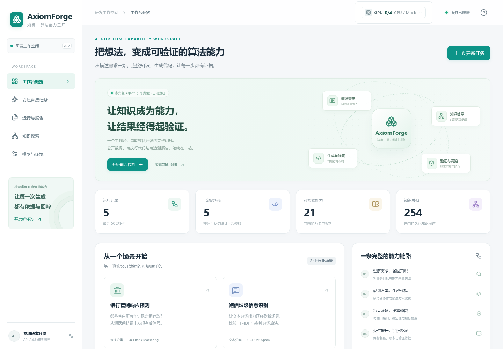
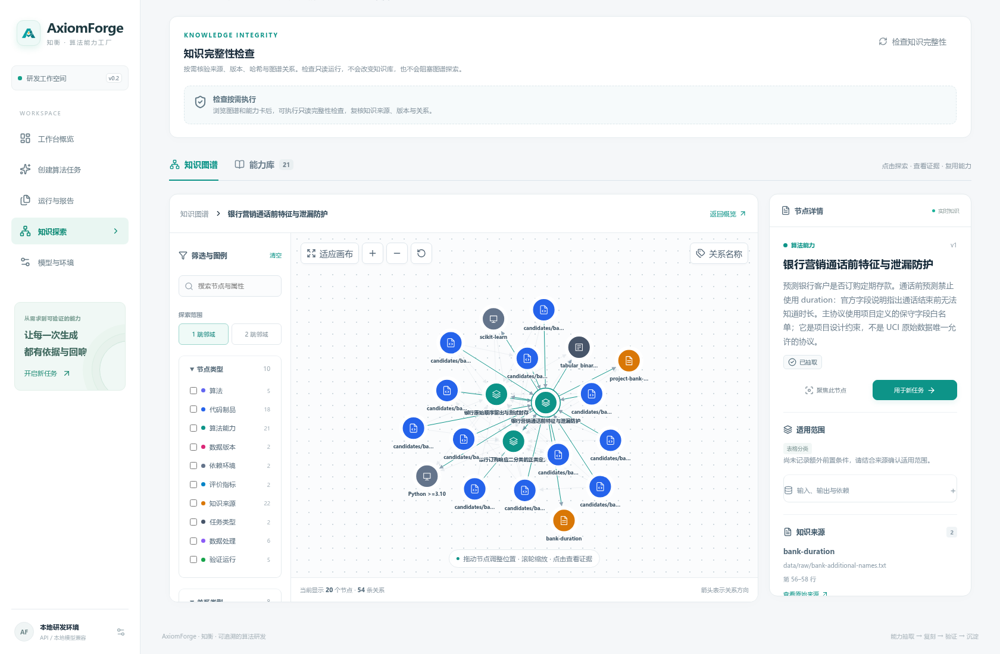
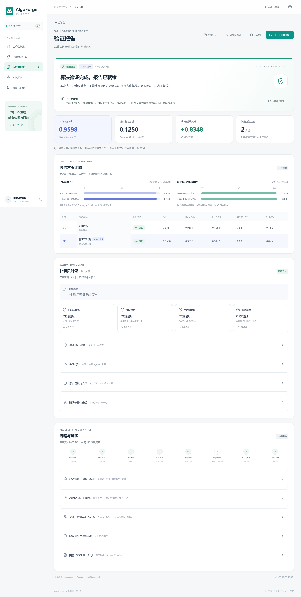
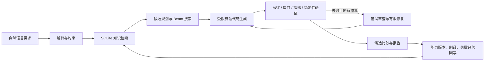

# AlgoForge · 可验证的算法能力工厂

> 将自然语言算法需求变成**有来源、有验证、有版本**的可运行算法能力。

AlgoForge 是面向 LLM Agent 笔试场景的小型可复现原型。它以**银行营销响应预测**为主场景，以 **SMS 垃圾信息分类**验证跨任务迁移，完整演示：能力理解、知识检索、方案规划、代码生成、自动验证、有限修复和知识回写。

[](https://github.com/dengdeng55525/algorithm-capability-factory/actions/workflows/ci.yml) [](https://github.com/dengdeng55525/algorithm-capability-factory/actions/workflows/frontend.yml)

仓库按成熟开源项目的方式组织，代码采用 MIT 许可证；第三方数据、模型和源码仍遵循各自许可证与使用条款，详见 [NOTICE](NOTICE)。

## 项目背景与目标

真实团队的算法能力通常分散在需求文档、历史代码、实验记录和专家经验里。AlgoForge 的目标不是让 LLM 任意执行代码，而是把这些能力转成有来源的结构化知识，再在固定数据协议和受限执行器中复刻、验证并沉淀。这样可以同时回答“为什么选这个算法”“代码是否能运行”“指标是否真实”“失败经验是否可复用”。

本原型面向题面要求的可复核闭环，主场景只选择一个具体业务问题：银行客户是否订购定期存款。SMS 分类用于证明相同编排和报告接口可以迁移到文本任务。

## 你可以先看到什么

- **Vue 工作台**：需求输入、运行监控、候选比较、折叠式验证报告、知识图谱和运行历史。
- **统一 Agent 工作流**：解释器 → 检索器 → 规划器 → 代码生成器 → 验证器 → 审查/修复器 → 回写器。
- **可审计知识图谱**：SQLite 持久化来源、能力、算法、数据、环境、验证运行、制品和失败经验。
- **可复现验证**：固定数据切分、主指标 AP、Dummy 基线、接口/功能/稳定性/资源检查，缺失值不填零。
- **多候选和有限搜索**：比较候选方案，并提供有界 Beam Search、修复预算和失败分母。
- **三种推理后端**：DeepSeek API、确定性 Mock、本地 OpenAI 兼容 HTTP 接口。四卡 14B 启动脚本和端点池已提供；实际 GPU 吞吐仍以目标机器验证报告为准。







截图只是界面证据；真实指标、运行状态和代码哈希以运行报告为准。

## 60 秒离线体验

Mock 不需要 API Key 或 GPU，可以先验证完整工程闭环：

```bash
git clone https://github.com/dengdeng55525/algorithm-capability-factory.git
cd algorithm-capability-factory
python3 -m venv .venv
source .venv/bin/activate
python -m pip install -r requirements.txt
python -m pip install -e '.[dev,ui]'
python scripts/verify_data.py
python -m capability_factory init --provider mock
python -m capability_factory run \
  --dataset bank \
  --provider mock \
  --max-candidates 2 \
  --max-repairs 2 \
  --description '预测银行客户是否订购定期存款，仅使用通话前特征，禁止 duration，比较两个候选并生成验证报告。'
```

命令会返回新的 `run_id`。报告可以通过 CLI 导出：

```bash
python -m capability_factory report RUN_ID --format json --output artifacts/demo-report.json
python -m capability_factory report RUN_ID --format markdown --output artifacts/demo-report.md
python -m capability_factory report RUN_ID --format html --output artifacts/demo-report.html
```

Mock 代表语言模型响应采用确定性规则，仍会执行真实的数据处理和算法验证；它不能作为真实 LLM 生成质量结论。

## 启动 Web 工作台

先构建 Vue 前端，需要 Node.js 22.12+ 和 npm：

```bash
# 在已按上一步创建的项目目录中执行
./scripts/build_web.sh
```

在两个终端启动 API 和 UI 网关：

```bash
# 终端 1
./scripts/start_api.sh

# 终端 2
./scripts/start_ui.sh
```

打开 <http://127.0.0.1:8501/app/>。API 进程也直接挂载同一工作台：<http://127.0.0.1:8000/app/>；OpenAPI 文档位于 <http://127.0.0.1:8000/docs>。

页面路径如下：

| 页面 | 路径 | 用途 |
| --- | --- | --- |
| 工作台概览 | `/app/#/` | 查看真实运行、能力和关系统计 |
| 创建算法任务 | `/app/#/workbench` | 输入需求、选择数据和推理后端 |
| 运行与验证报告 | `/app/#/runs/{run_id}` | 查看候选、检查、修复、代码和导出物 |
| 知识探索 | `/app/#/knowledge` | 探索图谱、来源、版本和验证路径 |
| 运行历史 | `/app/#/history` | 搜索、过滤和复用历史任务 |
| 模型与环境 | `/app/#/settings` | 查看 API、本地 14B 规划和执行边界 |

`start_ui.sh` 和 `start_api.sh` 会从脚本位置定位项目根目录，不依赖当前 shell 所在目录，也不会误用系统 `base` Python。旧版 Streamlit 入口保留在 `scripts/start_legacy_ui.sh`，默认 Vue 工作台是交付入口。

## 使用 DeepSeek API

凭证只放在服务端环境或未入 Git 的 `.env`：

```dotenv
DEEPSEEK_API_KEY=your-key
DEEPSEEK_BASE_URL=https://api.deepseek.com
DEEPSEEK_MODEL=deepseek-flash
```

然后检查并运行：

```bash
python -m capability_factory doctor --check-api
python -m capability_factory init --provider deepseek
python -m capability_factory run \
  --dataset bank \
  --provider deepseek \
  --search compare \
  --max-candidates 2 \
  --max-repairs 2 \
  --description '预测银行定期存款订购，禁止通话后特征，按验证集 AP 选择方案并保留来源和修复证据。'
```

`doctor --check-api` 只能证明端点可访问；完整 `run` 才能证明生成、验证和回写链路成功。真实 API 调用可能产生费用，浏览器不会读取或保存 API Key。

## 端到端闭环



每一步都写入结构化事件和事实字段；事件是工作流审计记录，不是隐藏思维链。工作流由同一个 LLM 按不同角色合约完成，文档不会把它包装成多个独立训练模型。

## 系统架构与模块

| 层 | 实现 | 选择理由 |
| --- | --- | --- |
| Agent 编排 | Python 显式状态机、Pydantic 合约 | 状态、预算、错误和终止条件可测试 |
| LLM | DeepSeek HTTP Provider、Mock Provider、本地 HTTP Provider | 真实 API 可用；Mock 便于离线复现；本地路线可替换 |
| 知识库 | SQLite + 属性图表 | 单机可复现，节点/关系/版本/来源可审计 |
| 检索 | 词项匹配 + 有界图扩展，最多两跳 | 结果可解释，能展示证据路径；不虚称为向量检索 |
| 算法执行 | 受限 AST 构造器 + 资源限制子进程 | 模型不能直接执行任意 Python 文本 |
| 验证 | scikit-learn 固定协议、AP/Dummy、接口和资源检查 | 算法候选使用统一分母和验证集 |
| 服务 | FastAPI + CLI | 同一套后端同时服务命令行、API 和 Web |
| 前端 | Vue 3 + TypeScript + D3 + Lucide | 报告、图谱和交互状态可清楚分层 |

执行器不是完整 Docker、虚拟机或操作系统级沙箱；它只接受受支持的算法构造语言。公网部署前仍需认证、租户隔离和更强的沙箱。

## 示例数据与任务

| 场景 | 公开数据 | 关键约束 | 主指标 |
| --- | --- | --- | --- |
| 银行营销响应（主场景） | UCI Bank Marketing | 只用通话前特征，禁止 `duration`；固定 60/20/20 切分 | Average Precision |
| SMS 垃圾信息分类（迁移场景） | UCI SMS Spam Collection | 文本规范化、分组去重、训练/验证/测试隔离 | Average Precision，并报告 F1 |

数据下载、来源、许可、行数和 SHA256 见 [数据与知识来源](docs/02_数据与知识来源.md)、[数据审计](docs/research/data_audit.json) 和 [来源索引](docs/SOURCES.md)。封存测试集不参与候选选择；生成候选只观察验证集。

## 知识图谱 schema

实际运行 schema 位于 [knowledge/runtime_schema.sql](knowledge/runtime_schema.sql)，使用 `cf_` 表前缀。主要节点包括：

- `Source`：URI、revision、许可证、内容哈希、文件/函数/行号定位。
- `Capability`：输入输出、适用条件、指标、依赖、状态和不可变版本。
- `TaskType`、`Algorithm`、`Transform`、`DatasetVersion`、`Environment`：能力适用范围和执行依赖。
- `ValidationRun`、`Artifact`、`FailureExperience`：运行状态、代码哈希、指标、失败指纹和修复关系。

主要关系包括 `DERIVED_FROM`、`USES`、`REQUIRES`、`EVALUATES`、`REPAIRS`、`AVOIDED_BY`、`SUPERSEDES`。来源关系表示可追溯性，不自动等价于算法已验证；验证证据必须沿真实运行路径查看。

```bash
python -m capability_factory export-graph --output artifacts/graph.json
# 可选：导出为 Gephi、yEd、NetworkX 等工具可读取的 GraphML
python scripts/export_graphml.py --output artifacts/graph.graphml
```

JSON 是 API/前端事实接口，GraphML 是离线交换格式；两者都从 SQLite 权威图谱生成，不维护第二份手工图数据。schema、节点示例和版本语义见 [系统架构与接口](docs/03_系统架构与接口.md)、[知识库 README](knowledge/README.md) 和 [前端/报告说明](docs/11_前端与报告说明.md)。

## 验证报告样例与公开证据

报告同时提供 JSON、Markdown 和 HTML：

- JSON：机器审计、接口集成和完整事实结构。
- Markdown：代码审查、答辩和版本控制友好。
- HTML：阅读候选比较、检查、资源、修复和来源。

报告首屏先显示运行结论、候选指标、基线和选择依据；计划、检索详情、修复链、代码和完整 JSON 默认折叠。`status`（工作流是否完成）和 `quality_status`（指标是否超过建议基线）分开表达；缺少检查或指标不会被显示为通过。

脱敏公开样例位于：

- [示例总览](examples/README.md)：每个证据包的运行方式、报告字段、导出规则和复核边界。
- [bank_repair](examples/evidence/bank_repair/)：银行任务、明确标记故障注入和有限修复。
- [bank_beam](examples/evidence/bank_beam/)：有界候选搜索及多候选对照。
- [sms_transfer](examples/evidence/sms_transfer/)：文本分类迁移示例。
- [knowledge_extraction.json](examples/evidence/knowledge_extraction.json)：能力抽取结果。

每个样例的复现命令、报告字段和脱敏导出规则见 [examples/README.md](examples/README.md)。每个样例的 `manifest.json` 记录源报告哈希、模式、状态、文件哈希和省略内容。样例目录名不能替代报告中的真实 `mode`、`status` 和指标检查。

## 生成算法代码示例

生成器输出受限的 `build_pipeline(task_spec)`，而不是任意 Python 程序。下面是公开 `bank_beam` 样例中被选中的逻辑回归候选节选；完整代码、验证 JSON 和 SHA256 位于 [bank_logistic_default](examples/evidence/bank_beam/candidates/bank_logistic_default/)。

```python
from sklearn.compose import ColumnTransformer
from sklearn.impute import SimpleImputer
from sklearn.linear_model import LogisticRegression
from sklearn.pipeline import Pipeline
from sklearn.preprocessing import OneHotEncoder, StandardScaler

def build_pipeline(task_spec):
    numeric = Pipeline([("impute", SimpleImputer(strategy="median")),
                        ("scale", StandardScaler())])
    categorical = OneHotEncoder(handle_unknown="ignore")
    prepare = ColumnTransformer([
        ("numeric", numeric, task_spec["numeric_features"]),
        ("categorical", categorical, task_spec["categorical_features"]),
    ])
    model = LogisticRegression(max_iter=1000, random_state=task_spec["seed"])
    return Pipeline([("prepare", prepare), ("model", model)])
```

可信执行器负责训练、预测、正类概率映射、行号对齐和指标计算；模型生成的字符串不会直接 `exec`。这段代码只说明交付接口，不代表脱离固定 `TaskSpec` 后可以运行任意数据。

## 验证结果与报告样例

以下数值直接读取公开 `report.json`，均为 `validation_only`，`sealed_test_scored=false`；它们是历史运行事实，不是最终测试集成绩或 SLA：

| 样例 | mode/status | 候选 | 选中方案 | AP | 其他观测 |
| --- | --- | ---: | --- | ---: | --- |
| `bank_beam` | real / passed | 6 | `bank_logistic_default` | 0.182877 | Lift@10%=2.093790 |
| `bank_repair` | real / passed | 2 | `bank_logreg_balanced` | 0.180759 | Lift@10%=1.984167；含标记故障修复 |
| `sms_transfer` | real / passed | 2 | `sms_nb_tfidf_default` | 0.959834 | F1@0.5=0.914729；Lift@10%=8.0 |

报告中 `candidate.status=passed` 只代表执行和强制检查通过，`quality_status` 另行表示验证集 AP 与类别占比基线的关系。完整 JSON、Markdown、HTML 和候选制品从 [examples/README.md](examples/README.md) 进入。

## 能力知识图谱示例

图谱中的能力版本、来源和验证运行通过真实关系连接。下面是脱敏后的最小结构示意，字段名称对应运行 schema：

```json
{
  "node": {
    "id": "capability:bank-precontact-policy:v1",
    "kind": "Capability",
    "input_schema": {"dataset": "bank", "features": "pre_contact_whitelist"},
    "output_schema": {"score": "probability", "positive_class": "yes"},
    "preconditions": ["duration must be excluded"],
    "metrics": ["average_precision", "lift_at_10pct"],
    "evidence": ["source:bank-task-protocol"]
  },
  "edges": [
    {"relation": "USES", "target": "algorithm:LogisticRegression"},
    {"relation": "DERIVED_FROM", "target": "source:bank-task-protocol"},
    {"relation": "EVALUATES", "target": "run:..."}
  ]
}
```

完整字段约束、版本语义和 SQL 表见 [系统架构与接口](docs/03_系统架构与接口.md) 和 [knowledge/runtime_schema.sql](knowledge/runtime_schema.sql)。

## 笔试要求对照

| 评分要求 | 代码/文档证据 |
| --- | --- |
| LLM 理解、抽取、生成、修复 | [providers.py](src/capability_factory/providers.py)、[prompts.py](src/capability_factory/prompts.py)、[workflow.py](src/capability_factory/workflow.py) |
| 行业场景与公开数据 | [datasets.py](src/capability_factory/datasets.py)、[数据协议](docs/02_数据与知识来源.md) |
| 知识库/知识图谱 | [knowledge.py](src/capability_factory/knowledge.py)、[runtime_schema.sql](knowledge/runtime_schema.sql) |
| 自然语言到可运行代码 | [workflow.py](src/capability_factory/workflow.py)、[execution/compiler.py](src/capability_factory/execution/compiler.py) |
| 统一验证 | [execution/runner.py](src/capability_factory/execution/runner.py)、[metrics.py](src/capability_factory/metrics.py) |
| API/CLI/Web | [api.py](src/capability_factory/api.py)、[cli.py](src/capability_factory/cli.py)、[web/](web) |
| 多候选、修复、Beam、插件 | [workflow.py](src/capability_factory/workflow.py)、[plugins.py](src/capability_factory/plugins.py)、[插件指南](docs/10_插件扩展指南.md) |
| 自动报告和回写 | [reporting.py](src/capability_factory/reporting.py)、[knowledge.py](src/capability_factory/knowledge.py) |
| 真实验收边界 | [实现与验收对照](docs/08_实现与验收对照.md)、[后端验证索引](docs/research/execution_validation.json)、[前端验证索引](docs/research/frontend_validation.json) |

## 仓库结构

```text
src/capability_factory/   Python 核心：workflow、knowledge、execution、API、CLI
web/                      Vue 工作台源码和 Playwright 测试
ui/                       可选旧版 Streamlit 界面
configs/                  数据任务和验证协议
knowledge/                SQLite schema、种子能力和图谱说明
examples/evidence/        脱敏报告、代码和抽取结果
scripts/                  数据校验、实验、构建和启动脚本
tests/                    Python 单元/接口/集成测试
docs/                     架构、数据、演示、验收、部署和验证记录
artifacts/                本地运行产物，默认不提交
```

## 测试、格式和持续集成

Python：

```bash
.venv/bin/pytest -q tests ui
.venv/bin/ruff check src scripts tests ui
.venv/bin/python -m compileall -q src scripts ui
```

Web：

```bash
cd web
npm ci
npm run format:check
npm run build
npm run test:e2e
```

浏览器测试使用 HTTP 夹具，不调用付费模型；它验证 UI 状态、报告折叠、图谱交互和错误恢复。GitHub Actions 对 CPU 回归和 Web 交互分别执行同样的可复现检查。当前机器的完整结果和限制写在 [frontend_validation.json](docs/research/frontend_validation.json)，不要手工复制测试数量作为长期承诺。

## 文档地图

- [文档总览](docs/README.md)：按读者和任务选择入口。
- [使用与演示](docs/07_使用与演示指南.md)：安装、CLI、API、Web 和答辩流程。
- [系统架构与接口](docs/03_系统架构与接口.md)：Agent 合约、状态机、图谱和接口。
- [数据与知识来源](docs/02_数据与知识来源.md)：公开数据、切分、防泄漏和来源。
- [实现与验收对照](docs/08_实现与验收对照.md)：原题逐项映射和证据边界。
- [前端与报告说明](docs/11_前端与报告说明.md)：报告层次、JSON 折叠和图谱证据。
- [交互工作台与参考设计](docs/12_交互工作台与参考设计.md)：界面交互与截图验收。
- [算力与四卡兼容](docs/05_算力预算与四卡兼容.md)：1–4 张 RTX 4090D 的规划边界。
- [部署说明](deploy/README.md)：Vue 网关、容器模板和本地模型接入边界。
- [变更记录](CHANGELOG.md)、[贡献指南](CONTRIBUTING.md)、[安全说明](SECURITY.md)和 [第三方声明](NOTICE)。

## 挑战与解决方案

| 挑战 | 当前方案 | 仍需注意 |
| --- | --- | --- |
| 通话时长造成标签泄漏 | 固定 pre-contact 特征白名单和 `duration` 禁用检查 | 只对已支持的银行协议负责 |
| LLM 代码不可直接信任 | 受限 AST 构造器、可信 evaluator、资源限制子进程 | 尚非 OS 级沙箱 |
| API 费用和网络失败 | Mock 离线模式、Provider 明示、预算/超时/不确定提交保护 | 真实 API 账单以服务商为准 |
| 图谱关系噪声 | 词项检索 + 有界 1/2 跳路径和来源哈希 | 尚非向量检索或企业级图数据库 |
| 本地 14B/多卡落地 | OpenAI 兼容 Provider 和静态 profiles | 尚未下载权重、部署或测吞吐 |

## 后续扩展方向

以下方向标记为 planned，不能当作当前完成项：

1. **更强隔离**：接入专用执行节点、容器强化或 microVM，并验证网络/凭证/文件边界。
2. **更严格评测**：建立能力抽取 gold、图检索消融、经验复用实验和固定预算的多轮重复。
3. **本地模型部署**：先完成单卡 Qwen 14B 结构化输出验收，再扩展四卡并记录 OOM、吞吐和回收。
4. **服务化能力**：增加认证、租户隔离、持久队列、审计保留策略和 PostgreSQL 存储后端。
5. **任务插件**：在不改变 Agent 状态机的前提下增加时间序列、异常检测和推荐任务。

## 当前边界

- 默认路线是 DeepSeek API；本地 Qwen2.5-Coder-14B AWQ、vLLM、四卡配置目前只是兼容框架和静态规划。
- API、Mock、历史回放和本地模型状态严格区分；Mock 结果不是真实 LLM 质量。
- 只支持固定的银行表格任务和 SMS 文本任务，不接受任意上传数据或任意 Python 代码。
- 当前服务是本机单用户原型，没有公网鉴权、租户隔离、持久队列或完整 OS 沙箱。
- 任何性能、成本、修复率或跨任务提升都必须来自对应实验报告，不能从代码入口推导。

## 贡献、反馈与许可证

贡献流程、提交约定和本地检查见 [CONTRIBUTING.md](CONTRIBUTING.md)。安全边界和敏感信息处理见 [SECURITY.md](SECURITY.md)。

项目目前是可复现的笔试原型，代码按 MIT 许可证分发；第三方数据、模型和源码不因本项目许可证获得额外授权。
