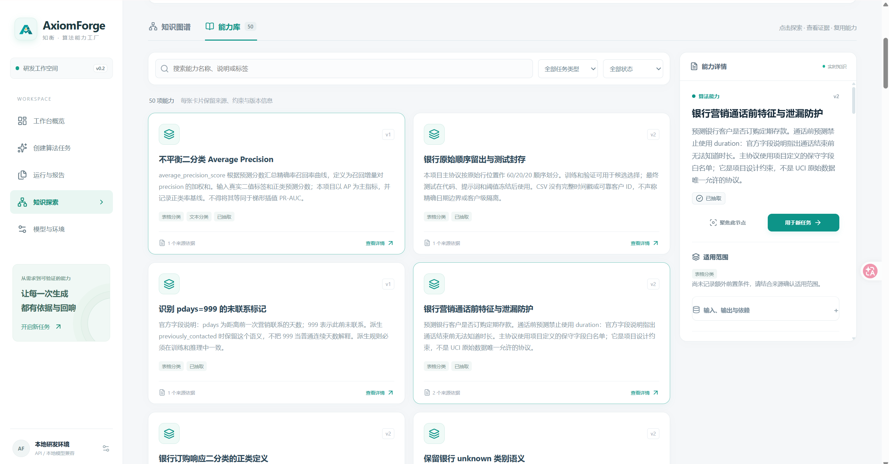
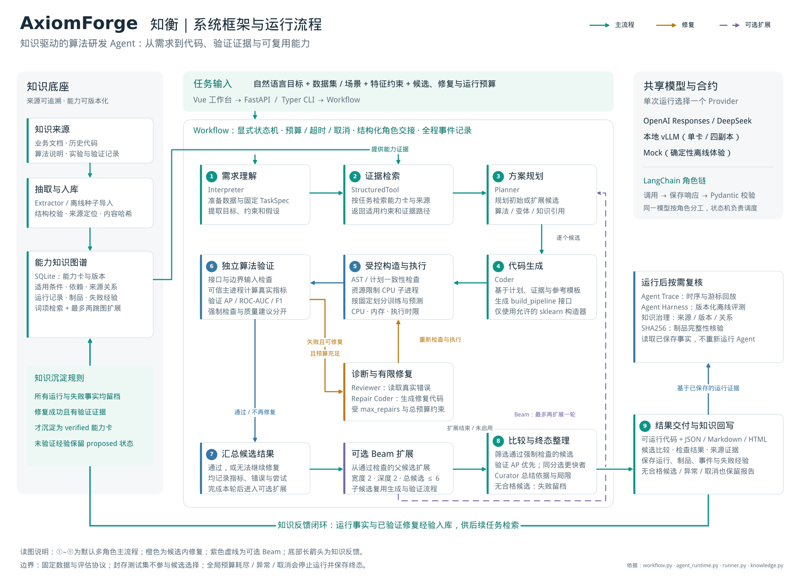
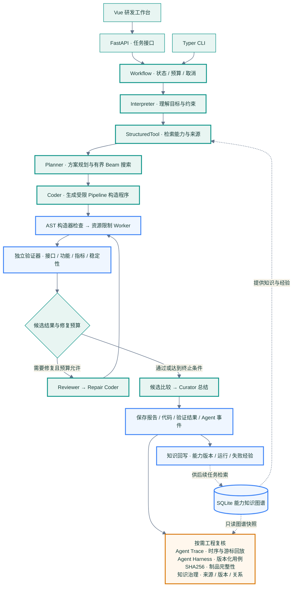
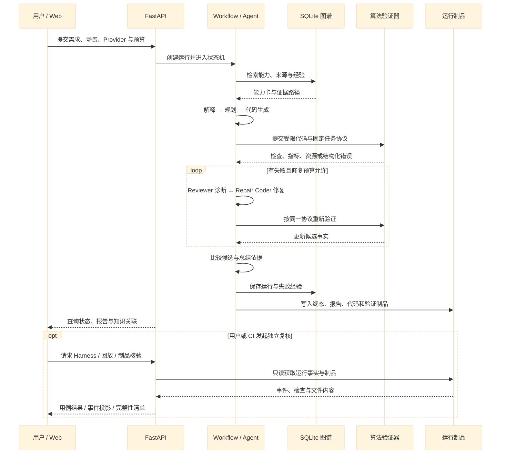

<p align="center">
  
</p>

<h1 align="center">AxiomForge · 知衡</h1>

<p align="center"><strong>作者：丁俊泽（Ding Junze）</strong></p>

### 知识驱动，验证有据。让算法能力持续生长。

**AxiomForge · 知衡**是面向算法研发的 Agent 工程平台。它将自然语言需求、行业知识与历史代码连接起来，完成**理解 → 检索 → 规划 → 生成 → 验证 → 修复 → 沉淀**，交付可运行代码、可阅读报告和可追溯的能力版本。

Knowledge-grounded agents for reproducible algorithm engineering.

[](https://github.com/dengdeng55525/axiomforge/actions/workflows/ci.yml) [](https://github.com/dengdeng55525/axiomforge/actions/workflows/frontend.yml)

[项目目标](#项目背景与目标) · [演示视频](#项目演示视频) · [能力库](#能力库) · [框架图](#系统框架与模块设计) · [快速开始](#快速离线体验) · [验证报告](#验证报告与结果) · [Agent Harness](#agent-harness-离线评测) · [知识图谱](#知识图谱与能力资产) · [文档中心](docs/README.md)

## 项目背景与目标

算法经验分散在业务文档、历史代码、实验记录和验证报告中。AxiomForge · 知衡把这些材料转化为可检索、可验证、可版本化的算法能力资产，再由 Agent 工作流把自然语言需求推进到可运行代码、独立验证和知识回写。

项目以**银行营销响应预测**为主场景，以 **SMS 垃圾信息分类**展示跨场景迁移。两类任务使用公开数据，共享编排、验证、报告与知识接口，分别管理特征规则和数据划分。

项目目标覆盖算法能力工厂的完整闭环：

- 把自然语言需求解析为任务目标、输入输出、业务约束、评价指标和资源预算。
- 从结构化知识图谱、批准来源和历史失败经验中检索可复用依据。
- 通过 Interpreter、Planner、Coder、Reviewer、Repair Coder 和 Curator 协作生成多个候选方案。
- 在受限执行器中检查代码安全、接口规范、功能正确性、指标表现和运行稳定性。
- 把运行报告、候选代码、失败诊断、修复结果和能力版本保存为下一次检索直接使用的证据。

### 目标拆解

1. **统一需求语言**：将行业描述转换为可校验的任务目标、输入输出、特征白名单、指标和资源预算。
2. **统一算法交付**：让每个候选方案都产生代码、来源、执行事实、指标和制品哈希，交付内容可复现、可审查。
3. **统一知识回写**：把验证通过的能力、失败指纹和修复路径写入版本化图谱，直接用于下一次检索和候选规划。


工作台将任务、报告和知识放在同一个研发空间：从需求进入运行，从结论展开证据，再沿图谱追溯来源与历史。

| 核心能力 | 工程价值 |
| --- | --- |
| 结构化 Agent 协作 | LangChain 角色链、Pydantic 合约与显式状态机统一管理交接、预算和终止条件 |
| 图谱增强生成 | 词项检索与有界图扩展提供能力卡、来源、适用约束和失败经验 |
| 多候选搜索与修复 | 比较合法算法变体，使用 Beam Search 扩展候选，根据真实执行错误修复 |
| 独立算法验证 | 受限构造器、资源限制进程、固定数据协议、可信主进程指标计算 |
| Agent 观测与 Harness | 角色与工具时序、token 预算、事件回放、版本化离线评测 |
| 可复现知识资产 | 能力版本、来源哈希、验证记录、失败经验与按需制品完整性核验 |
| API 与本地推理 | OpenAI Responses、DeepSeek、本地兼容 HTTP、Mock，配套单卡与四卡 14B 配置 |

## 项目演示视频

第一段项目视频展示工作台、任务配置、验证报告与知识图谱交互。点击播放器即可在 GitHub 内观看，也可[下载项目演示视频](display/display.mp4)。

https://github.com/user-attachments/assets/0716fbd6-675a-4dd8-863c-39e44db8545a

第二段项目视频聚焦能力库：能力卡检索、来源定位、关系探索、版本详情和 Web 端能力关联。点击播放器即可在 GitHub 内观看，也可[下载能力库演示视频](display/display2.mp4)。

https://github.com/user-attachments/assets/d7f21835-b554-4202-b7f1-7fc689542f15

第三段项目视频聚焦本地部署：模型与环境切换、GPU 状态、任务运行、验证报告和知识回写。点击播放器即可在 GitHub 内观看，也可[下载本地部署演示视频](display/display3.mp4)。

https://github.com/user-attachments/assets/afe2894e-6596-485d-a983-74cdb6e76f8d

## 能力库

AxiomForge 的能力库把算法研发中的规则、指标、数据协议、代码经验和失败修复路径组织为可检索的能力卡。每张卡片都带有来源、版本、适用范围、输入输出、依赖环境和验证状态，能够直接参与下一次任务的检索、规划和复用。



上图展示能力库的完整交互面：左侧进入知识探索，中间区域提供能力名称、说明或标签搜索，并按任务类型和状态筛选；卡片显示版本、能力类型、来源数量和抽取状态；右侧详情面板集中呈现能力说明、适用范围、输入输出与依赖，并通过“聚焦此节点”和“用于新任务”继续展开图谱或创建任务。

### 能力资产的组织方式

1. **能力卡索引**：覆盖平均精度、银行通话前特征与泄漏防护、`pdays=999` 未联系标记、未知类别处理和文本分类等可复用规则。
2. **版本与状态**：使用 `capability_id + version + content_sha256` 管理不可变版本，状态区分 `draft`、`extracted`、`verified` 和 `deprecated`。
3. **来源与证据**：每张卡关联公开数据说明、项目协议或固定 Git 提交，保存 `source_id`、revision、locator、许可证和内容哈希。
4. **适用边界**：卡片明确任务类型、输入输出、依赖、评价指标和禁止条件；银行任务中的 `duration` 泄漏约束、SMS 文本去重和训练集词表隔离均以卡片形式进入规划。
5. **复用闭环**：从能力详情聚焦图谱节点，沿 `DERIVED_FROM`、`USES`、`IMPLEMENTS`、`EVALUATES` 和 `SUPERSEDES` 追踪证据，再使用“用于新任务”把选中的能力带入 Workflow。

能力库列表负责快速定位资产，知识图谱负责展开来源与关系，验证报告负责回看运行事实。三者共用 SQLite 持久化数据和版本化 API，形成“检索 → 复用 → 验证 → 回写”的资产闭环。

## 系统框架与模块设计

下面的框架图对应仓库的实际模块边界：用户从 Vue 工作台、FastAPI 或 Typer CLI 进入 Workflow；Agent 角色链负责理解、检索、规划、生成和修复；独立验证器负责算法事实；报告、图谱、Harness 和制品哈希共同形成可追溯的回写闭环。

<p align="center">
  
</p>

图中央的 ①–⑨ 展开主流程：需求理解 → 证据检索 → 方案规划 → 代码生成 → 受控执行 → 独立验证 → 汇总候选 → 比较与终态整理 → 结果交付。橙色支路由 Reviewer 与 Repair Coder 处理候选失败，紫色虚线表示运行期间的 Beam 扩展；两条支路都重新经过同一个验证器。底部反馈路径把运行与修复经验写回左侧知识底座，右侧的 Trace、Harness、知识治理和 SHA256 核验用于运行后的独立复核。[打开框架图原图](AxiomForge_Framework.svg)支持放大查看模块连接。

模块之间通过明确合约连接：`contracts.py` 定义角色输出，`workflow.py` 管理状态、预算和终止，`agent_runtime.py` 组织 LangChain Runnable，`knowledge.py` 持久化能力图谱，`execution/` 执行受限算法，`reporting.py` 生成 JSON、Markdown 和 HTML，FastAPI、Vue 和 CLI 复用同一份运行事实。

### 模块边界

1. **入口与编排**：Vue、FastAPI 和 Typer 只负责收集请求、展示状态和导出结果；`Workflow` 负责状态、预算、取消与终态。
2. **Agent 与事实隔离**：Interpreter、Planner、Coder、Reviewer、Repair Coder 和 Curator 通过 Pydantic 合约交接；算法执行与指标计算由独立验证器完成。
3. **结果与治理回写**：报告、候选代码、Agent 事件、Harness 结果、知识关系和 SHA256 清单共同组成一次运行的证据包。

| 模块 | 输入与职责 | 输出与协作边界 |
| --- | --- | --- |
| 入口层 `api.py` / `cli.py` / `web/` | 接收需求、数据场景、Provider、候选与修复预算 | 经 `RunRequest` 校验后提交运行，按运行 ID 查询进度与报告 |
| 编排层 `workflow.py` / `agent_runtime.py` | 固定任务协议、调用角色、管理候选与全局预算 | 有序事件、角色响应、候选计划和终态；统一处理取消与异常 |
| 知识层 `ingestion.py` / `repository.py` / `knowledge.py` | 摄取文档和 Git 快照，定位来源，检索能力与邻域 | 带版本、来源、约束和路径的能力卡；保存运行与失败经验 |
| 执行层 `execution/compiler.py` / `runner.py` | 校验构造程序、准备 worker 输入、限制资源 | 预测、检查项、结构化错误和资源测量；主进程独立计算指标 |
| 交付层 `reporting.py` / `optimization.py` | 聚合候选事实、选中结果、质量与成本 | 三种报告、候选代码、资源比较与 Pareto 前沿 |
| 复核层 `harness.py` / `knowledge_governance.py` / `reproducibility.py` | 读取已保存轨迹、知识快照和运行制品 | 用例检查、来源与版本治理、SHA256 完整性结果 |

深入核对接口、状态机、数据协议、部署和实验记录，请进入[文档中心](docs/README.md)。文档中心按“首次运行、架构理解、Agent 工程、知识治理、部署验证、扩展开发”组织了完整资料，用于核对代码边界并复现实验。

## 快速离线体验

使用 Python 3.10+；前端构建使用 Node.js 22.12+。Mock 模式无需 API Key 或 GPU，完整闭环包括真实的 CPU 训练与指标验证。`requirements.txt` 固定复现依赖，`pyproject.toml` 提供可编辑安装与 `axiomforge` 命令。

```bash
git clone https://github.com/dengdeng55525/axiomforge.git
cd axiomforge
python3 -m venv .venv
source .venv/bin/activate
python -m pip install -r requirements.txt
python -m pip install --no-deps -e .
python scripts/verify_data.py

axiomforge init --provider mock
axiomforge run \
  --dataset bank --provider mock \
  --max-candidates 2 --max-repairs 2 \
  --description '预测银行客户是否订购定期存款，仅使用通话前特征，禁止 duration，比较两个候选并生成验证报告。'
```

命令返回 `run_id`。将其替换到下面的命令，导出同一次运行的三种报告：

```bash
axiomforge report RUN_ID --format json --output artifacts/demo-report.json
axiomforge report RUN_ID --format markdown --output artifacts/demo-report.md
axiomforge report RUN_ID --format html --output artifacts/demo-report.html
```

Mock 使用确定性规则产生角色响应，同时执行真实的数据处理、算法训练和验证。报告通过 `mode` 区分 Mock 与真实模型运行。Python 模块入口 `python -m capability_factory` 与 `axiomforge` 命令等价。

### 离线复现步骤

1. **准备数据与知识底座**：执行 `verify_data.py` 和 `axiomforge init --provider mock`，固定公开数据版本、来源哈希与种子能力卡。
2. **运行端到端任务**：使用 `axiomforge run` 创建候选、执行验证、保存事件并回写知识库；同一条命令支持银行和 SMS 场景。
3. **导出工程制品**：通过 `axiomforge report` 生成 JSON、Markdown、HTML 三种报告，再用 `validate`、`harness` 和 `analyze-run` 做只读复核。


`init` 导入来源和种子能力卡，输出摄取数量与模式；`run` 生成候选、执行验证，并把结果写入 `artifacts/runs/<run_id>/`。

### 环境与首次运行检查

所有命令在仓库根目录、项目虚拟环境内执行。先运行 `axiomforge status` 检查数据和知识库，再运行 `axiomforge doctor` 查看执行器与模型配置。数据校验脚本优先校验缓存归档，缺失时从 UCI 下载并核对固定 SHA256；哈希不一致会停止处理。

| 入口 | 启动前准备 | 成功后查看 |
| --- | --- | --- |
| CLI / Mock | Python 依赖、数据校验、`init --provider mock` | 终端的 `run_id`、候选摘要、报告路径 |
| Web / API | 构建 `web/dist/`，启动 FastAPI | `/app/` 工作台、`/docs` 接口说明、`/health` 状态 |
| 云端 API | 在项目 `.env` 配置服务端 Key、模型 ID 和端点 | `doctor --check-api`，然后在创建任务页选择 Provider |
| 本地 14B | 启动独立 vLLM 服务，配置单卡或四副本端点 | 模型与环境页面、GPU 状态栏、本地任务报告 |

`python -m capability_factory` 与 `.venv/bin/axiomforge` 可用于明确指定项目环境。出现 `No module named capability_factory` 时，在仓库内执行上述可编辑安装；Web 启动、API / 本地切换和常见问题见[使用指南](docs/07_使用与演示指南.md)。

### CLI 运行契约

CLI 与 Web 使用同一套 `Workflow`、SQLite 知识库和报告格式。诊断、治理和 Harness 命令默认读取本地事实；模型调用仅由 `run`、`init` 和显式的 `doctor --check-api` 触发。

| 命令 | 作用 | 读写边界 | 成功退出码 | JSON 产物 |
| --- | --- | --- | ---: | --- |
| `axiomforge status` | 汇总 Python、Provider、四卡槽位、数据集、知识库和最近运行 | 只读；不创建数据库、不请求网络 | `0` | 标准输出 `axiomforge-status.v1` |
| `axiomforge doctor` | 检查运行前提、执行器和本地部署配置 | 只读；默认不请求网络 | `0` | 标准输出 `axiomforge-doctor.v1` |
| `axiomforge doctor --check-api --provider openai` | 在显式授权下读取模型目录 | 仅访问选定 API；不会读取代理环境变量 | `0` 已认证，`1` 连接或配置失败 | 结果包含脱敏的 `api_status` |
| `axiomforge validate` | 检查知识图谱来源、版本、哈希和关系完整性 | SQLite 只读打开，不初始化或迁移 | `0` 质量门通过，`1` 缺失或失败 | `--output artifacts/validation.json` |
| `axiomforge validate RUN_ID --case bank_e2e` | 对单次运行执行对应 Harness 用例 | 只读已保存事件；不调用模型、不执行生成代码 | `0` 运行与用例均通过，`1` 失败 | `--output artifacts/harness/run.json` |
| `axiomforge validate RUN_ID --suite` | 对单次运行执行全部版本化 Harness 用例 | 只读 | `0` 全部通过，`1` 存在失败用例 | `--output artifacts/harness/suite.json` |
| `axiomforge harness replay RUN_ID --through 12` | 回放脱敏 Agent 事件 | 只读；按游标裁剪 | `0` | 标准输出 `agent-trace.v1` |

常用的本地检查路径如下。`status` 在刚安装的空目录即可执行；`validate` 明确返回数据库缺失或质量门失败，作为 CI 门禁。

```bash
axiomforge status --recent 5
axiomforge doctor
axiomforge validate --output artifacts/knowledge-validation.json
axiomforge validate RUN_ID --case bank_e2e \
  --output artifacts/harness/RUN_ID.json
axiomforge validate RUN_ID --suite \
  --output artifacts/harness/RUN_ID-suite.json
```

诊断与治理输出包含版本化 `schema_version`，运行级命令同时返回运行标识。`validate --output` 可把检查结果保存为 CI 制品；查询和离线评测复用已保存事实。模型调用、算法训练和知识回写由 `run` 负责。


`status` 作为进入项目后的第一条命令，`doctor` 用于定位依赖、数据和端点配置。两者默认离线读取本地事实，输出可保存为 CI 附件。

## Web 研发工作台

前端使用 Vue 3、TypeScript、D3 和 Lucide。创建任务时选择场景与推理后端，填写目标和约束，再设置候选、搜索与修复预算。运行详情围绕结论、比较和证据展开，中间态按需折叠。


### 启动方式

构建前端需要 Node.js 22.12+ 和 npm。在项目目录执行：

```bash
./scripts/build_web.sh

# 终端 1：API 与任务执行服务
./scripts/start_api.sh

# 终端 2：Web 网关
./scripts/start_ui.sh
```

打开 <http://127.0.0.1:8501/app/>。API 也直接挂载工作台：<http://127.0.0.1:8000/app/>；交互式接口文档位于 <http://127.0.0.1:8000/docs>。

启动脚本从自身位置定位项目根目录，并使用项目 Python 环境。Python 数据科学界面的 Streamlit 入口位于 `scripts/start_legacy_ui.sh`。

| 页面 | 路径 | 后端事实来源 |
| --- | --- | --- |
| 工作台概览 | `/app/#/` | `/runs`、`/capabilities`、`/graph` |
| 创建算法任务 | `/app/#/workbench` | `/config`、`POST /runs` |
| 运行与验证报告 | `/app/#/runs/{run_id}` | `/runs/{run_id}`、`/runs/{run_id}/agent-trace` |
| 知识探索 | `/app/#/knowledge` | `/graph/explore`、`/capabilities/{id}`、`/knowledge/quality` |
| 运行历史 | `/app/#/history` | `/runs` |
| 模型与环境 | `/app/#/settings` | `/config`、`/health`、`/inference/profiles` |


CLI 和 Web 进入同一个 Workflow。命令行输出保留运行标识、候选摘要、模型用量和报告路径，供脚本调用 `validate`、`harness`、`report` 与 `analyze-run`。

## 模型接入与计算资源

服务端配置好凭证或本地端点后，用户可在创建任务页面选择推理后端。后端共用相同的角色合约、验证器和报告格式，便于在固定任务协议下比较运行结果。


| 推理方式 | Provider | 配置 | 适用方式 |
| --- | --- | --- | --- |
| OpenAI / 兼容 Responses 网关 | `openai` | `OPENAI_*` | 官方 Python SDK、Responses 流式或非流式调用 |
| DeepSeek API | `deepseek` | `DEEPSEEK_*` | 云端理解、规划、生成与修复 |
| 本地模型 | `local_http` | `LOCAL_LLM_*` | Qwen2.5-Coder-14B AWQ、vLLM 兼容接口与端点池 |
| 确定性 Mock | `mock` | 无凭证 | 离线体验、工程回归和界面测试 |

### 云端 API

将所选服务的配置写入项目根目录未入 Git 的 `.env`，参考 [.env.example](.env.example)。密钥仅由服务端读取：

```dotenv
# OpenAI 或部署者提供的 Responses 兼容服务
OPENAI_API_KEY=your-server-api-key
OPENAI_BASE_URL=https://api.openai.com/v1
OPENAI_MODEL=your-available-model-id
OPENAI_STREAM=true

# DeepSeek
DEEPSEEK_API_KEY=your-key
DEEPSEEK_BASE_URL=https://api.deepseek.com
DEEPSEEK_MODEL=deepseek-flash
```

```bash
axiomforge doctor --provider openai --check-api
axiomforge run \
  --dataset bank --provider openai --search compare \
  --max-candidates 2 --max-repairs 2 \
  --description '预测银行定期存款订购，仅使用通话前特征，保存候选比较、验证结果与知识来源。'
```

将 `--provider` 换为 `deepseek` 即可复用这条流程。`init --provider mock` 导入离线种子知识；`init --provider openai` 或 `deepseek` 可使用模型从批准的来源片段抽取能力卡。

Responses Provider 在终态响应到达、用量核验及 JSON / Pydantic 校验完成后交接结果。报告记录请求模型、返回模型、传输模式和实际 token 用量；预算与取消贯穿模型调用。接口与配置说明见 [技术选型与框架集成](docs/14_技术选型与框架集成.md)。

### 本地 14B 与四卡部署

默认四卡方案采用 **4 个 Qwen2.5-Coder-14B-Instruct-AWQ 单卡副本**，分别监听 8100–8103，通过 `local_http` 端点池调用。单卡配置使用相同的模型别名和任务接口。模型服务独立部署，算法训练与验证由 CPU worker 执行。

```dotenv
LOCAL_LLM_PROFILE=four_gpu_14b
LOCAL_LLM_MODEL=coder14
LOCAL_LLM_BASE_URL=http://127.0.0.1:8100/v1
LOCAL_LLM_ENDPOINTS=http://127.0.0.1:8100/v1,http://127.0.0.1:8101/v1,http://127.0.0.1:8102/v1,http://127.0.0.1:8103/v1
```

| 资源档位 | GPU | 主机内存 | 配置 |
| --- | --- | --- | --- |
| API / Mock | 0 | 16 GiB | `api` |
| 单卡本地 14B | 1 × RTX 4090D 24 GB | 32 GiB | `single_gpu_14b` |
| 四卡本地 14B | 4 × RTX 4090D 24 GB | 64–128 GiB | `four_gpu_14b` |

配置固定模型 revision、端口和 GPU 分组。驱动、CUDA、vLLM、上下文长度与并发共同影响实际占用，部署时通过健康检查和本地任务记录资源。安装、启动和端点验证见 [四卡部署指南](docs/05_算力预算与四卡兼容.md)、[推理配置](configs/inference_profiles.json) 与 [部署说明](deploy/README.md)。

### GPU 状态栏

顶栏提供固定的 GPU 0–3 四槽位视图，显示可见卡数、设备可见状态、利用率、显存和温度。展开面板即可查看每张卡；没有可见 GPU 时，界面保留 API / Mock 的使用路径。


`GET /system/gpus` 与 `/health` 返回 `gpu-status.v1` 快照。设备可见性来自进程级 `nvidia-smi` 读取，模型端点状态单独管理。状态探测不改变 CUDA、代理或 SSH 配置；需要临时代理时，将参数限定在目标应用进程，详见部署指南。

## 端到端闭环

Web 通过 FastAPI 提交任务，CLI 直接调用同一个 Workflow。Agent 运行层负责结构化交接，独立验证器负责代码执行与算法指标；报告和知识回写保留运行事实。运行后的 Harness、知识治理与制品核验从已保存事实中按需产生检查结果。



### 运行的证据时序



算法验证器计算运行期的代码与指标事实；Agent Harness 评估已保存的工作流证据。知识治理和完整性检查是按需复核接口，独立于知识回写路径。边界动作写入事件，模型输出通过结构化合约后进入下一阶段。

## Agent 工作流设计与模块协作

一次运行由选定的 Provider 承担多个专职角色。LangChain Core 的 `RunnableSequence` 连接 `invoke_provider → persist_response → validate_contract`，`StructuredTool` 封装只读能力检索，Workflow 控制搜索、修复、预算和终态。

### Agent 执行步骤

1. **理解**：Interpreter 将自然语言拆成任务类型、输入输出、约束、指标和预算。
2. **检索**：StructuredTool 查询能力卡、来源、版本、失败经验和邻域关系，形成带 `evidence_ids` 的证据包。
3. **规划**：Planner 生成候选算法、变体、父子关系、资源估计和设计依据，并执行有界 Beam 扩展。
4. **生成**：Coder 按 `build_pipeline(task_spec)` 合约生成受限构造程序，AST 检查先于执行。
5. **验证**：Worker 在固定数据协议和资源预算内运行，主进程独立计算接口、功能、稳定性和指标事实。
6. **修复与搜索**：Reviewer 读取真实错误，Repair Coder 在预算内提交下一次尝试；通过候选比较选择终态。
7. **沉淀**：Curator 汇总依据、代码、检查、失败指纹和资源记录，写入报告、能力版本与运行事件。

| 角色 | 职责 | 输出合约 |
| --- | --- | --- |
| `interpreter` | 提取目标、特征约束、假设与警告 | `TaskInterpretation` |
| `planner` | 根据知识证据设计候选、变体、父子关系与实现依据 | `PlanSet` / `CandidatePlan` |
| `coder` | 生成允许范围内的 sklearn Pipeline 构造程序 | `GeneratedCode` |
| `reviewer` | 读取真实错误，给出诊断和具体修复建议 | `Review` |
| `repair_coder` | 根据诊断生成下一次代码并提交重新验证 | `GeneratedCode` |
| `curator` | 汇总实测候选、失败记录与选择依据 | `Explanation` |
| `extractor` | 从批准的文档或代码来源抽取能力卡 | 带来源的能力卡集合 |

角色提示词见 [prompts.py](src/capability_factory/prompts.py)，输出约束见 [contracts.py](src/capability_factory/contracts.py)。调用文件、耗时、模型和 token 统计保存于 `artifacts/runs/<run_id>/llm/` 与报告的 `usage.records`，运行层元数据记录在 `provenance.agent_runtime`。

### 从需求到知识回写

以“仅使用通话前信息，比较客户订购预测方案”为例，Workflow 先加载银行字段白名单和固定划分，再让 Interpreter 提取目标与约束。检索工具返回通话时长禁用规则、混合列处理、未知类别处理和 AP 评价等能力卡；Planner 在 `evidence_ids` 中引用这些依据，并为每个候选记录算法、参数变体和设计理由。

Coder 接收计划、任务协议和检索结果，输出统一的 Pipeline 构造函数。执行器检查构造程序与计划的一致性，再训练和验证；错误以类型、消息和检查项进入 Reviewer。Reviewer 给出诊断与修改建议，Repair Coder 生成下一次代码，随后按相同数据协议重新验证。每次尝试保存独立代码哈希、检查结果与修复记录。

候选比较从通过强制检查的方案中按验证 AP 降序选择，同分时优先训练耗时更短的方案。Curator 使用候选事实总结设计依据和取舍；运行状态、制品和经验随后写回知识库。经过验证的修复经验形成 `verified` 能力卡，未完成验证的建议标记为 `proposed` 经验状态。

### 搜索、修复与终止策略

| 控制项 | 实现方式 | 工程作用 |
| --- | --- | --- |
| 候选比较 | `--search compare` 在相同数据协议下比较初始方案 | 使算法差异与指标变化可以直接对照 |
| Beam 扩展 | `--search beam`，宽度 2、深度 2，最多 6 个候选 | 从通过检查的父方案扩展合法变体，记录父子关系和剪枝 |
| 有限修复 | `--max-repairs` 为 0–2，每次修复重新验证 | 将错误诊断与可运行修复绑定，保留失败到恢复的路径 |
| 全局预算 | `--max-seconds` 为 10–1800 秒，同时约束调用与 token | 防止角色循环、候选扩展和慢响应持续占用资源 |
| 终态保存 | 成功、失败、取消与异常均进入终态整理 | 部分候选与失败原因仍可通过运行 ID 查询 |

`--orchestration multi_role` 使用完整角色链；`single_shot` 提供单次生成的对照入口。角色合约、工具调用、预算和最终算法验证均由服务层控制，便于开展固定条件下的编排比较。

### 工具选型与集成理由

| 工具 | 实际职责 | 选型理由与入口 |
| --- | --- | --- |
| **LangChain Core** | Runnable 角色链、StructuredTool 图检索 | 结构化交接可组合，预算与状态可测试；[运行层](src/capability_factory/agent_runtime.py) |
| **OpenAI Python SDK** | Responses API 请求、流式响应与用量解析 | 官方 SDK 与统一 Provider 合约衔接；[Provider](src/capability_factory/providers.py) |
| **DeepSeek / vLLM** | 云端模型、本地 14B 与 HTTP 端点池 | 共用生成、修复和验证接口；[四卡配置](configs/inference_profiles.json) |
| **SQLite** | 能力版本、来源、关系、运行与失败经验 | 单机事务持久化，方便复现与审计；[知识库](src/capability_factory/knowledge.py) |
| **NetworkX** | Python 兼容界面的有向图与布局 | 连接数据科学工作流；[兼容界面](ui/app.py)、[GraphML 导出](src/capability_factory/graph_export.py) |
| **FastAPI / Pydantic / Typer** | API、结构化合约、OpenAPI、CLI | 多入口复用相同服务层；[API](src/capability_factory/api.py)、[CLI](src/capability_factory/cli.py) |
| **Vue 3 / TypeScript / D3 / Lucide** | 主工作台、报告、交互图谱与状态图标 | 模块化组件、类型约束与图谱交互；[Web 源码](web) |
| **Streamlit / Plotly** | Python 实验与图表入口 | 复用 FastAPI 数据，服务数据科学环境；[启动脚本](scripts/start_legacy_ui.sh) |
| **scikit-learn / pandas / NumPy** | 算法 Pipeline、数据准备与独立指标 | 两类任务共享验证框架；[插件](src/capability_factory/plugins.py)、[验证器](src/capability_factory/execution/runner.py) |
| **本地 Agent Evaluation Harness** | 版本化用例、运行事实检查与只读回放 | 无模型调用的版本化事实服务 CI 和跨后端回归；[Harness](src/capability_factory/harness.py) |

LlamaIndex 的文档索引、AutoGen / CrewAI 的协作编排和 Neo4j 的服务化图存储均有适配契约与迁移路径，现有可复现入口使用 LangChain、SQLite 和 NetworkX；逐项接入方式见 [技术选型与框架集成](docs/14_技术选型与框架集成.md)。

## 验证报告与结果

报告先呈现结论、候选比较、指标基线和设计依据，再展开逐项检查、代码、修复与来源。JSON、Markdown 和 HTML 共享同一份结构化事实，分别服务接口集成、代码审查和浏览阅读。

### 报告功能

1. **结论层**：给出运行状态、选中候选、AP / ROC-AUC / F1 / Lift、Dummy 基线和资源摘要。
2. **证据层**：按需展开功能、接口、稳定性和指标检查，关联代码路径、修复尝试、来源和事件序列。
3. **交付层**：同一份事实导出 JSON、Markdown、HTML，支持 API 集成、GitHub 阅读、打印归档和 Harness 复核。


| 验证维度 | 检查内容 |
| --- | --- |
| 功能正确性 | 合法方案、数据协议、特征限制、训练预测与独立指标计算 |
| 接口规范 | `build_pipeline(task_spec)`、正类概率、行数与顺序、单条与空批次 |
| 运行稳定性 | 编译和子进程结果、边界输入、时间和资源预算 |
| 指标表现 | 验证集 AP、Dummy 基线、ROC-AUC、F1 与 Lift |

`status` 表示运行是否完成，`quality_status` 表示验证指标与基线的关系。缺少的指标显示为待评估；候选选择仅使用验证集，封存测试集按独立协议使用。

### 公开运行记录

下表取自仓库保存的 `report.json`。这些历史运行均为 `validation_only`，保留 `sealed_test_scored=false`：

| 运行样例 | 模式 / 状态 | 候选数 | 选中候选 AP | 其他事实 |
| --- | --- | ---: | ---: | --- |
| [bank_beam](examples/evidence/bank_beam/) | real / passed | 6 | 0.182877 | Lift@10% 2.093790，有界候选扩展 |
| [bank_repair](examples/evidence/bank_repair/) | real / passed | 2 | 0.180759 | Lift@10% 1.984167，含已标记故障注入与修复 |
| [sms_transfer](examples/evidence/sms_transfer/) | real / passed | 2 | 0.959834 | F1@0.5 0.914729，文本任务迁移 |
| [sms_openai_langchain](examples/evidence/sms_openai_langchain/) | real / passed | 2 | 0.959834 | Responses，5 次调用，6 张能力卡 |

[示例目录](examples/README.md)提供复现命令、完整报告与候选代码。每个证据包的 `manifest.json` 记录模式、状态、文件哈希和导出范围；[能力抽取样例](examples/evidence/knowledge_extraction.json)展示结构化知识输出。

### 如何阅读一次验证结果

银行 Beam 示例共比较 6 个候选，选中方案的验证 AP 为 **0.182877**，同一验证集的 Dummy AP 为 **0.110706**，绝对提升 **0.072171**；前 10% 联系名单的 Lift 为 **2.093790**。该结果用于衡量客户排序能力，业务阈值与联系预算结合报告中的 Precision、Recall 和 F1 分析。

短信迁移示例在 1,032 条验证样本上得到 AP **0.959834**、ROC-AUC **0.983741**、F1@0.5 **0.914729**。报告同时保存数据协议、选中候选和验证检查，可沿以下顺序阅读：

1. 打开[银行候选比较报告](examples/evidence/bank_beam/report.md)或[短信迁移报告](examples/evidence/sms_transfer/report.md)，先查看结论与基线。
2. 查看 `candidates[].checks` 和 `attempts`，定位接口、安全、功能、资源及修复结果。
3. 沿 `code_path` 打开候选代码，用 `code_sha256` 和制品清单对应具体版本。
4. 查看 `evidence`、`events` 和 `knowledge_writeback`，追踪选型依据、角色执行与知识沉淀。

JSON 面向程序读取，Markdown 直接在 GitHub 浏览，HTML 下载后在浏览器打开。测试集评分与候选选择分离，示例的评估范围为验证集。

### 生成代码接口

生成器输出 `build_pipeline(task_spec)`。以下节选来自 [bank_beam 的选中候选](examples/evidence/bank_beam/candidates/bank_logistic_default/model.py)：

```python
from sklearn.compose import ColumnTransformer
from sklearn.impute import SimpleImputer
from sklearn.linear_model import LogisticRegression
from sklearn.pipeline import Pipeline
from sklearn.preprocessing import OneHotEncoder, StandardScaler

def build_pipeline(task_spec):
    numeric = Pipeline([("impute", SimpleImputer(strategy="median")),
                        ("scale", StandardScaler())])
    prepare = ColumnTransformer([
        ("numeric", numeric, task_spec["numeric_features"]),
        ("categorical", OneHotEncoder(handle_unknown="ignore"),
         task_spec["categorical_features"]),
    ])
    model = LogisticRegression(max_iter=1000, random_state=task_spec["seed"])
    return Pipeline([("prepare", prepare), ("model", model)])
```

构造程序先通过 AST 白名单解析，再交给受限 worker。可信执行器负责训练、预测和行号对齐，指标由主进程计算。执行范围与部署权限见 [安全说明](SECURITY.md)。

### 生成接口约束

1. **输入**：`task_spec` 明确数值列、类别列、随机种子、目标列和任务类型，生成器不读取隐含全局状态。
2. **输出**：`build_pipeline(task_spec)` 返回尚未拟合的 sklearn Pipeline，验证器统一调用 `fit`、`predict_proba` 并检查行数、顺序和概率范围。
3. **安全**：AST 白名单、导入限制、CPU / 内存 / 时间预算和 worker 隔离共同控制执行边界，所有拒绝与错误进入报告。

`task_spec` 提供允许的数值列、类别列和随机种子，生成函数只负责返回尚未拟合的 Pipeline。worker 使用训练集拟合预处理与分类器，调用 `predict_proba` 取得正类概率；验证器检查输出长度、有限值、概率范围和边界输入。由执行器统一控制数据读写、标签和指标，避免候选自行改变评估协议。

对于文本任务，插件把列预处理替换为 TF-IDF 与分类器，复用同一个生成和验证框架。完整代码可查看[短信 TF-IDF + ComplementNB 示例](examples/evidence/sms_transfer/candidates/sms_nb_tfidf_default/attempt_0/model.py)。

## Agent 观测与事件回放

观测台把角色调用、工具执行和合约校验组织为 span，汇总调用次数、输入 / 输出 / 缓存 token、耗时与预算。通过事件时序可以定位修复起点、合约拒绝、工具失败与预算耗尽。


拖动游标会请求 `GET /runs/{run_id}/agent-trace?through_sequence=N`，只投影该游标之前的事实。回放读取保存的事件，观测投影采用脱敏字段，不包含提示词正文、模型响应正文或隐式推理。协议与示例见 [Agent 观测与回放](docs/15_Agent观测与回放.md)。

### Agent Harness 离线评测

Agent Evaluation Harness 使用版本化用例检查已保存的运行：终态是否符合预期，必要事件与角色是否出现，候选和修复证据是否完整，预算与脱敏约束是否满足。它独立于算法验证器，聚焦 Agent 工作流的工程契约。

```bash
axiomforge harness cases
axiomforge harness evaluate RUN_ID --case bank_e2e \
  --output artifacts/harness/bank_e2e.json
axiomforge harness suite RUN_ID --output artifacts/harness/suite.json
axiomforge harness replay RUN_ID --through 12
```


| 接口 | 输出 |
| --- | --- |
| `GET /harness/cases` | 已登记的银行、短信、修复和脱敏用例 |
| `GET /runs/{id}/harness?case_id=bank_e2e` | 单用例 `observed` / `expected`、证据路径和检查结果 |
| `GET /runs/{id}/harness-suite` | 全部登记用例的聚合分数、失败用例与逐项结果 |

`suite` 对一条运行执行整个用例目录；不同任务、修复要求与预期状态由各用例独立判定。定向回归选择与运行协议对应的单用例。Harness 只读已保存事实，无模型调用、无生成代码执行；schema 与扩展方式见 [离线评测指南](docs/17_Agent_Harness_离线评测.md)。


`suite` 负责聚合用例结果，`replay` 负责按游标回放脱敏事件。两条命令组合后从总体状态进入具体角色交接。

## 知识图谱与能力资产

知识探索提供搜索、节点类型与关系筛选、邻域扩展和详情面板。能力节点定位来源、算法、依赖和验证运行，失败经验节点回看修复结果与适用任务。

能力库列表和图谱关系是同一套知识资产的两种视图：先在[能力库](#能力库)中筛选能力卡，再进入下方图谱查看来源、版本、制品和验证路径。


### Schema 与版本语义

运行 schema 位于 [knowledge/runtime_schema.sql](knowledge/runtime_schema.sql)，采用 SQLite 属性图表与 `cf_` 前缀。

| 节点 | 保存的信息 |
| --- | --- |
| `Source` | URI、Git revision、许可证、内容哈希、函数与行号 |
| `Capability` | 输入输出、适用条件、指标、依赖、状态和不可变版本 |
| `TaskType` / `Algorithm` / `Transform` | 任务协议、算法策略与数据变换 |
| `DatasetVersion` / `Environment` | 数据版本、执行环境与依赖 |
| `ValidationRun` / `Artifact` | 运行状态、验证事实、生成代码与哈希 |
| `FailureExperience` | 失败指纹、诊断、修复建议及验证状态 |

`DERIVED_FROM` 连接来源，`USES` / `REQUIRES` 表达使用和依赖，`IMPLEMENTS` / `EVALUATES` 连接代码与验证，`REPAIRS` / `AVOIDED_BY` 表达修复经验，`SUPERSEDES` 保存版本演进。检索组合词项匹配和最多两跳的有界图扩展，为候选提供可解释路径。

```text
Source ← DERIVED_FROM — Capability v1 ← SUPERSEDES — Capability v2
                              ↑ IMPLEMENTS
                           Artifact ← EVALUATES — ValidationRun
```

能力卡完整内容保存在 `cf_capability_versions.card_json`，详情接口可按版本读取。内容哈希支持重复导入去重，历史版本保留来源和验证关系。具体字段、节点示例与导入方式见 [系统架构与接口](docs/03_系统架构与接口.md) 和 [知识库说明](knowledge/README.md)。

### 能力卡与来源示例

下面是 `init --provider mock` 摄取的 `bank-precontact-policy` 能力卡字段节选，表达通话前特征约束及其输入输出：

```json
{
  "capability_id": "bank-precontact-policy",
  "name": "银行营销通话前特征与泄漏防护",
  "version": 1,
  "status": "extracted",
  "task_types": ["tabular_binary_classification"],
  "input_schema": {
    "type": "features",
    "task_types": ["tabular_binary_classification"]
  },
  "output_schema": {"type": "implementation-guidance"},
  "dependencies": ["Python >=3.10", "scikit-learn"]
}
```

完整卡片还保存规则摘要、`evidence`、标签、关联能力和来源定位。每条来源包含 `source_id`、`uri`、`revision`、`license`、`locator` 和 `content_sha256`；代码来源进一步定位文件、函数和行号。该能力通过 `DERIVED_FROM` 关联 UCI 字段说明与项目业务协议，通过 `SOLVES` 关联表格二分类任务，生成的算法制品再通过 `IMPLEMENTS` 关联能力版本。


Web 知识探索页把能力卡字段、来源节点和关系路径放在同一详情面板中，分别对应 `/capabilities/{id}`、`/graph/explore` 和 `/knowledge/quality` 的运行事实；截图展示银行营销通话前特征能力的适用范围、来源与版本关系。

### 图谱落地要点

1. **节点模型**：`Source`、`Capability`、`TaskType`、`Algorithm`、`Transform`、`DatasetVersion`、`Environment`、`ValidationRun`、`Artifact` 和 `FailureExperience` 覆盖输入、实现、验证与经验。
2. **关系模型**：`DERIVED_FROM`、`USES`、`REQUIRES`、`IMPLEMENTS`、`EVALUATES`、`REPAIRS`、`AVOIDED_BY`、`SUPERSEDES` 形成有向证据路径。
3. **版本语义**：能力卡内容哈希用于幂等摄取，内容变化创建不可变版本；验证通过的经验标记为 `validated`，未完成验证的建议标记为 `proposed`。

| 持久化表 | 核心字段与约束 | 作用 |
| --- | --- | --- |
| `cf_sources` | 来源 ID、内容哈希、来源 JSON | 保留原始证据及抽取定位 |
| `cf_capability_versions` | `(capability_id, version)` 主键、内容哈希、状态、完整卡片 | 同内容去重，更新生成不可变新版本 |
| `cf_nodes` / `cf_edges` | 节点类型、属性、关系类型、两端外键、关系唯一约束 | 表达来源、任务、算法、依赖、制品与验证路径 |
| `cf_runs` / `cf_run_revisions` / `cf_events` | 运行 ID、报告修订、事件序号 | 保存当前报告、历史快照和有序轨迹 |
| `cf_artifacts` / `cf_failures` | 制品哈希、失败指纹、任务类型、验证状态 | 绑定代码版本、错误诊断和可复用经验 |

能力状态采用 `draft / extracted / verified / deprecated`。同内容重复摄取保持幂等，内容变更产生新版本并用 `SUPERSEDES` 连接前序；失败经验单独记录 `proposed / validated`，通过修复验证后再进入已验证能力。字段定义见 [runtime_schema.sql](knowledge/runtime_schema.sql)，初始内容见 [seed_capabilities.json](knowledge/seed_capabilities.json)。

```bash
axiomforge export-graph --output artifacts/graph.json
python scripts/export_graphml.py --output artifacts/graph.graphml
```

JSON 服务于 API 与前端，GraphML 供 Gephi、yEd 和图分析工具交换。两种导出都读取同一份 SQLite 图谱。


图谱导出、报告重生成和资源分析共用同一份持久化运行事实；导出的 JSON、Markdown 和资源分析结果支持独立归档。

### 知识治理与制品完整性

`GET /knowledge/quality` 按需检查来源、状态、版本、内容哈希与关系；`GET /runs/{run_id}/reproducibility` 为输入、代码、验证、报告生成 SHA256 清单。检查结果定位缺失、越界、超限和篡改，支持 API、CLI 与 CI 复用。实现见 [知识治理](src/capability_factory/knowledge_governance.py)、[制品核验](src/capability_factory/reproducibility.py) 与 [治理指南](docs/16_知识治理与可复现交付.md)。

## 示例数据与行业协议

| 场景 | 固定数据版本 | 输入与正类 | 划分与评价 |
| --- | --- | --- | --- |
| 银行营销响应 | UCI Bank Marketing 的 `bank-additional-full.csv`，41,188 行 | 主协议使用 10 个通话前字段，`y=yes` 为正类 | 原始顺序 24,712 / 8,238 / 8,238；AP、Dummy AP、ROC-AUC、Lift |
| SMS 垃圾信息分类 | UCI SMS Spam Collection，解析 5,574 行，规范化后 5,159 组 | 原始短信文本，`spam` 为正类 | seed=42 分层划分 3,095 / 1,032 / 1,032；AP、F1、概率接口 |

来源、许可、下载方式、行数与 SHA256 记录在 [数据协议](docs/02_数据与知识来源.md)、[数据审计](docs/research/data_audit.json) 和 [来源索引](docs/SOURCES.md)。训练集用于拟合，验证集用于候选比较，封存测试集保持独立。

银行主协议使用 `age`、`job`、`marital`、`education`、`default`、`housing`、`loan`、`pdays`、`previous`、`poutcome`，禁用预测时不可获取的 `duration`。短信按大小写与空白规范化结果分组，保证同一规范化文本不跨集合；TF-IDF 词表与 IDF 仅由训练集拟合。

### 数据协议与任务矩阵

1. **银行营销响应**：41,188 行公开样本、10 个通话前字段、`duration` 泄漏约束，使用 AP、Dummy AP、ROC-AUC 和 Lift 评价排序效果。
2. **SMS 垃圾信息分类**：5,574 条原始短信，规范化分组后 5,159 组，使用 TF-IDF 与分类器输出正类概率并评价 AP、F1 和 ROC-AUC。
3. **Harness 覆盖**：`bank_e2e`、`bank_repair`、`sms_text_transfer`、未知类别、空批次和泄漏请求共同验证数据协议与接口边界。

### 可直接运行的测试任务

```bash
# 跨场景：比较短信分类候选
axiomforge run --dataset sms --provider mock \
  --max-candidates 2 --max-repairs 2 \
  --description '识别垃圾短信，spam 为正类，比较 TF-IDF 逻辑回归与朴素贝叶斯，输出概率与验证报告。'

# 搜索：银行任务最多扩展 6 个候选
axiomforge run --dataset bank --provider mock --search beam \
  --max-candidates 6 --max-seconds 900 \
  --description '仅使用通话前字段预测客户订购，禁止 duration，比较 AP 与前 10% 名单 Lift。'

# 修复回归：显式注入一次接口故障，观察诊断、修复与重验证
axiomforge run --dataset bank --provider mock --inject-failure \
  --max-candidates 2 --max-repairs 2 \
  --description '比较银行营销预测方案，接口出错时修复并保存失败经验。'
```

模型配置完成后，将 `--provider mock` 换为 `deepseek`、`openai` 或 `local_http` 即可运行对应后端。任务输入目录见 [task_cases.json](examples/task_cases.json)，包含银行预算、未知类别、泄漏请求、错误修复以及短信去重和空输入等 12 个测试场景。运行后可按任务选择 `bank_e2e`、`bank_repair` 或 `sms_text_transfer` Harness 用例，检查同一条运行的事件、角色和候选证据。

## 创新性与加分点

知衡将证据驱动协作、图谱增强生成、有界搜索、经验复用与资源分析整合到同一条运行链路。工程价值体现在决策可追踪、结果可复核、经验可累积。

| 设计方向 | 实现机制 | 代码与运行证据 |
| --- | --- | --- |
| 结构化 Agent 协作 | 专职角色经合约交接，独立验证反馈驱动 Reviewer 与 Repair Coder | [运行层](src/capability_factory/agent_runtime.py)、[工作流](src/capability_factory/workflow.py) |
| 图谱增强生成与验证 | 检索来源、能力版本、适用条件和经验；规划引用知识，执行遵守固定协议 | [知识库](src/capability_factory/knowledge.py)、[schema](knowledge/runtime_schema.sql) |
| 有界搜索与自修复 | Beam 扩展、算法变体去重、父子关系、剪枝与修复预算 | [搜索](src/capability_factory/search.py)、[实测记录](docs/research/budget_beam_validation.json) |
| 失败经验复用 | 诊断、失败指纹、修复前后哈希与结果绑定；验证状态影响后续检索依据 | [知识回写](src/capability_factory/knowledge.py)、[回归测试](tests/test_knowledge_runtime.py) |
| 行业约束与运行控制 | 防标签泄漏、固定切分、AP 基线、取消、限时与资源隔离 | [数据协议](src/capability_factory/datasets.py)、[执行器](src/capability_factory/execution/runner.py) |
| 现代 Agent 评测 | 版本化 Harness、角色与工具观测、预算摘要、游标回放 | [Harness](src/capability_factory/harness.py)、[观测](src/capability_factory/observability.py) |
| 代码仓库能力抽取 | 固定 Git commit，抽取函数、类、方法、签名、文档与导入依赖 | [抽取器](src/capability_factory/repository.py)、[公开样例](examples/evidence/innovation/repository.json) |
| 能力版本与设计解释 | 内容哈希去重、不可变版本、来源引用、候选理由与自然语言总结 | [版本测试](tests/test_repository.py)、[报告](examples/evidence/bank_beam/report.md) |
| 跨场景与插件扩展 | 表格 / 文本共用编排，各自维护任务与特征协议，可扩展模板和指标 | [插件](src/capability_factory/plugins.py)、[扩展指南](docs/10_插件扩展指南.md) |
| 接口与可复现交付 | FastAPI OpenAPI、部署配置、知识检查与制品 SHA256 清单 | [接口样例](examples/evidence/innovation/openapi.json)、[制品核验](src/capability_factory/reproducibility.py) |

### 质量与资源权衡

候选选择遵循验证 AP 优先规则，资源分析补充训练耗时、峰值 RSS 与 Pareto 前沿，并记录父子方案变化。质量、成本和缺失测量在同一视图中展示。


上图对应保存的本地 14B 短信运行，两个候选均通过，选中候选验证 AP 为 **0.9598**。资源观测用于方案取舍，重复运行用于建立波动基线。完整代码与检查见 [本地运行报告](examples/evidence/sms_local_resources/report.html)，分析实现见 [optimization.py](src/capability_factory/optimization.py)。

### 工程设计细节

- **搜索空间可核验**：候选预算、算法变体和时限写入合约，拒绝、扩展与跳过都留下事件。
- **经验与验证绑定**：修复诊断和实际尝试结果关联，知识状态随验证事实更新。
- **仓库来源可定位**：固定提交、函数行号和文件哈希形成溯源链，重复导入保持幂等。
- **治理与执行分层**：运行负责产生事实；Harness、知识检查和制品核验以只读方式复核事实。

扩展命令、测量口径和运行记录见 [工程创新与扩展指南](docs/13_创新点与加分项演示.md)。

## 仓库结构

```text
axiomforge/
├── src/capability_factory/
│   ├── api.py / cli.py          API 与命令行入口
│   ├── workflow.py             状态机、候选搜索、修复与回写
│   ├── agent_runtime.py        LangChain 角色链与只读工具
│   ├── providers.py            Responses、DeepSeek、本地 HTTP、Mock
│   ├── contracts.py / prompts.py  结构化合约与角色提示词
│   ├── knowledge.py            SQLite 图谱、版本与检索
│   ├── repository.py           Git 快照中的代码能力抽取
│   ├── observability.py / harness.py  Agent 观测与离线评测
│   ├── knowledge_governance.py  知识来源、版本和关系检查
│   ├── reproducibility.py      制品哈希与完整性核验
│   ├── datasets.py / metrics.py  数据协议与可信指标
│   ├── search.py / optimization.py  有界搜索与资源分析
│   ├── reporting.py / gpu_status.py  报告与设备状态
│   └── execution/              受限编译、worker 与独立验证
├── web/                        Vue 工作台与 Playwright 测试
├── ui/                         Streamlit 数据科学入口
├── configs/                    任务、验证策略、Harness 与推理配置
├── knowledge/                  schema、种子能力卡与图谱说明
├── examples/evidence/          脱敏报告、代码和验证样例
├── scripts/                    数据准备、启动、构建与导出工具
├── tests/                      单元、接口、集成与回归测试
├── docs/                       架构、数据、部署与工程指南
├── deploy/                     服务部署与容器模板
└── artifacts/                  可复核运行报告、代码、日志与验证制品
```

单次运行保存在 `artifacts/runs/<run_id>/`，包括请求、事件、角色调用、候选代码、检查结果和报告。核心调用路径为 `Workflow.run → invoke_role → validate_candidate → write_report / save_run`；Web 通过 API 查询同一份状态与产物。

## 测试与持续集成

后端检查覆盖角色合约、数据协议、预算、知识版本、代码执行、修复、Harness 与 API；浏览器检查覆盖报告折叠、图谱、观测、GPU 状态和错误恢复。

```bash
# Python
.venv/bin/pytest -q tests ui
.venv/bin/ruff check src scripts tests ui
.venv/bin/python -m compileall -q src scripts ui

# Web
cd web
npm ci
npm run format:check
npm run build
npm run test:e2e
```

GitHub Actions 分别运行 CPU 与 Web 工作流。浏览器测试使用 HTTP 夹具，付费模型运行保存在独立证据包；首页徽章链接到 `main` 分支检查状态。评测用例见 [Harness 目录](configs/agent_harness_cases.json)，运行记录见 [后端验证索引](docs/research/execution_validation.json)、[前端验证索引](docs/research/frontend_validation.json) 与 [CI 记录](docs/research/ci_budget_validation.json)。

## 文档中心

[文档中心](docs/README.md)按研发任务组织完整指南：首次使用按“安装 → 数据 → 运行 → 报告”阅读，开发者从“架构 → 合约 → 插件 → 测试”进入源码，本地部署从“四卡配置 → 模型端点 → 状态诊断”开始。每篇专题文档都链接对应实现和验证材料，支持边读边运行。

| 主题 | 文档 |
| --- | --- |
| 安装与使用 | [文档总览](docs/README.md)、[使用指南](docs/07_使用与演示指南.md)、[界面阅读路径](docs/18_前端截图与阅读路径.md) |
| 架构与接口 | [系统架构](docs/03_系统架构与接口.md)、[技术选型](docs/14_技术选型与框架集成.md)、[插件扩展](docs/10_插件扩展指南.md) |
| Agent 工程 | [观测与回放](docs/15_Agent观测与回放.md)、[Harness 评测](docs/17_Agent_Harness_离线评测.md)、[创新与扩展](docs/13_创新点与加分项演示.md) |
| 知识与数据 | [数据来源](docs/02_数据与知识来源.md)、[知识库](knowledge/README.md)、[知识治理与交付](docs/16_知识治理与可复现交付.md) |
| 前端与报告 | [报告说明](docs/11_前端与报告说明.md)、[交互设计](docs/12_交互工作台与参考设计.md)、[样例目录](examples/README.md) |
| 部署与验证 | [算力与四卡](docs/05_算力预算与四卡兼容.md)、[部署说明](deploy/README.md)、[实现与验收](docs/08_实现与验收对照.md) |

### 项目交付索引

| 交付主题 | README 阅读位置 | 关键实现或制品 |
| --- | --- | --- |
| 项目背景与目标 | [项目背景与目标](#项目背景与目标) | `README.md`、[实施总方案](docs/01_项目实施总方案.md) |
| 系统架构与模块设计 | [系统框架与模块设计](#系统框架与模块设计)、[端到端闭环](#端到端闭环) | `AxiomForge_Framework.svg`、`src/capability_factory/` |
| 能力知识图谱 schema 与示例 | [知识图谱与能力资产](#知识图谱与能力资产) | `knowledge/runtime_schema.sql`、`knowledge/seed_capabilities.json`、GraphML 导出 |
| Agent 工作流设计 | [Agent 工作流设计与模块协作](#agent-工作流设计与模块协作) | `workflow.py`、`agent_runtime.py`、`contracts.py` |
| 环境配置与运行方法 | [快速离线体验](#快速离线体验)、[模型接入与计算资源](#模型接入与计算资源) | `requirements.txt`、`.env.example`、`deploy/` |
| 示例数据与测试任务 | [示例数据与行业协议](#示例数据与行业协议) | UCI Bank Marketing、UCI SMS Spam、`configs/` |
| 生成算法代码 | [生成代码接口](#生成代码接口) | `examples/evidence/*/candidates/`、`execution/` |
| 验证结果与报告样例 | [验证报告与结果](#验证报告与结果) | JSON / Markdown / HTML 报告、`examples/evidence/` |
| 工程挑战与解决方案 | [工程挑战、解决方案与后续方向](#工程挑战解决方案与后续方向) | Harness、治理、资源和安全测试 |
| 后续可扩展方向 | [后续可扩展方向](#后续可扩展方向) | 插件接口、四卡端点池、图存储适配器 |

## 工程挑战、解决方案与后续方向

### 工程挑战与解决方案

| 开发中遇到的问题 | 解决方案 | 结果与复核入口 |
| --- | --- | --- |
| 银行通话时长能够抬高离线指标，但在发起联系前不可获得 | TaskSpec 固定字段白名单；生成、构造与验证共用特征策略 | 用 AP、Dummy 和 Lift 评价同一业务协议，见[数据准备](src/capability_factory/datasets.py) |
| 重复短信会使训练与验证之间共享文本 | 规范化文本分组、seed=42 固定切分；TF-IDF 仅在训练集拟合 | 分组与标签规则进入数据 manifest，见[数据协议](docs/02_数据与知识来源.md) |
| 本地模型慢响应曾在代码生成前消耗运行预算 | 将总时限贯穿角色调用、候选扩展与验证；超时写入终态和阶段事实 | 能从事件区分模型调用超时、算法执行超时与候选失败，见[预算修复记录](docs/research/budget_beam_validation.json) |
| JSON 格式错误、接口命名错误和计划与代码不一致会中断执行 | Pydantic 合约、AST 构造器检查、算法与变体核验；真实错误驱动有限修复 | 每次尝试独立保存代码与检查，见[修复示例](examples/evidence/bank_repair/report.md) |
| 自由代码执行会引入文件、网络和进程资源风险 | 受限构造程序、可信 worker、CPU / 内存 / 时间预算与取消回收 | 支持边界和对抗回归，权限范围见[安全说明](SECURITY.md) |
| 修复建议和历史知识会随代码、来源与验证结果变化 | 能力内容哈希去重、不可变版本、成功验证绑定经验、来源与关系治理 | 历史版本可追溯，见[知识治理指南](docs/16_知识治理与可复现交付.md) |
| 长报告与原始 JSON 增加理解成本，异步返回可能覆盖其他运行 | 结论优先、候选比较、证据折叠、运行 ID 绑定请求与事件游标 | 报告可浏览、可下载、可回放，浏览器回归覆盖路由切换和错误恢复 |
| API、单卡与四副本模型服务具有不同连接和资源状态 | Provider 统一合约；设备可见性与模型端点状态分别展示 | 同一工作台切换模型后端，见[四卡部署与状态诊断](docs/05_算力预算与四卡兼容.md) |

部署面向本机与受控研发环境。工程边界、依赖版本、数据协议和运行事实均有对应入口，保证同一套约束下复现结果。

### 工程经验

1. **数据协议**：字段白名单、固定切分、去重和泄漏检查在生成、执行、指标和报告阶段保持一致。
2. **执行安全**：生成程序先经过 AST 构造器，再进入资源限制 worker；主进程掌握标签、指标和制品写入权限。
3. **模型预算**：API、本地端点和 Mock 统一 Provider 合约，调用、搜索、修复和验证共享全局预算并写入事件。
4. **知识版本**：来源哈希、能力版本、失败指纹和验证状态共同决定后续检索优先级，历史运行保持可追溯。

### 后续可扩展方向

| 扩展方向 | 现有基础 | 下一步工程目标 |
| --- | --- | --- |
| Agent 独立执行与任务调度 | 角色合约、工具边界、全局预算、事件流 | 独立 worker、队列、任务级并发和输出限额，验证取消与故障恢复 |
| 搜索与跨任务经验迁移 | 有界 Beam、图谱检索、候选谱系与失败记忆 | 将知识路径、资源成本与历史成功率加入评分，比较 MCTS 和 Beam 的固定预算表现 |
| 更多行业任务 | 表格 / 文本插件、指标与模板注册接口 | 接入异常检测、时序预测和推荐，分别建立切分、泄漏与评估协议 |
| 四卡运行基准 | 14B 四副本端点池、GPU 状态与算法资源报告 | 记录并发吞吐、P50/P95 延迟、显存、失败重试和单任务成本 |
| 团队部署与访问控制 | FastAPI、版本化运行、OpenAPI 与部署模板 | 加入认证、租户数据隔离、审计保留策略和分级发布流程 |
| 服务化知识存储 | SQLite 属性图、能力版本、来源与关系校验 | 增加 Neo4j 适配器与数据迁移校验，保持单机复现入口 |

运行权限与服务暴露范围统一说明在 [SECURITY.md](SECURITY.md)。

## 贡献与许可证

欢迎通过 Issue 反馈可复现问题，通过 Pull Request 改进任务插件、验证策略、知识来源与交互体验。开发环境、提交约定和检查流程见 [CONTRIBUTING.md](CONTRIBUTING.md)，版本变更见 [CHANGELOG.md](CHANGELOG.md)。

代码采用 [MIT 许可证](LICENSE)。第三方数据、模型和源码遵循各自许可证与使用条款，来源与声明见 [NOTICE](NOTICE)。
