<p align="center">
  
</p>

<h1 align="center">AxiomForge · 知衡</h1>

<p align="center"><strong>作者：丁俊泽（Ding Junze）</strong></p>

### 知识驱动，验证有据。让算法能力持续生长。

**AxiomForge · 知衡**是面向算法研发的 Agent 工程平台。它将自然语言需求、行业知识与历史代码连接起来，完成**理解 → 检索 → 规划 → 生成 → 验证 → 修复 → 沉淀**，交付可运行代码、可阅读报告和可追溯的能力版本。

Knowledge-grounded agents for reproducible algorithm engineering.

[](https://github.com/dengdeng55525/axiomforge/actions/workflows/ci.yml) [](https://github.com/dengdeng55525/axiomforge/actions/workflows/frontend.yml)

[快速开始](#快速离线体验) · [系统架构](#端到端闭环) · [验证报告](#验证报告与结果) · [Agent Harness](#agent-harness-离线评测) · [知识图谱](#知识图谱与能力资产) · [文档中心](docs/README.md)

## 从一次需求到可复用能力

算法经验常常分散在业务文档、代码仓库和实验报告中。知衡将来源、适用条件、实现方案和验证结果组织成能力知识图谱，再通过有预算、有合约、有反馈的 Agent 工作流完成算法复刻。每个候选都经过统一的数据与评估协议，成功实现和失败经验共同进入后续检索。

项目以**银行营销响应预测**为主场景，以 **SMS 垃圾信息分类**展示跨场景迁移。两类任务使用公开数据，共享编排、验证、报告与知识接口，分别管理特征规则和数据划分。


工作台将任务、报告和知识放在同一个研发空间：从需求进入运行，从结论展开证据，再沿图谱追溯来源与历史。

文中截图由当前前端渲染仓库历史报告与文档配置；[截图来源清单](docs/images/capture-manifest.json)记录报告来源、构建信息、图像哈希与复现命令。当前清单包含 8 张 Web 工作台截图和 7 张 CLI 过程截图，共 15 张上下文证据。

| 核心能力 | 工程价值 |
| --- | --- |
| 结构化 Agent 协作 | LangChain 角色链、Pydantic 合约与显式状态机统一管理交接、预算和终止条件 |
| 图谱增强生成 | 词项检索与有界图扩展提供能力卡、来源、适用约束和失败经验 |
| 多候选搜索与修复 | 比较合法算法变体，使用 Beam Search 扩展候选，根据真实执行错误修复 |
| 独立算法验证 | 受限构造器、资源限制进程、固定数据协议、可信主进程指标计算 |
| Agent 观测与 Harness | 角色与工具时序、token 预算、事件回放、版本化离线评测 |
| 可复现知识资产 | 能力版本、来源哈希、验证记录、失败经验与按需制品完整性核验 |
| API 与本地推理 | OpenAI Responses、DeepSeek、本地兼容 HTTP、Mock，配套单卡与四卡 14B 配置 |

## 快速离线体验

使用 Python 3.10+。Mock 模式无需 API Key 或 GPU；完成依赖安装和数据准备后，模型阶段可离线运行。

```bash
git clone https://github.com/dengdeng55525/axiomforge.git
cd axiomforge
python3 -m venv .venv
source .venv/bin/activate
python -m pip install -r requirements.txt
python -m pip install -e '.[dev,ui]'
python scripts/verify_data.py

axiomforge init --provider mock
axiomforge run \
  --dataset bank --provider mock \
  --max-candidates 2 --max-repairs 2 \
  --description '预测银行客户是否订购定期存款，仅使用通话前特征，禁止 duration，比较两个候选并生成验证报告。'
```

命令返回 `run_id`。将其替换到下面的命令，导出同一次运行的三种报告：

```bash
axiomforge report RUN_ID --format json --output artifacts/demo-report.json
axiomforge report RUN_ID --format markdown --output artifacts/demo-report.md
axiomforge report RUN_ID --format html --output artifacts/demo-report.html
```

Mock 使用确定性规则产生角色响应，同时执行真实的数据处理、算法训练和验证。报告通过 `mode` 区分 Mock 与真实模型运行。Python 模块入口 `python -m capability_factory` 与 `axiomforge` 命令等价。

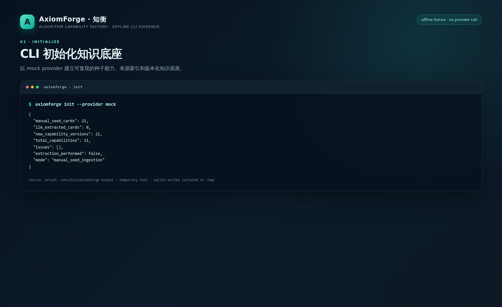

CLI 初始化在临时工作区写入 SQLite 知识底座，并输出种子卡片数量、来源数量和运行模式。文档截图由真实 `axiomforge init --provider mock` 输出渲染。

### CLI 运行契约

CLI 与 Web 使用同一套 `Workflow`、SQLite 知识库和报告格式。诊断、治理和 Harness 命令默认读取本地事实；模型调用仅由 `run`、`init` 和显式的 `doctor --check-api` 触发。

| 命令 | 作用 | 读写边界 | 成功退出码 | JSON 产物 |
| --- | --- | --- | ---: | --- |
| `axiomforge status` | 汇总 Python、Provider、四卡槽位、数据集、知识库和最近运行 | 只读；不创建数据库、不请求网络 | `0` | 标准输出 `axiomforge-status.v1` |
| `axiomforge doctor` | 检查运行前提、执行器和本地部署配置 | 只读；默认不请求网络 | `0` | 标准输出 `axiomforge-doctor.v1` |
| `axiomforge doctor --check-api --provider openai` | 在显式授权下读取模型目录 | 仅访问选定 API；不会读取代理环境变量 | `0` 已认证，`1` 连接或配置失败 | 结果包含脱敏的 `api_status` |
| `axiomforge validate` | 检查知识图谱来源、版本、哈希和关系完整性 | SQLite 只读打开，不初始化或迁移 | `0` 质量门通过，`1` 缺失或失败 | `--output artifacts/validation.json` |
| `axiomforge validate RUN_ID --case bank_e2e` | 对单次运行执行对应 Harness 用例 | 只读已保存事件；不调用模型、不执行生成代码 | `0` 运行与用例均通过，`1` 失败 | `--output artifacts/harness/run.json` |
| `axiomforge validate RUN_ID --suite` | 对单次运行执行全部版本化 Harness 用例 | 只读 | `0` 全部通过，`1` 存在失败用例 | `--output artifacts/harness/suite.json` |
| `axiomforge harness replay RUN_ID --through 12` | 回放脱敏 Agent 事件 | 只读；按游标裁剪 | `0` | 标准输出 `agent-trace.v1` |

常用的本地检查路径如下。`status` 可以在刚安装的空目录执行；`validate` 会明确返回数据库缺失或质量门失败，适合作为 CI 门禁。

```bash
axiomforge status --recent 5
axiomforge doctor
axiomforge validate --output artifacts/knowledge-validation.json
axiomforge validate RUN_ID --case bank_e2e \
  --output artifacts/harness/RUN_ID.json
axiomforge validate RUN_ID --suite \
  --output artifacts/harness/RUN_ID-suite.json
```

每个 JSON 都包含 `schema_version`、检查结果、退出依据和运行标识，可直接交给 CI、报告页面或后续审计流程。`--output` 是唯一写入路径；命令本身不会修改全局环境、CUDA、代理或 SSH 配置。

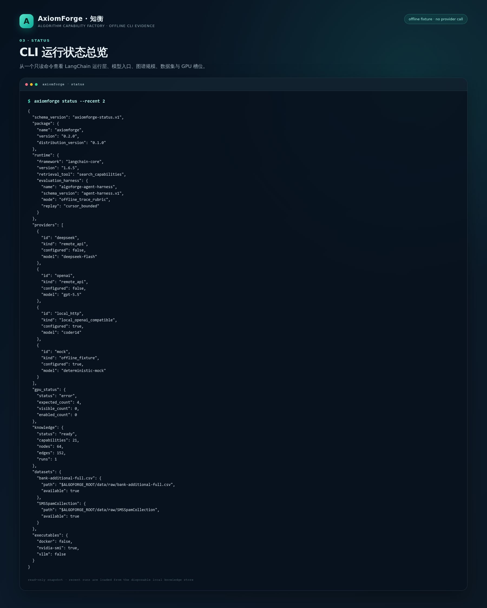

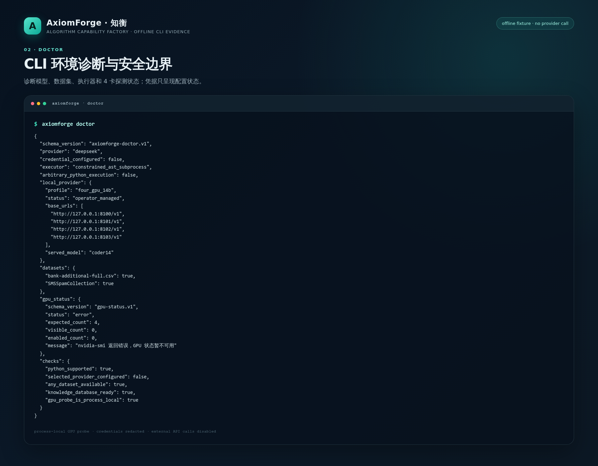

`status` 适合开发者进入项目后的第一条命令，`doctor` 用于定位依赖、数据和端点配置。两者默认离线读取本地事实，输出可保存为 CI 附件。

## Web 研发工作台

前端使用 Vue 3、TypeScript、D3 和 Lucide。创建任务时选择场景与推理后端，填写目标和约束，再设置候选、搜索与修复预算。运行详情围绕结论、比较和证据展开，中间态按需折叠。

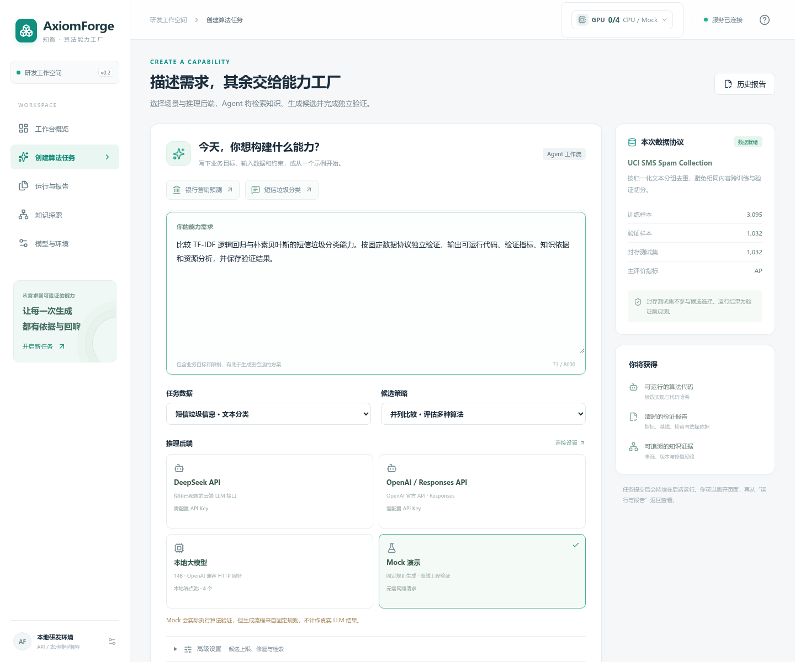

### 启动方式

构建前端需要 Node.js 22.12+ 和 npm。在项目目录执行：

```bash
./scripts/build_web.sh

# 终端 1：API 与任务执行服务
./scripts/start_api.sh

# 终端 2：Web 网关
./scripts/start_ui.sh
```

打开 <http://127.0.0.1:8501/app/>。API 也直接挂载工作台：<http://127.0.0.1:8000/app/>；交互式接口文档位于 <http://127.0.0.1:8000/docs>。

启动脚本从自身位置定位项目根目录，并使用项目 Python 环境。Python 数据科学界面的兼容入口保留在 `scripts/start_legacy_ui.sh`。

| 页面 | 路径 | 后端事实来源 |
| --- | --- | --- |
| 工作台概览 | `/app/#/` | `/runs`、`/capabilities`、`/graph` |
| 创建算法任务 | `/app/#/workbench` | `/config`、`POST /runs` |
| 运行与验证报告 | `/app/#/runs/{run_id}` | `/runs/{run_id}`、`/runs/{run_id}/agent-trace` |
| 知识探索 | `/app/#/knowledge` | `/graph/explore`、`/capabilities/{id}`、`/knowledge/quality` |
| 运行历史 | `/app/#/history` | `/runs` |
| 模型与环境 | `/app/#/settings` | `/config`、`/health`、`/inference/profiles` |

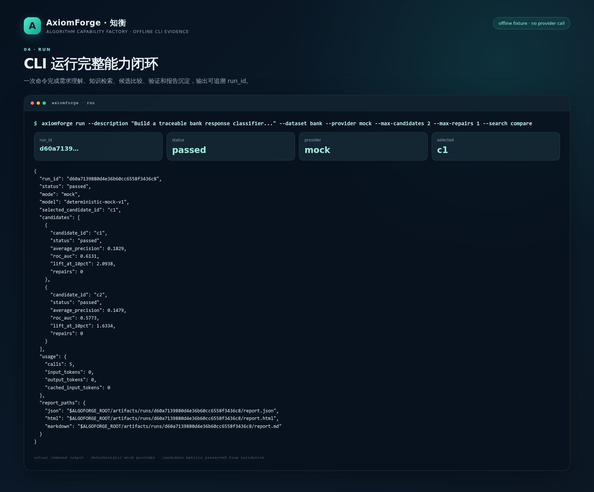

CLI 和 Web 进入同一个 Workflow。命令行输出保留运行标识、候选摘要、模型用量和报告路径，便于脚本继续调用 `validate`、`harness`、`report` 与 `analyze-run`。

## 模型接入与计算资源

服务端配置好凭证或本地端点后，用户可在创建任务页面选择推理后端。后端共用相同的角色合约、验证器和报告格式，便于在固定任务协议下比较运行结果。

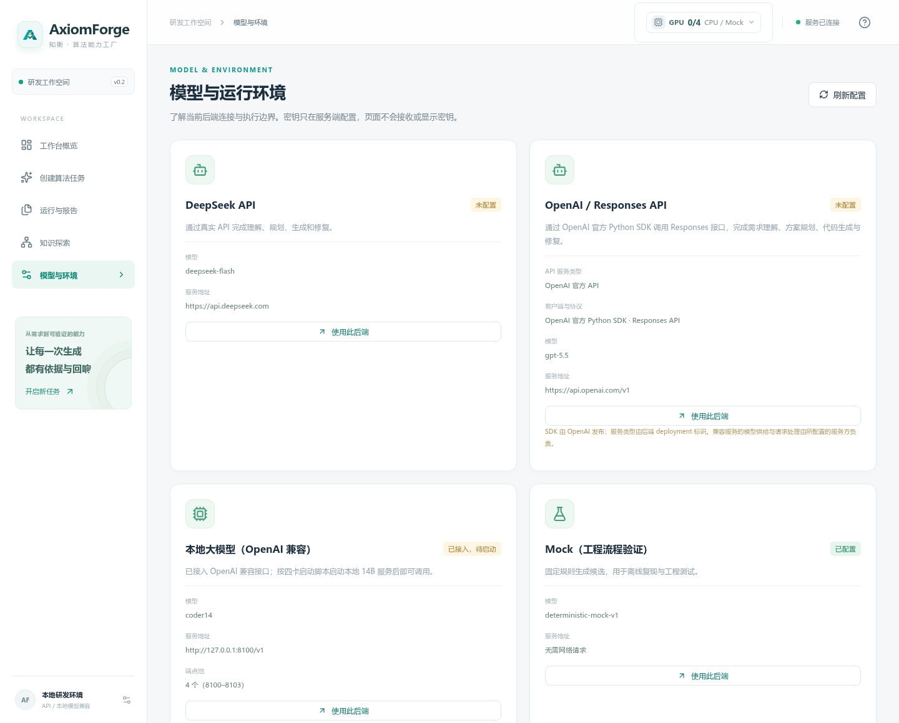

| 推理方式 | Provider | 配置 | 适用方式 |
| --- | --- | --- | --- |
| OpenAI / 兼容 Responses 网关 | `openai` | `OPENAI_*` | 官方 Python SDK、Responses 流式或非流式调用 |
| DeepSeek API | `deepseek` | `DEEPSEEK_*` | 云端理解、规划、生成与修复 |
| 本地模型 | `local_http` | `LOCAL_LLM_*` | Qwen2.5-Coder-14B AWQ、vLLM 兼容接口与端点池 |
| 确定性 Mock | `mock` | 无凭证 | 离线体验、工程回归和界面测试 |

### 云端 API

将所选服务的配置写入项目根目录未入 Git 的 `.env`，参考 [.env.example](.env.example)。密钥仅由服务端读取：

```dotenv
# OpenAI 或部署者提供的 Responses 兼容服务
OPENAI_API_KEY=your-server-api-key
OPENAI_BASE_URL=https://api.openai.com/v1
OPENAI_MODEL=your-available-model-id
OPENAI_STREAM=true

# DeepSeek
DEEPSEEK_API_KEY=your-key
DEEPSEEK_BASE_URL=https://api.deepseek.com
DEEPSEEK_MODEL=deepseek-flash
```

```bash
axiomforge doctor --provider openai --check-api
axiomforge run \
  --dataset bank --provider openai --search compare \
  --max-candidates 2 --max-repairs 2 \
  --description '预测银行定期存款订购，仅使用通话前特征，保存候选比较、验证结果与知识来源。'
```

将 `--provider` 换为 `deepseek` 即可复用这条流程。`init --provider mock` 导入离线种子知识；`init --provider openai` 或 `deepseek` 可使用模型从批准的来源片段抽取能力卡。

Responses Provider 在终态响应到达、用量核验及 JSON / Pydantic 校验完成后交接结果。报告记录请求模型、返回模型、传输模式和实际 token 用量；预算与取消贯穿模型调用。接口与配置说明见 [技术选型与框架集成](docs/14_技术选型与框架集成.md)。

### 本地 14B 与四卡部署

默认四卡方案采用 **4 个 Qwen2.5-Coder-14B-Instruct-AWQ 单卡副本**，分别监听 8100–8103，通过 `local_http` 端点池调用。单卡配置使用相同的模型别名和任务接口。模型服务独立部署，算法训练与验证由 CPU worker 执行。

```dotenv
LOCAL_LLM_PROFILE=four_gpu_14b
LOCAL_LLM_MODEL=coder14
LOCAL_LLM_BASE_URL=http://127.0.0.1:8100/v1
LOCAL_LLM_ENDPOINTS=http://127.0.0.1:8100/v1,http://127.0.0.1:8101/v1,http://127.0.0.1:8102/v1,http://127.0.0.1:8103/v1
```

| 资源档位 | GPU | 主机内存建议 | 配置 |
| --- | --- | --- | --- |
| API / Mock | 0 | 16 GiB | `api` |
| 单卡本地 14B | 1 × RTX 4090D 24 GB | 32 GiB | `single_gpu_14b` |
| 四卡本地 14B | 4 × RTX 4090D 24 GB | 64–128 GiB | `four_gpu_14b` |

配置固定模型 revision、端口和 GPU 分组。驱动、CUDA、vLLM、上下文长度与并发共同影响实际占用，部署时通过健康检查和本地任务记录资源。安装、启动和端点验证见 [四卡部署指南](docs/05_算力预算与四卡兼容.md)、[推理配置](configs/inference_profiles.json) 与 [部署说明](deploy/README.md)。

### GPU 状态栏

顶栏提供固定的 GPU 0–3 四槽位视图，显示可见卡数、设备可见状态、利用率、显存和温度。展开面板即可查看每张卡；没有可见 GPU 时，界面保留 API / Mock 的使用路径。

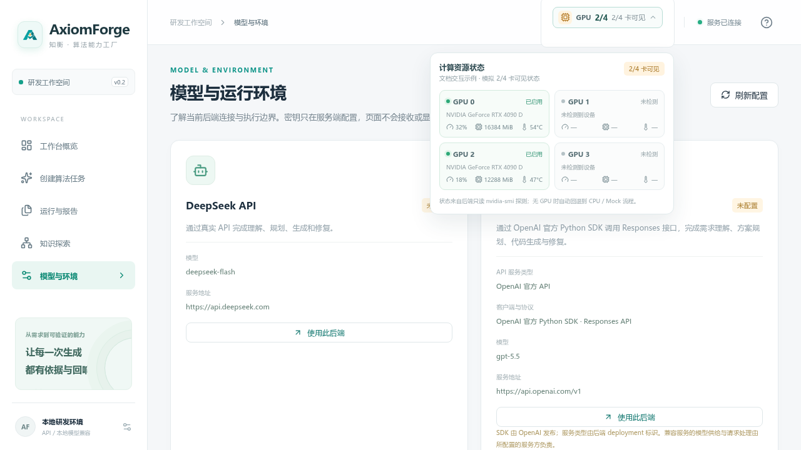

图中使用 2/4 卡界面夹具展示部分设备可见的状态；实际页面读取当前服务所在环境的 GPU 快照。

`GET /system/gpus` 与 `/health` 返回 `gpu-status.v1` 快照。设备可见性来自进程级 `nvidia-smi` 读取，模型端点状态单独管理。状态探测不改变 CUDA、代理或 SSH 配置；需要临时代理时，将参数限定在目标应用进程，详见部署指南。

## 端到端闭环

Web 通过 FastAPI 提交任务，CLI 直接调用同一个 Workflow。Agent 运行层负责结构化交接，独立验证器负责代码执行与算法指标；报告和知识回写保留运行事实。运行后的 Harness、知识治理与制品核验从已保存事实中按需产生检查结果。

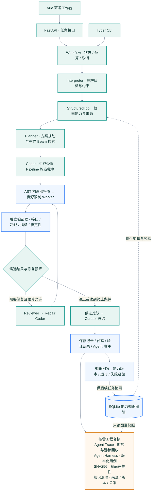

### 运行的证据时序

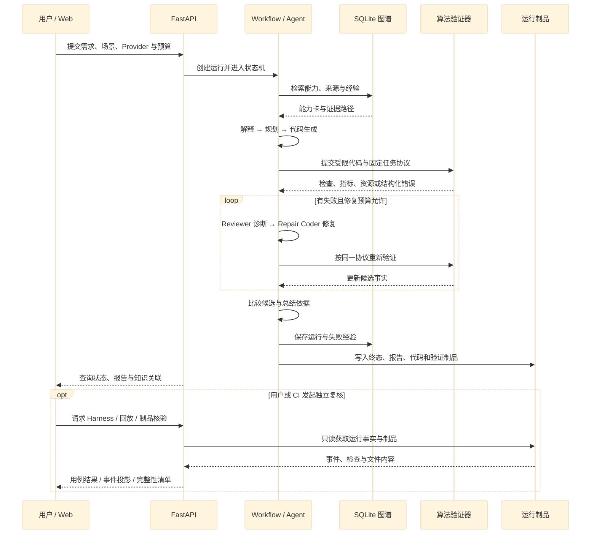

算法验证器计算运行期的代码与指标事实；Agent Harness 评估已保存的工作流证据。知识治理和完整性检查是按需复核接口，独立于知识回写路径。边界动作写入事件，模型输出通过结构化合约后进入下一阶段。

## Agent 协作与模块设计

一次运行由选定的 Provider 承担多个专职角色。LangChain Core 的 `RunnableSequence` 连接 `invoke_provider → persist_response → validate_contract`，`StructuredTool` 封装只读能力检索，Workflow 控制搜索、修复、预算和终态。

| 角色 | 职责 | 输出合约 |
| --- | --- | --- |
| `interpreter` | 提取目标、特征约束、假设与警告 | `TaskInterpretation` |
| `planner` | 根据知识证据设计候选、变体、父子关系与实现依据 | `PlanSet` / `CandidatePlan` |
| `coder` | 生成允许范围内的 sklearn Pipeline 构造程序 | `GeneratedCode` |
| `reviewer` | 读取真实错误，给出诊断和具体修复建议 | `Review` |
| `repair_coder` | 根据诊断生成下一次代码并提交重新验证 | `GeneratedCode` |
| `curator` | 汇总实测候选、失败记录与选择依据 | `Explanation` |
| `extractor` | 从批准的文档或代码来源抽取能力卡 | 带来源的能力卡集合 |

角色提示词见 [prompts.py](src/capability_factory/prompts.py)，输出约束见 [contracts.py](src/capability_factory/contracts.py)。调用文件、耗时、模型和 token 统计保存于 `artifacts/runs/<run_id>/llm/` 与报告的 `usage.records`，运行层元数据记录在 `provenance.agent_runtime`。

### 工具选型与集成理由

| 工具 | 实际职责 | 选型理由与入口 |
| --- | --- | --- |
| **LangChain Core** | Runnable 角色链、StructuredTool 图检索 | 结构化交接可组合，预算与状态可测试；[运行层](src/capability_factory/agent_runtime.py) |
| **OpenAI Python SDK** | Responses API 请求、流式响应与用量解析 | 官方 SDK 与统一 Provider 合约衔接；[Provider](src/capability_factory/providers.py) |
| **DeepSeek / vLLM** | 云端模型、本地 14B 与 HTTP 端点池 | 共用生成、修复和验证接口；[四卡配置](configs/inference_profiles.json) |
| **SQLite** | 能力版本、来源、关系、运行与失败经验 | 单机事务持久化，方便复现与审计；[知识库](src/capability_factory/knowledge.py) |
| **NetworkX** | Python 兼容界面的有向图与布局 | 连接数据科学工作流；[兼容界面](ui/app.py)、[GraphML 导出](src/capability_factory/graph_export.py) |
| **FastAPI / Pydantic / Typer** | API、结构化合约、OpenAPI、CLI | 多入口复用相同服务层；[API](src/capability_factory/api.py)、[CLI](src/capability_factory/cli.py) |
| **Vue 3 / TypeScript / D3 / Lucide** | 主工作台、报告、交互图谱与状态图标 | 模块化组件、类型约束与图谱交互；[Web 源码](web) |
| **Streamlit / Plotly** | 可选 Python 实验与图表入口 | 复用 FastAPI 数据，便于数据科学环境使用；[启动脚本](scripts/start_legacy_ui.sh) |
| **scikit-learn / pandas / NumPy** | 算法 Pipeline、数据准备与独立指标 | 两类任务共享验证框架；[插件](src/capability_factory/plugins.py)、[验证器](src/capability_factory/execution/runner.py) |
| **本地 Agent Evaluation Harness** | 版本化用例、运行事实检查与只读回放 | 可重复、无模型调用，适合 CI 和跨后端回归；[Harness](src/capability_factory/harness.py) |

扩展选型涵盖 LlamaIndex 的文档索引、AutoGen / CrewAI 的协作编排和 Neo4j 的服务化图存储。当前模块通过明确接口衔接，逐项比较与接入方式见 [技术选型与框架集成](docs/14_技术选型与框架集成.md)。

## 验证报告与结果

报告先呈现结论、候选比较、指标基线和设计依据，再展开逐项检查、代码、修复与来源。JSON、Markdown 和 HTML 共享同一份结构化事实，分别服务接口集成、代码审查和浏览阅读。


| 验证维度 | 检查内容 |
| --- | --- |
| 功能正确性 | 合法方案、数据协议、特征限制、训练预测与独立指标计算 |
| 接口规范 | `build_pipeline(task_spec)`、正类概率、行数与顺序、单条与空批次 |
| 运行稳定性 | 编译和子进程结果、边界输入、时间和资源预算 |
| 指标表现 | 验证集 AP、Dummy 基线、ROC-AUC、F1 与 Lift |

`status` 表示运行是否完成，`quality_status` 表示验证指标与建议基线的关系。缺少的指标显示为待评估；候选选择仅使用验证集，封存测试集按独立协议使用。

### 公开运行记录

下表取自仓库保存的 `report.json`。这些历史运行均为 `validation_only`，保留 `sealed_test_scored=false`：

| 运行样例 | 模式 / 状态 | 候选数 | 选中候选 AP | 其他事实 |
| --- | --- | ---: | ---: | --- |
| [bank_beam](examples/evidence/bank_beam/) | real / passed | 6 | 0.182877 | Lift@10% 2.093790，有界候选扩展 |
| [bank_repair](examples/evidence/bank_repair/) | real / passed | 2 | 0.180759 | Lift@10% 1.984167，含已标记故障注入与修复 |
| [sms_transfer](examples/evidence/sms_transfer/) | real / passed | 2 | 0.959834 | F1@0.5 0.914729，文本任务迁移 |
| [sms_openai_langchain](examples/evidence/sms_openai_langchain/) | real / passed | 2 | 0.959834 | Responses，5 次调用，6 张能力卡 |

[示例目录](examples/README.md)提供复现命令、完整报告与候选代码。每个证据包的 `manifest.json` 记录模式、状态、文件哈希和导出范围；[能力抽取样例](examples/evidence/knowledge_extraction.json)展示结构化知识输出。

### 生成代码接口

生成器输出 `build_pipeline(task_spec)`。以下节选来自 [bank_beam 的选中候选](examples/evidence/bank_beam/candidates/bank_logistic_default/)：

```python
from sklearn.compose import ColumnTransformer
from sklearn.impute import SimpleImputer
from sklearn.linear_model import LogisticRegression
from sklearn.pipeline import Pipeline
from sklearn.preprocessing import OneHotEncoder, StandardScaler

def build_pipeline(task_spec):
    numeric = Pipeline([("impute", SimpleImputer(strategy="median")),
                        ("scale", StandardScaler())])
    prepare = ColumnTransformer([
        ("numeric", numeric, task_spec["numeric_features"]),
        ("categorical", OneHotEncoder(handle_unknown="ignore"),
         task_spec["categorical_features"]),
    ])
    model = LogisticRegression(max_iter=1000, random_state=task_spec["seed"])
    return Pipeline([("prepare", prepare), ("model", model)])
```

构造程序先通过 AST 白名单解析，再交给受限 worker。可信执行器负责训练、预测和行号对齐，指标由主进程计算。执行范围与部署权限见 [安全说明](SECURITY.md)。

## Agent 观测与事件回放

观测台把角色调用、工具执行和合约校验组织为 span，汇总调用次数、输入 / 输出 / 缓存 token、耗时与预算。通过事件时序可以定位修复起点、合约拒绝、工具失败与预算耗尽。

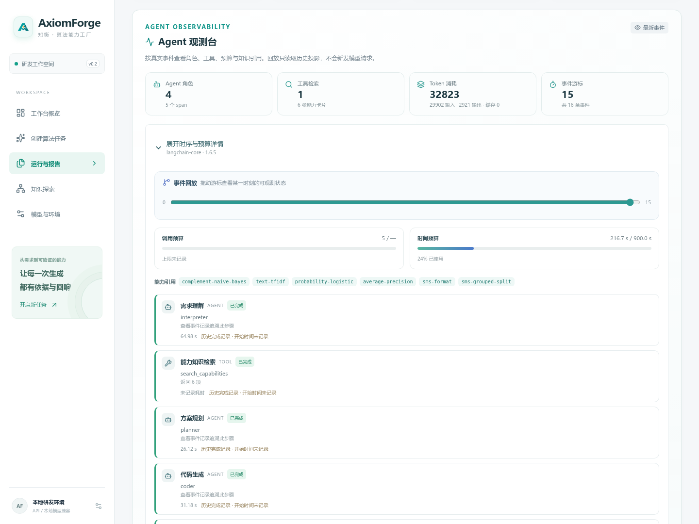

拖动游标会请求 `GET /runs/{run_id}/agent-trace?through_sequence=N`，只投影该游标之前的事实。回放读取保存的事件，观测投影采用脱敏字段，不包含提示词正文、模型响应正文或隐式推理。协议与示例见 [Agent 观测与回放](docs/15_Agent观测与回放.md)。

### Agent Harness 离线评测

Agent Evaluation Harness 使用版本化用例检查已保存的运行：终态是否符合预期，必要事件与角色是否出现，候选和修复证据是否完整，预算与脱敏约束是否满足。它独立于算法验证器，聚焦 Agent 工作流的工程契约。

```bash
axiomforge harness cases
axiomforge harness evaluate RUN_ID --case bank_e2e \
  --output artifacts/harness/bank_e2e.json
axiomforge harness suite RUN_ID --output artifacts/harness/suite.json
axiomforge harness replay RUN_ID --through 12
```

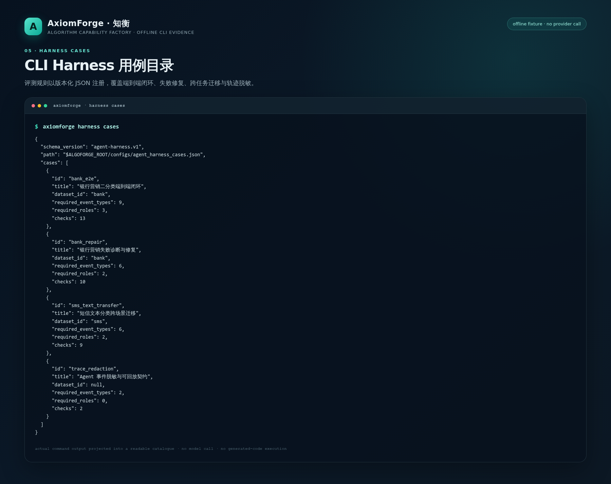

| 接口 | 输出 |
| --- | --- |
| `GET /harness/cases` | 已登记的银行、短信、修复和脱敏用例 |
| `GET /runs/{id}/harness?case_id=bank_e2e` | 单用例 `observed` / `expected`、证据路径和检查结果 |
| `GET /runs/{id}/harness-suite` | 全部登记用例的聚合分数、失败用例与逐项结果 |

`suite` 对一条运行执行整个用例目录；不同任务、修复要求与预期状态由各用例独立判定。定向回归可选择与运行协议对应的单用例。Harness 只读已保存事实，无模型调用、无生成代码执行；schema 与扩展方式见 [离线评测指南](docs/17_Agent_Harness_离线评测.md)。

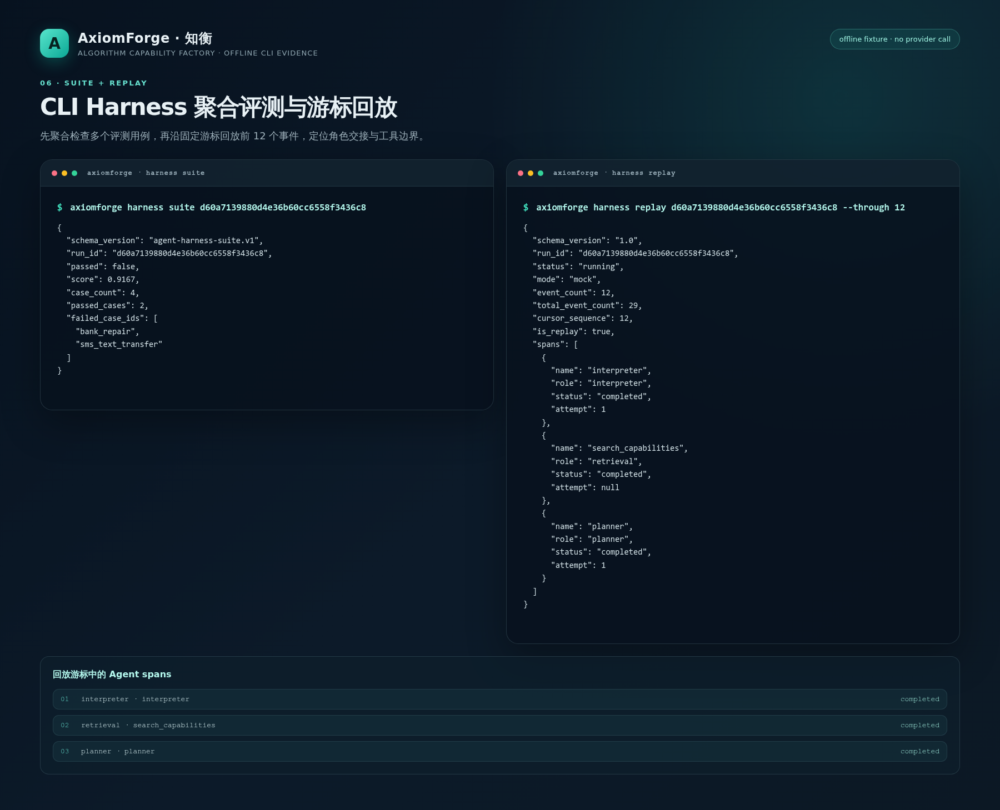

`suite` 负责聚合用例结果，`replay` 负责按游标回放脱敏事件。两条命令组合后可以从总体状态进入具体角色交接。

## 知识图谱与能力资产

知识探索提供搜索、节点类型与关系筛选、邻域扩展和详情面板。从能力可以定位来源、算法、依赖和验证运行，从失败经验可以回看修复结果与适用任务。


### Schema 与版本语义

运行 schema 位于 [knowledge/runtime_schema.sql](knowledge/runtime_schema.sql)，采用 SQLite 属性图表与 `cf_` 前缀。

| 节点 | 保存的信息 |
| --- | --- |
| `Source` | URI、Git revision、许可证、内容哈希、函数与行号 |
| `Capability` | 输入输出、适用条件、指标、依赖、状态和不可变版本 |
| `TaskType` / `Algorithm` / `Transform` | 任务协议、算法策略与数据变换 |
| `DatasetVersion` / `Environment` | 数据版本、执行环境与依赖 |
| `ValidationRun` / `Artifact` | 运行状态、验证事实、生成代码与哈希 |
| `FailureExperience` | 失败指纹、诊断、修复建议及验证状态 |

`DERIVED_FROM` 连接来源，`USES` / `REQUIRES` 表达使用和依赖，`IMPLEMENTS` / `EVALUATES` 连接代码与验证，`REPAIRS` / `AVOIDED_BY` 表达修复经验，`SUPERSEDES` 保存版本演进。检索组合词项匹配和最多两跳的有界图扩展，为候选提供可解释路径。

```text
Source ← DERIVED_FROM — Capability v1 ← SUPERSEDES — Capability v2
                              ↑ IMPLEMENTS
                           Artifact ← EVALUATES — ValidationRun
```

能力卡完整内容保存在 `cf_capability_versions.card_json`，详情接口可按版本读取。内容哈希支持重复导入去重，历史版本保留来源和验证关系。具体字段、节点示例与导入方式见 [系统架构与接口](docs/03_系统架构与接口.md) 和 [知识库说明](knowledge/README.md)。

```bash
axiomforge export-graph --output artifacts/graph.json
python scripts/export_graphml.py --output artifacts/graph.graphml
```

JSON 服务于 API 与前端，GraphML 供 Gephi、yEd 和图分析工具交换。两种导出都读取同一份 SQLite 图谱。

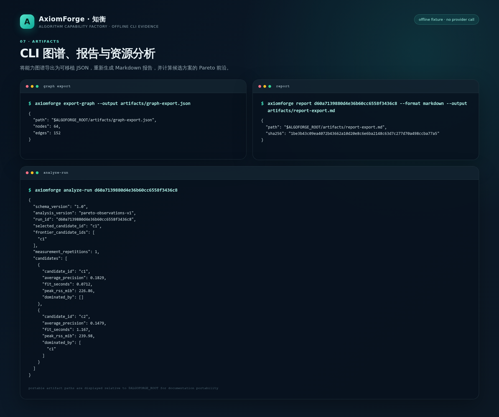

图谱导出、报告重生成和资源分析共用同一份持久化运行事实；导出的 JSON、Markdown 和资源分析结果可以独立归档。

### 知识治理与制品完整性

`GET /knowledge/quality` 按需检查来源、状态、版本、内容哈希与关系；`GET /runs/{run_id}/reproducibility` 为输入、代码、验证、报告生成 SHA256 清单。检查结果定位缺失、越界、超限和篡改，支持 API、CLI 与 CI 复用。实现见 [知识治理](src/capability_factory/knowledge_governance.py)、[制品核验](src/capability_factory/reproducibility.py) 与 [治理指南](docs/16_知识治理与可复现交付.md)。

## 示例数据与行业协议

| 场景 | 公开数据 | 任务约束 | 评价方式 |
| --- | --- | --- | --- |
| 银行营销响应 | UCI Bank Marketing | 通话前特征、禁止 `duration`、固定 60/20/20 划分 | AP、Dummy 基线、ROC-AUC、Lift |
| SMS 垃圾信息分类 | UCI SMS Spam Collection | 文本规范化、分组去重、训练 / 验证 / 测试隔离 | AP、F1、固定分类接口 |

来源、许可、下载方式、行数与 SHA256 记录在 [数据协议](docs/02_数据与知识来源.md)、[数据审计](docs/research/data_audit.json) 和 [来源索引](docs/SOURCES.md)。训练集用于拟合，验证集用于候选比较，封存测试集保持独立。

## 创新性与加分点

知衡将证据驱动协作、图谱增强生成、有界搜索、经验复用与资源分析整合到同一条运行链路。工程价值体现在决策可追踪、结果可复核、经验可累积。

| 设计方向 | 实现机制 | 代码与运行证据 |
| --- | --- | --- |
| 结构化 Agent 协作 | 专职角色经合约交接，独立验证反馈驱动 Reviewer 与 Repair Coder | [运行层](src/capability_factory/agent_runtime.py)、[工作流](src/capability_factory/workflow.py) |
| 图谱增强生成与验证 | 检索来源、能力版本、适用条件和经验；规划引用知识，执行遵守固定协议 | [知识库](src/capability_factory/knowledge.py)、[schema](knowledge/runtime_schema.sql) |
| 有界搜索与自修复 | Beam 扩展、算法变体去重、父子关系、剪枝与修复预算 | [搜索](src/capability_factory/search.py)、[实测记录](docs/research/budget_beam_validation.json) |
| 失败经验复用 | 诊断、失败指纹、修复前后哈希与结果绑定；验证状态影响后续检索依据 | [知识回写](src/capability_factory/knowledge.py)、[回归测试](tests/test_knowledge_runtime.py) |
| 行业约束与运行控制 | 防标签泄漏、固定切分、AP 基线、取消、限时与资源隔离 | [数据协议](src/capability_factory/datasets.py)、[执行器](src/capability_factory/execution/runner.py) |
| 现代 Agent 评测 | 版本化 Harness、角色与工具观测、预算摘要、游标回放 | [Harness](src/capability_factory/harness.py)、[观测](src/capability_factory/observability.py) |
| 代码仓库能力抽取 | 固定 Git commit，抽取函数、类、方法、签名、文档与导入依赖 | [抽取器](src/capability_factory/repository.py)、[公开样例](examples/evidence/innovation/repository.json) |
| 能力版本与设计解释 | 内容哈希去重、不可变版本、来源引用、候选理由与自然语言总结 | [版本测试](tests/test_repository.py)、[报告](examples/evidence/bank_beam/report.md) |
| 跨场景与插件扩展 | 表格 / 文本共用编排，各自维护任务与特征协议，可扩展模板和指标 | [插件](src/capability_factory/plugins.py)、[扩展指南](docs/10_插件扩展指南.md) |
| 接口与可复现交付 | FastAPI OpenAPI、部署配置、知识检查与制品 SHA256 清单 | [接口样例](examples/evidence/innovation/openapi.json)、[制品核验](src/capability_factory/reproducibility.py) |

### 质量与资源权衡

候选选择遵循验证 AP 优先规则，资源分析补充训练耗时、峰值 RSS 与 Pareto 前沿，并记录父子方案变化。质量、成本和缺失测量在同一视图中展示。

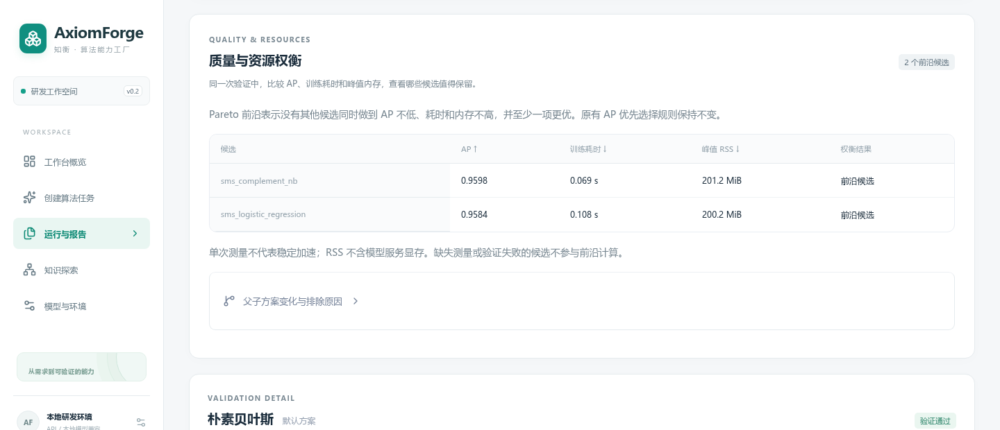

上图对应保存的本地 14B 短信运行，两个候选均通过，选中候选验证 AP 为 **0.9598**。资源来自该次 worker 观测，适合解释本次方案取舍；重复测量可进一步评估波动。完整代码与检查见 [本地运行报告](examples/evidence/sms_local_resources/report.html)，分析实现见 [optimization.py](src/capability_factory/optimization.py)。

### 工程设计细节

- **搜索空间可核验**：候选预算、算法变体和时限写入合约，拒绝、扩展与跳过都留下事件。
- **经验与验证绑定**：修复诊断和实际尝试结果关联，知识状态随验证事实更新。
- **仓库来源可定位**：固定提交、函数行号和文件哈希形成溯源链，重复导入保持幂等。
- **治理与执行分层**：运行负责产生事实；Harness、知识检查和制品核验以只读方式复核事实。

扩展命令、测量口径和运行记录见 [工程创新与扩展指南](docs/13_创新点与加分项演示.md)。

## 仓库结构

```text
axiomforge/
├── src/capability_factory/
│   ├── api.py / cli.py          API 与命令行入口
│   ├── workflow.py             状态机、候选搜索、修复与回写
│   ├── agent_runtime.py        LangChain 角色链与只读工具
│   ├── providers.py            Responses、DeepSeek、本地 HTTP、Mock
│   ├── contracts.py / prompts.py  结构化合约与角色提示词
│   ├── knowledge.py            SQLite 图谱、版本与检索
│   ├── repository.py           Git 快照中的代码能力抽取
│   ├── observability.py / harness.py  Agent 观测与离线评测
│   ├── knowledge_governance.py  知识来源、版本和关系检查
│   ├── reproducibility.py      制品哈希与完整性核验
│   ├── datasets.py / metrics.py  数据协议与可信指标
│   ├── search.py / optimization.py  有界搜索与资源分析
│   ├── reporting.py / gpu_status.py  报告与设备状态
│   └── execution/              受限编译、worker 与独立验证
├── web/                        Vue 工作台与 Playwright 测试
├── ui/                         可选 Streamlit 入口
├── configs/                    任务、验证策略、Harness 与推理配置
├── knowledge/                  schema、种子能力卡与图谱说明
├── examples/evidence/          脱敏报告、代码和验证样例
├── scripts/                    数据准备、启动、构建与导出工具
├── tests/                      单元、接口、集成与回归测试
├── docs/                       架构、数据、部署与工程指南
├── deploy/                     服务部署与容器模板
└── artifacts/                  可复核运行报告、代码、日志与验证制品
```

单次运行保存在 `artifacts/runs/<run_id>/`，包括请求、事件、角色调用、候选代码、检查结果和报告。核心调用路径为 `Workflow.run → invoke_role → validate_candidate → write_report / save_run`；Web 通过 API 查询同一份状态与产物。

## 测试与持续集成

后端检查覆盖角色合约、数据协议、预算、知识版本、代码执行、修复、Harness 与 API；浏览器检查覆盖报告折叠、图谱、观测、GPU 状态和错误恢复。

```bash
# Python
.venv/bin/pytest -q tests ui
.venv/bin/ruff check src scripts tests ui
.venv/bin/python -m compileall -q src scripts ui

# Web
cd web
npm ci
npm run format:check
npm run build
npm run test:e2e
```

GitHub Actions 分别运行 CPU 与 Web 工作流。浏览器测试使用 HTTP 夹具，付费模型运行保存在独立证据包；首页徽章链接到 `main` 分支检查状态。评测用例见 [Harness 目录](configs/agent_harness_cases.json)，运行记录见 [后端验证索引](docs/research/execution_validation.json)、[前端验证索引](docs/research/frontend_validation.json) 与 [CI 记录](docs/research/ci_budget_validation.json)。

## 文档中心

| 主题 | 文档 |
| --- | --- |
| 安装与使用 | [文档总览](docs/README.md)、[使用指南](docs/07_使用与演示指南.md)、[界面阅读路径](docs/18_前端截图与阅读路径.md) |
| 架构与接口 | [系统架构](docs/03_系统架构与接口.md)、[技术选型](docs/14_技术选型与框架集成.md)、[插件扩展](docs/10_插件扩展指南.md) |
| Agent 工程 | [观测与回放](docs/15_Agent观测与回放.md)、[Harness 评测](docs/17_Agent_Harness_离线评测.md)、[创新与扩展](docs/13_创新点与加分项演示.md) |
| 知识与数据 | [数据来源](docs/02_数据与知识来源.md)、[知识库](knowledge/README.md)、[知识治理与交付](docs/16_知识治理与可复现交付.md) |
| 前端与报告 | [报告说明](docs/11_前端与报告说明.md)、[交互设计](docs/12_交互工作台与参考设计.md)、[样例目录](examples/README.md) |
| 部署与验证 | [算力与四卡](docs/05_算力预算与四卡兼容.md)、[部署说明](deploy/README.md)、[实现与验收](docs/08_实现与验收对照.md) |

## 工程挑战与演进

| 挑战 | 当前机制 | 复核入口 |
| --- | --- | --- |
| 标签泄漏与指标失真 | 通话前特征协议、固定切分、验证与封存测试隔离 | 数据审计、特征检查、AP 与 Dummy |
| 生成代码与资源风险 | 受限 AST、可信执行器、进程 CPU / 内存 / 时间预算 | 对抗测试、超时与取消回收 |
| 模型成本与运行中断 | Provider 显式配置、全局预算、调用超时、取消 | 用量记录、事件和异常回归 |
| 知识与运行逐步演化 | 不可变能力版本、来源哈希、治理与制品核验 | 图谱关系、质量报告、SHA256 清单 |
| 多后端与设备差异 | 统一模型接口、单卡 / 四副本配置、设备与端点状态分离 | 部署配置、健康检查与本地运行报告 |

当前部署面向本机与受控研发环境。后续扩展围绕专用执行节点与更强隔离、固定预算的重复评测与消融、多卡负载与故障恢复基准、认证与租户隔离，以及时间序列、异常检测和推荐任务插件展开。运行权限与服务暴露范围统一说明在 [SECURITY.md](SECURITY.md)。

## 贡献与许可证

欢迎通过 Issue 反馈可复现问题，通过 Pull Request 改进任务插件、验证策略、知识来源与交互体验。开发环境、提交约定和检查流程见 [CONTRIBUTING.md](CONTRIBUTING.md)，版本变更见 [CHANGELOG.md](CHANGELOG.md)。

代码采用 [MIT 许可证](LICENSE)。第三方数据、模型和源码遵循各自许可证与使用条款，来源与声明见 [NOTICE](NOTICE)。
