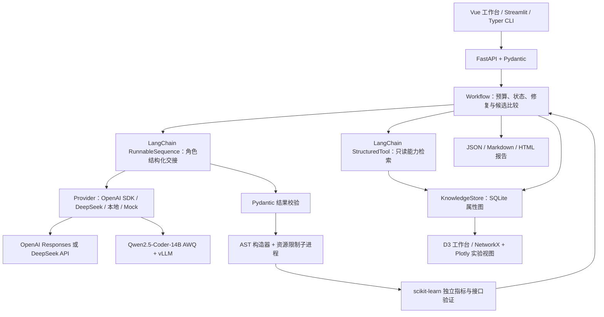

# 技术选型与框架集成

AlgoForge 以 LangChain Core 组织结构化角色链，以 OpenAI Python SDK、DeepSeek HTTP 和 vLLM 接入模型，以 SQLite 管理能力与验证事实，以 FastAPI 提供统一服务。Vue 工作台和 Streamlit 实验入口共用这一条执行链路。

本章说明每个工具的职责、选择理由、配置方式和验收入口，对应题目“可使用相关框架，但需说明选择理由”的开发要求。

## 1. 工具如何组成算法能力工厂



| 层次 | 使用工具 | 具体工作 | 选择理由 |
| --- | --- | --- | --- |
| Agent 组件 | `langchain-core` | `RunnableSequence` 角色链、`StructuredTool` 检索工具 | 角色调用、输入校验和工具 schema 使用标准组件，外层保留明确的状态与预算策略 |
| OpenAI 接入 | 官方 `openai` Python SDK | 通过 Responses API 完成理解、规划、代码生成、审查、修复和总结 | SDK 负责协议对象与响应解析，应用 Provider 统一处理结构化合约与调用审计 |
| API 兼容接入 | `httpx` | DeepSeek API、本地 OpenAI 兼容 Chat Completions | 两类服务保留各自参数与鉴权策略，共用角色输入输出和验证协议 |
| 本地模型服务 | Qwen2.5-Coder-14B AWQ、vLLM | 独立推理服务、单卡兼容、4 卡副本池 | 模型推理与算法 CPU worker 分离，部署配置可以按可用 GPU 数量选择 |
| 知识持久化 | Python `sqlite3` | 能力、来源、版本、关系、运行、制品、失败经验与事件 | 事务、外键、内容哈希与不可变版本共同支撑本机复现和审计 |
| 图与展示 | NetworkX、Plotly、D3 | NetworkX/Plotly 为 Streamlit 生成图布局，D3 为 Vue 提供交互探索 | Python 实验与浏览器交互采用各自适合的图组件，共用持久化图谱事实 |
| 服务与合约 | FastAPI、Pydantic、Uvicorn | 请求校验、运行接口、报告接口、OpenAPI 和 HTTP 服务 | 接口由结构化模型生成，CLI、Web 与自动化测试使用同一套业务逻辑 |
| 命令行 | Typer | 初始化、运行、图谱导出、仓库抽取、报告与资源分析 | 类型化命令参数适合复现脚本、CI 和现场演示 |
| 用户界面 | Vue 3、TypeScript、Lucide、Streamlit | 主工作台与 Python 实验入口 | 主工作台强调流程和证据阅读；实验入口服务数据科学使用习惯 |
| 算法与数据 | scikit-learn、pandas、NumPy | Pipeline、固定数据切分、AP/ROC-AUC/F1、预测接口验证 | 表格和文本任务采用相同的候选接口和可比较评估协议 |

依赖定义见 [pyproject.toml](../pyproject.toml)，可复现安装清单见 [requirements.txt](../requirements.txt)。GPU serving 使用独立的部署环境，见 [部署说明](../deploy/README.md)。

## 2. LangChain 的实际作用

### 结构化角色链

每个角色沿相同的调用路径执行：

```text
角色请求（role / system / payload / max_tokens）
  → RunnableSequence.invoke
  → invoke_provider：Provider.generate
  → persist_response：保存 JSON 响应与检查剩余预算
  → validate_contract：schema.model_validate
  → 下一阶段的结构化输入
```

实现入口是 [agent_runtime.py::invoke_role](../src/capability_factory/agent_runtime.py)。三个具名 `RunnableLambda` 组成 `RunnableSequence`，原始结构化响应先保存，再进行合约校验；格式修复可复核被拒绝的响应。角色包括 Interpreter、Planner、Coder、Reviewer、Repair Coder 和 Curator。一次运行选定一个 Provider，角色分别提交请求并保存自己的结果。提示词定义见 [prompts.py](../src/capability_factory/prompts.py)，结构化输出见 [contracts.py](../src/capability_factory/contracts.py)，调用与交接见 [workflow.py](../src/capability_factory/workflow.py)。

选择 `langchain-core` 的理由是直接复用 Runnable 和 Tool 两组基础抽象：角色链可以组合、工具参数具有明确 schema，项目的运行时限、令牌预算和验证策略继续在 Workflow 中集中控制。无效输出触发已有的合约纠正流程；Provider 异常、用户取消和预算耗尽沿同一套终止策略形成报告。

### 只读知识检索工具

`agent_runtime.py::capability_search_tool` 使用 `StructuredTool.from_function` 包装 `KnowledgeStore.search`，工具名为 `search_capabilities`，工作流通过 `retrieve_capabilities` 调用。参数由 `CapabilitySearchInput` 严格校验：

| 字段 | 约束 |
| --- | --- |
| `query` | 查询文本，长度 1–8000 |
| `task_type` | `tabular_binary_classification` 或 `text_binary_classification` |
| `limit` | 1–6，默认 6 |
| `use_graph` | 布尔值，默认开启图扩展 |

输出是带来源、版本、评分和路径的能力卡。Workflow 在理解需求之后调用工具，检索结果随候选规划与代码生成一起传递。

该工具负责知识读取；能力版本更新、运行保存和经验回写由工作流的固定阶段管理。生成算法代码由专门的 AST 与资源限制执行器处理。这一职责分工让检索、推理和执行拥有独立的参数约束与验收入口。

### 框架与工具调用的审计字段

[agent_runtime.py::runtime_metadata](../src/capability_factory/agent_runtime.py) 读取已安装框架版本，写入每次运行的报告。

| 报告字段 | 记录内容 |
| --- | --- |
| `provenance.agent_runtime.framework` | `langchain-core` |
| `provenance.agent_runtime.version` | 当前安装的 `langchain-core` 版本 |
| `provenance.agent_runtime.role_chain` | `invoke_provider`、`persist_response`、`validate_contract` |
| `provenance.agent_runtime.retrieval_tool` | `search_capabilities` |
| `provenance.agent_runtime.external_tracing` | `false` |
| `KNOWLEDGE_RETRIEVED` 事件的 `data.tool` | 本次检索调用的工具名 |

角色链和检索工具均在 `tracing_context(enabled=False)` 内调用，外部 LangSmith 追踪关闭。角色请求与响应审计保存在本地运行目录，Provider 用量与耗时写入报告。

### 协作机制与创新性

1. **结构化交接**：Planner 提交候选、理由和知识引用，Coder 交付符合接口的构造程序。
2. **独立验证反馈**：本地验证器返回接口、执行、指标与资源事实，Reviewer 据此生成修复诊断。
3. **有限搜索与修复**：Beam Search 扩展合法变体，修复轮次、候选数和总时限统一受预算控制。
4. **经验进入下一次检索**：失败指纹、修复方案、验证状态与能力版本沉淀为可检索关系。

这四个环节对应题目的 Agent 协作、知识增强、自修复和失败经验复用要求。完整创新评分对照见 [创新点与加分项演示](13_创新点与加分项演示.md)。

### 2.1 现代 Agent 观测与安全回放

角色链具备可观测的生命周期。Workflow 在每个 Agent 和只读工具边界写入 `AGENT_STARTED`、`AGENT_COMPLETED`、`AGENT_REJECTED`、`AGENT_FAILED`、`TOOL_STARTED`、`TOOL_COMPLETED`、`TOOL_FAILED` 事件，并将模型用量、预算应用和运行终态写入同一条带序列的事件流。`src/capability_factory/observability.py` 将这些事实投影为 Agent / Tool span、预算摘要和证据摘要。

观测投影包含四个面向生产研发的能力：

- **状态可见**：角色、schema、attempt、候选 ID、状态、耗时和结构化结果键可按 span 查看。
- **预算可见**：调用数、输入/输出/缓存 token、最大调用数、最大 token 和有效时间预算来自事件或终态报告；缺失字段保留 `null`。
- **只读回放**：`GET /runs/{run_id}/agent-trace?through_sequence=N` 只读取 `N` 之前的事件，重新计算当时的 span、预算和知识证据，未来信息不会出现在投影中。
- **敏感边界**：投影仅保留白名单字段和结构化摘要，不复制 prompt、响应正文、生成代码或隐式推理；外部 LangSmith 追踪由运行层显式关闭。

运行报告附带完整游标的 `agent_trace`；前端 [AgentTracePanel.vue](../web/src/components/AgentTracePanel.vue) 通过摘要卡、折叠详情和事件滑块呈现同一份投影。详细字段、兼容旧报告的规则和复核命令见 [Agent 观测与回放](15_Agent观测与回放.md)。

## 3. OpenAI、DeepSeek 与本地模型的选择

| Provider 值 | 推理路线 | 服务端配置 | 典型使用场景 |
| --- | --- | --- | --- |
| `openai` | 官方 OpenAI Python SDK → Responses API | `OPENAI_API_KEY`、`OPENAI_BASE_URL`、`OPENAI_MODEL`、`OPENAI_STREAM`；临时进程参数 `OPENAI_PROXY_URL` | 使用 OpenAI 官方服务或部署者选择的兼容 Responses 网关 |
| `deepseek` | DeepSeek HTTP API | `DEEPSEEK_API_KEY`、`DEEPSEEK_BASE_URL`、`DEEPSEEK_MODEL` | DeepSeek 云端任务、已有 API 运行复现 |
| `local_http` | vLLM OpenAI 兼容 Chat Completions | `LOCAL_LLM_BASE_URL`、`LOCAL_LLM_ENDPOINTS`、`LOCAL_LLM_MODEL`、`LOCAL_LLM_PROFILE` | 本地 14B 推理、单卡或 4 卡副本服务 |
| `mock` | 确定性工程测试响应 | 无需模型凭证 | CI、界面联调与完整验证链路回归 |

官方 SDK 是客户端依赖，模型请求的实际服务商由 `OPENAI_BASE_URL` 决定。使用第三方兼容网关时，报告记录实际端点与返回模型，展示为对应网关的运行结果。模型 ID 按所选服务的实际可用列表配置。

### OpenAI / 兼容 Responses 网关

将以下配置加入项目根目录的 `.env`，填入自己的服务端凭证：

```dotenv
OPENAI_API_KEY=your-server-api-key
OPENAI_BASE_URL=https://api.openai.com/v1
OPENAI_MODEL=gpt-5.5
OPENAI_STREAM=true
```

`OPENAI_MODEL` 填写所选服务已开放的模型 ID。可选 `OPENAI_REASONING_EFFORT` 默认是 `none`，用于请求对应的推理配置；将其设为空值可采用模型默认设置，其余取值应与所选模型支持范围一致。使用组织指定的兼容 Responses 网关时，将 `OPENAI_BASE_URL` 改为该网关提供的基础地址，例如 `https://your-gateway.example/v1`。应用读取项目环境变量和 `.env`；Codex CLI 的客户端配置独立管理。

`OPENAI_STREAM` 默认 `true`，通过 SSE 接收 Responses 事件；设为 `false` 时使用非流式响应。可在项目 `.env` 中配置，也可作为单次应用进程参数传入。这一设置只选择 Provider 的响应接收方式，生效范围保持在项目配置与应用进程内。

`OPENAI_PROXY_URL` 默认为空，应用直接连接所选 API。需要临时 HTTP(S) 代理时，仅在目标命令前传入该变量，将占位内容替换为本次使用的代理 URL：

```bash
OPENAI_PROXY_URL='YOUR_TEMPORARY_PROXY_URL' .venv/bin/python -m capability_factory doctor --provider openai --check-api
```

该变量只作用于本条命令；命令退出后失效。若 API 服务本次启动需要代理，可将同一前缀用于 `.venv/bin/python -m capability_factory serve`，作用域保持在当前应用进程。项目使用 `trust_env=False`，代理配置按 `SecretStr` 处理，报告与前端只记录 `proxy_configured` 布尔状态。

安装并运行：

```bash
python -m pip install -r requirements.txt
python -m pip install --no-deps -e .
python scripts/verify_data.py
python -m capability_factory doctor --provider openai --check-api
python -m capability_factory init --provider mock
python -m capability_factory run \
  --dataset bank \
  --provider openai \
  --search compare \
  --max-candidates 2 \
  --max-repairs 2 \
  --description '预测银行定期存款订购，仅使用通话前特征，比较候选，按验证集 AP 选择方案并保留来源、修复与资源证据。'
```

`init --provider mock` 导入离线知识与公开来源；后续 `run --provider openai` 使用真实 API 完成角色调用。API 密钥由后端进程读取，报告保存模型、端点、用量、耗时与内容哈希。

[OpenAIResponsesProvider](../src/capability_factory/providers.py) 使用 `client.responses.create`，以 `developer` / `user` 角色消息分别提交角色指令和任务输入，设置 `store=False`、JSON 对象输出格式及所选 `stream` 模式。流式调用逐事件检查用户取消与全局截止时间，在终态响应中核验用量及完成状态；中间推理片段和增量文本不写入审计制品，也不进入代码执行器。已完成响应的最终内容经 JSON 检查和 LangChain 角色链的 Pydantic 校验后交给后续阶段；流中断、未完成终态与无效合约沿统一错误流程生成可复核记录。

Provider 校验 HTTPS 地址、响应完成状态、响应内容与用量，保存请求模型和实际返回模型。相关审计字段如下：

| 字段 | 含义 |
| --- | --- |
| `provider_metadata.deployment` | `official_api` 或 `openai_compatible_api`，按实际端点识别 |
| `provider_metadata.stream` | 本次 Provider 使用的流式或非流式模式 |
| `usage.records[].requested_max_output_tokens` | 向服务提交的本次输出 token 额度 |
| `usage.records[].output_tokens` | 服务返回的实际输出 token 用量 |
| `usage.records[].output_limit_exceeded` | 实际输出是否超过本次请求额度 |

兼容网关可能返回高于 `max_output_tokens` 请求参数的用量。应用保留请求额度与实际值，并按实际输入/输出用量累计全局 token 预算；后续调用继续受剩余预算、调用次数与全局时限控制。流式接收和用量审计共同提供调用过程与资源结果的复核依据。

模型目录访问与真实能力抽取也有独立命令：

```bash
# 检查模型目录访问和服务端配置
python -m capability_factory doctor --provider openai --check-api

# 使用真实模型从批准的文档与代码片段中抽取能力卡
python -m capability_factory init --provider openai
```

`doctor` 提供配置和端点诊断；`init` 保存抽取结果与来源引用，`run` 完成需求到生成、验证和知识回写的端到端运行。三类命令分别对应连通性、知识抽取和算法能力复刻的复核入口。

### Web 工作台切换

1. 在服务端配置需要的 API 凭证与本地端点，启动 FastAPI 和 Web 工作台。
2. 在“模型与环境”查看 Provider 配置，在“创建算法任务”选择 OpenAI API、DeepSeek API、本地模型或 Mock。
3. 提交任务后，在报告中查看实际 Provider、模型、角色调用、候选检查与知识回写。
4. 切换下一次任务的 Provider 即可比较另一条推理路线；任务协议、验证器与报告结构保持统一。

本地模型部署命令与 4 卡 profile 见 [算力预算与四卡兼容](05_算力预算与四卡兼容.md)。

## 4. SQLite、NetworkX 与图谱检索

### SQLite 负责事实与版本

[knowledge/runtime_schema.sql](../knowledge/runtime_schema.sql) 定义来源、能力、版本、图节点/边、运行、制品、失败经验和事件。`KnowledgeStore` 在事务中写入这些事实，内容变化生成新的能力版本，`SUPERSEDES` 连接历史版本。

SQLite 的选择对应本机可复现这一交付目标：启动项目即可创建数据库，备份与导出路径明确，来源、版本与运行证据放在同一套查询接口下。

### 检索与图扩展

[KnowledgeStore.search](../src/capability_factory/knowledge.py) 先按任务类型与能力状态过滤，再计算词项分数，并沿 `USES`、`REQUIRES`、`AVOIDED_BY` 做最多两跳扩展。检索会排除通用环境依赖产生的弱关联，返回 `lexical_score`、`graph_score`、`evidence_path` 和 `source_locator`。

LangChain 的检索工具沿用这套算法。知识引用随候选计划保存，验证与失败经验回写后又能参与后续检索，从而把能力生成与知识演化连起来。

### NetworkX、D3 和 GraphML 各自的职责

- **NetworkX + Plotly**：Streamlit 中的 `draw_graph` 将图谱快照转成 `DiGraph`，使用固定种子的 `spring_layout` 布局并按类型绘图。
- **D3**：主工作台提供拖拽、缩放、节点选择、关系过滤和来源侧栏，便于沿实际关系阅读验证证据。
- **GraphML**：独立导出器保留节点 ID、关系类型和嵌套属性 JSON，可由图分析工具读取；SQLite 保存权威事实。

```bash
python -m capability_factory export-graph --output artifacts/graph.json
python scripts/export_graphml.py --output artifacts/graph.graphml
```

## 5. 框架选型对照

题目列出的工具覆盖不同的技术方向。下表记录其适用场景，以及本项目选择的实现路径：

| 对照工具 | 适用场景 | AlgoForge 的选型与衔接方式 |
| --- | --- | --- |
| **LangChain** | 统一 Runnable、工具 schema 与模型组合 | 采用 `langchain-core` 的角色链和只读检索工具，Provider 与验证器保持独立合约 |
| **LlamaIndex** | 大量文档的解析、索引和检索管线 | 当前使用固定来源抽取、词项检索和属性图扩展；长文档索引扩展沿用 `source_id`、revision 与来源定位字段 |
| **AutoGen** | 多 Agent 对话及工具协作实验 | 当前选择显式角色链控制轮次与交接，角色合约可用于后续比较对话式编排策略 |
| **CrewAI** | 角色、任务、流程的声明式组织 | 当前由 Workflow 管理任务阶段与状态，职责映射集中在提示词、Pydantic 模型和事件记录中 |
| **Neo4j** | 服务化属性图、Cypher 查询与团队图应用 | 当前选用 SQLite 持久化属性图；JSON/GraphML 导出和来源、版本 schema 为后续存储适配提供交换基础 |

对照选型使演示路径保持集中：一套角色编排、一套事实存储、一套独立验证协议。扩展其他工具时，以同一批任务的成功率、来源引用正确性、修复效果和资源开销进行比较。

## 6. 题目要求与复核入口

| 题目要求 | 工具与机制 | 复核入口 |
| --- | --- | --- |
| 使用 LLM 理解、抽取、生成或修复 | LangChain 角色链 + OpenAI / DeepSeek / 本地 Provider | [角色运行层](../src/capability_factory/agent_runtime.py)、[工作流](../src/capability_factory/workflow.py)、运行 `usage.records` |
| 构建行业知识库与知识图谱 | SQLite + 来源抽取 + 有界图检索 | [知识库](../src/capability_factory/knowledge.py)、[schema](../knowledge/runtime_schema.sql)、知识探索页面 |
| 从描述生成可运行算法 | Planner / Coder + scikit-learn 构造器 | 候选 `model.py`、代码哈希与设计依据 |
| 功能、指标、稳定性和接口验证 | AST 检查 + 独立进程 + 可信 evaluator | 候选检查明细、`verification.json`、资源统计 |
| 多轮修复与多个候选 | Reviewer / Repair Coder + Beam Search | `repairs`、`attempts`、`search_tree` 和事件时间线 |
| 结果沉淀与版本管理 | SQLite 事务、内容哈希、能力版本和失败经验关系 | `knowledge_writeback`、版本关系和来源定位 |
| 简洁用户界面、CLI 或 API | Vue / Streamlit + Typer + FastAPI | [README](../README.md)、OpenAPI、浏览器测试 |

### 框架与 Provider 回归测试

| 测试入口 | 验证内容 |
| --- | --- |
| [test_agent_runtime.py](../tests/test_agent_runtime.py) | Runnable 的调用、持久化与校验顺序；无效响应审计；预算检查；Typed Tool 参数与任务过滤；外部追踪关闭 |
| [test_openai_provider.py](../tests/test_openai_provider.py) | Responses SDK 请求与用量；官方/兼容端点识别；响应拒绝与截断；有限重试；预算与取消；凭证回显与重定向处理 |

```bash
python -m pytest -q tests/test_agent_runtime.py tests/test_openai_provider.py
```

这些测试使用可控的 Provider 与 HTTP 响应夹具，可独立复核框架集成和协议处理；真实模型生成效果对应实际运行报告。

### 本机验收

```bash
python -m capability_factory init --provider mock
python -m capability_factory run \
  --provider mock --dataset sms --search compare --max-candidates 2 \
  --description '识别垃圾短信，比较线性模型与朴素贝叶斯并输出验证报告。'
python -m pytest -q tests ui
python -m ruff check src scripts tests ui
```

Mock 验证真实数据处理、算法训练、指标计算和知识回写；API 与本地实测报告则记录对应模型的生成结果。报告中的 `provider`、`model`、`mode`、`usage.records`、候选检查与 `knowledge_writeback` 可以联合复核从需求到能力沉淀的完整流程。
