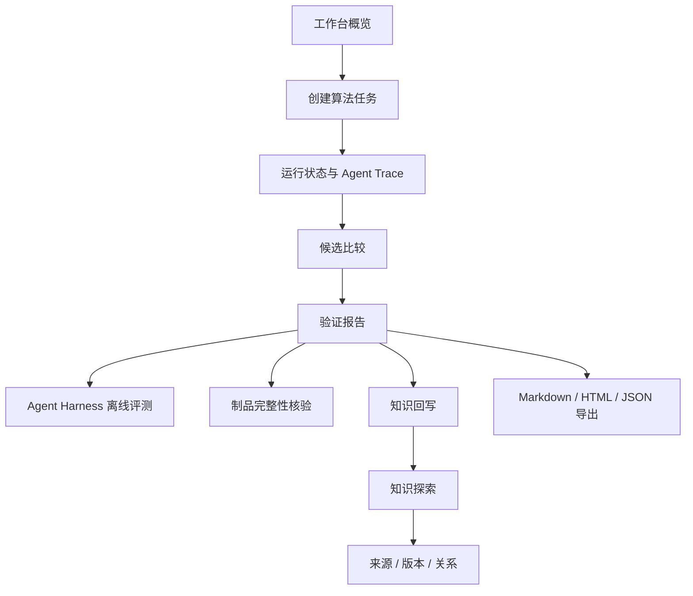
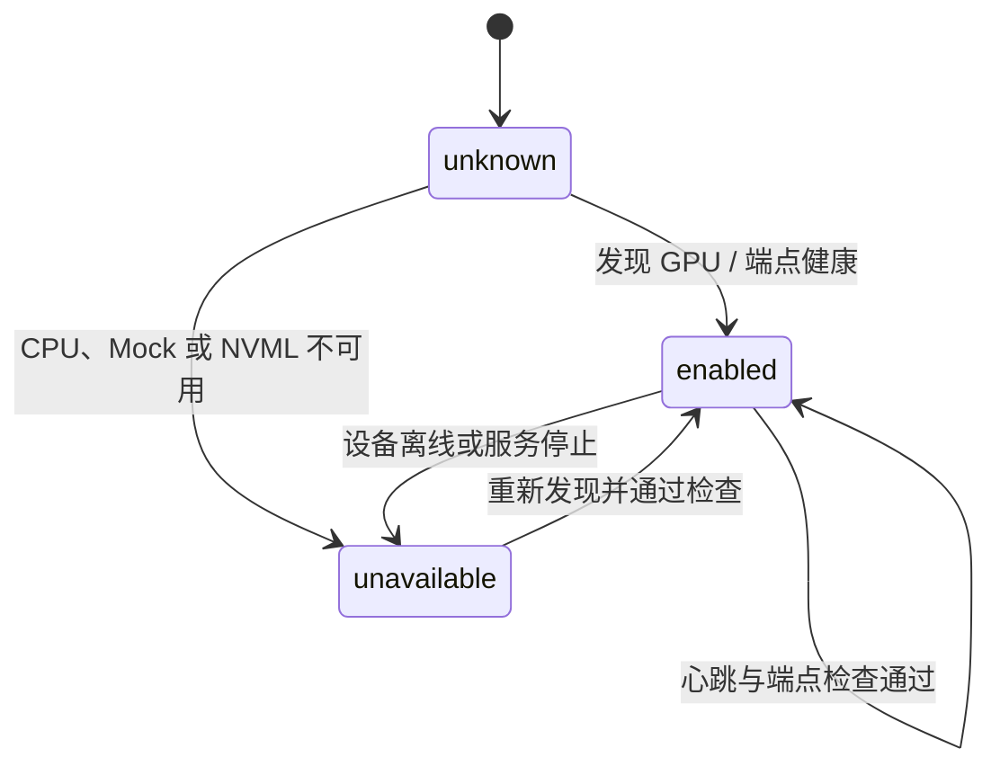

# 前端截图与阅读路径

本页把工作台截图、页面职责和后端证据放在同一张阅读地图中。截图用于快速理解交互，报告、API 和 SQLite 制品用于复核实际结论。

## 截图画廊

<table>
  <tr>
    <td width="50%" align="center">
      <a href="images/workbench-overview.png"></a><br>
      <strong>工作台概览</strong><br>
      <sub>场景入口、运行历史、能力链和服务连接状态。</sub>
    </td>
    <td width="50%" align="center">
      <a href="images/workbench-graph.png"></a><br>
      <strong>知识图谱</strong><br>
      <sub>节点筛选、关系展开、来源和能力版本追踪。</sub>
    </td>
  </tr>
  <tr>
    <td width="50%" align="center">
      <a href="images/workbench-report.png"></a><br>
      <strong>验证报告</strong><br>
      <sub>结论、候选比较、检查证据、修复尝试和可折叠中间态。</sub>
    </td>
    <td width="50%" align="center">
      <a href="images/resource-tradeoffs.png"></a><br>
      <strong>质量与资源权衡</strong><br>
      <sub>AP、训练时长和 worker 峰值 RSS 的候选比较。</sub>
    </td>
  </tr>
  <tr>
    <td width="50%" align="center">
      <a href="images/gpu-status-bar.png"></a><br>
      <strong>0–4 卡 GPU 状态栏</strong><br>
      <sub>顶栏显示可见卡数，展开后查看每张卡的启用状态、利用率、显存与温度。</sub>
    </td>
    <td width="50%" align="center">
      <strong>阅读顺序</strong><br>
      <sub>先从工作台进入任务，再查看报告结论和候选证据，最后沿图谱、Harness 与制品哈希复核。</sub>
    </td>
  </tr>
</table>

## 从页面到事实



| 页面 | 推荐阅读顺序 | 关键事实 | 关联接口 |
| --- | --- | --- | --- |
| 概览 | 先看场景卡和最近运行 | 任务类型、Provider、运行状态 | `/summary`、`/runs` |
| 创建任务 | 先选数据，再选模型和预算 | 数据协议、搜索深度、修复次数 | `POST /runs` |
| 运行报告 | 先读结论，再展开证据 | 候选指标、检查项、修复链、资源 | `/runs/{id}` |
| Agent 观测 | 由上到下拖动事件游标 | 角色 span、工具调用、token、终态 | `/runs/{id}/agent-trace` |
| Harness 评测 | 选择单个用例或全部 suite | 终态、事件、角色、候选、修复预算、脱敏字段 | `/runs/{id}/harness`、`/runs/{id}/harness-suite` |
| 知识探索 | 先筛能力，再展开关系 | 来源哈希、能力版本、验证路径 | `/graph`、`/capabilities` |
| 模型与环境 | 对比 API 与本地端点 | Provider、GPU 端点、0–4 张卡启用状态、资源边界 | `/settings`、`/health`、`/system/gpus` |

## 截图更新规则

截图以脱敏公开数据和可复现运行生成，文件放在 `docs/images/`。更新截图时同步记录：

1. 前端版本或 Git commit；
2. 页面路径和入口参数；
3. 运行模式（Mock、真实 API 或本地模型）；
4. 对应报告 `run_id` 和制品哈希；
5. 是否包含验证集指标，封存测试集保持单独标识。

截图不承担真实性证明。真实性由 `report.json`、`report.md`、`report.html`、知识质量检查和制品完整性清单共同提供。

模型与环境页顶部的 GPU 状态栏由 `GpuStatusBar.vue` 全局挂载，展示 0–4 张 GPU 的 `enabled / unavailable / unknown` 状态。它读取 `/health.gpu_status` 和 `/system/gpus` 的 `gpu-status.v1` 契约；CPU、Mock 或未安装 NVML 时显示可解释的不可用状态，页面不会把“配置了四卡”当作“已经启用四卡”。浏览器 fixture 覆盖 2/4 部分启用和 0/4 CPU/Mock 两种情况，见 [`web/tests/gpu-status.spec.ts`](../web/tests/gpu-status.spec.ts)。



| 状态 | 用户看到的含义 | 处理建议 |
| --- | --- | --- |
| `enabled` | 当前端点已声明并通过健康检查 | 可选择本地模型；运行报告记录端点和模型 |
| `unavailable` | 当前环境没有可用设备或服务 | 使用 API / Mock，或启动对应 vLLM 端点 |
| `unknown` | 尚未完成探测，状态信息不足 | 等待健康检查结果，不把它解释为已启用 |

## 本地重新生成

```bash
./scripts/build_web.sh
./scripts/start_api.sh
./scripts/start_ui.sh
```

启动后依次打开 `/app/#/`、`/app/#/workbench`、`/app/#/runs/{run_id}` 和 `/app/#/knowledge`。使用 Mock 运行即可完成截图联调，不需要 API Key 或 GPU；使用真实 API 或本地模型时，截图旁应注明 Provider 和模型名称。
